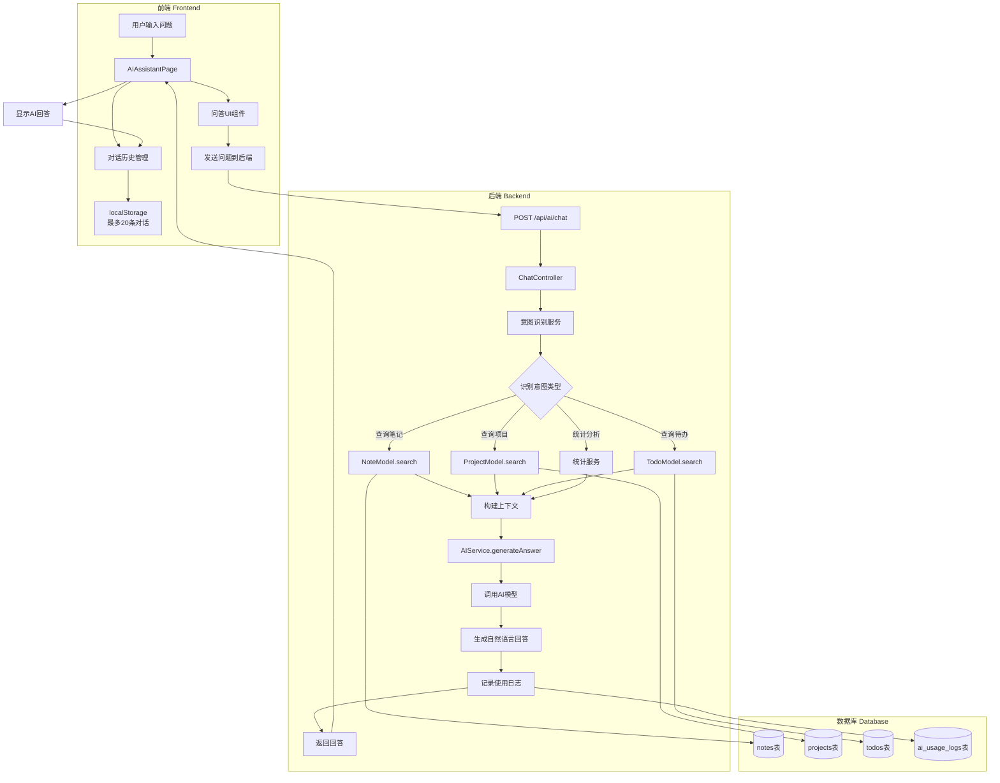
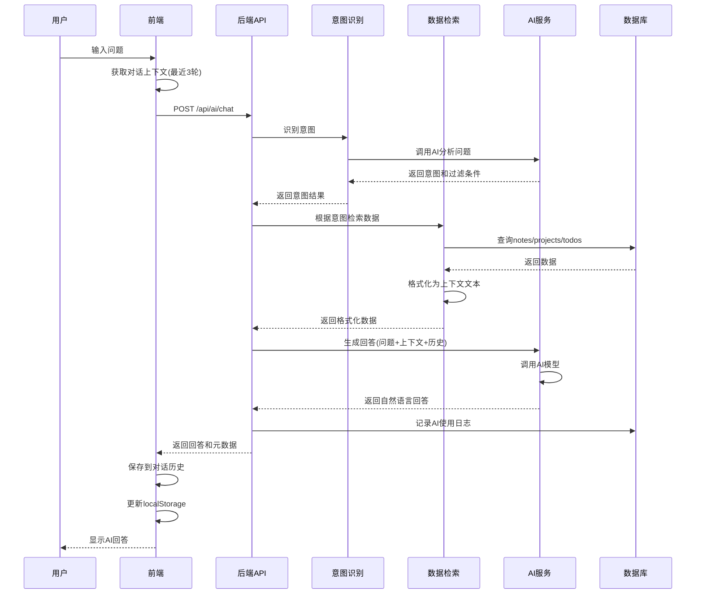

# AI对话问答功能 - 架构设计文档

**创建时间**: 2025-11-02  
**任务名称**: AI对话问答功能  
**状态**: 架构设计

---

## 1. 整体架构图



---

## 2. 核心组件设计

### 2.1 前端组件

#### 2.1.1 对话界面组件（参考ChatGPT）

```typescript
// 新增对话会话管理
interface Conversation {
  id: string;
  title: string;  // 自动从第一条消息生成
  messages: ChatMessage[];
  createdAt: Date;
  updatedAt: Date;
}

interface ChatMessage {
  id: string;
  role: 'user' | 'assistant';
  content: string;
  timestamp: Date;
  metadata?: {
    intent?: string;
    dataSource?: string[];
    tokensUsed?: number;
  };
}
```

#### 2.1.2 界面布局（参考ChatGPT）

```
┌─────────────────────────────────────────────────────────┐
│  AI Workbench - 智能助手                                 │
├──────────────┬──────────────────────────────────────────┤
│              │                                          │
│  对话列表    │           当前对话区域                    │
│  (左侧栏)    │                                          │
│              │  ┌────────────────────────────────────┐ │
│ ┌──────────┐ │  │ 用户: 我最近的项目是什么？          │ │
│ │+ 新对话  │ │  └────────────────────────────────────┘ │
│ └──────────┘ │                                          │
│              │  ┌────────────────────────────────────┐ │
│ 📝 对话1     │  │ AI: 您最近的项目有：                │ │
│ 今天 10:30   │  │ 1. AI Workbench - 进行中            │ │
│              │  │ 2. 知识库系统 - 已完成              │ │
│ 📝 对话2     │  └────────────────────────────────────┘ │
│ 昨天 15:20   │                                          │
│              │                                          │
│ 📝 对话3     │                                          │
│ 11-01 09:15  │                                          │
│              │                                          │
│ [清空历史]   │  ┌────────────────────────────────────┐ │
│              │  │ 输入您的问题...          [发送] │ │
│              │  └────────────────────────────────────┘ │
└──────────────┴──────────────────────────────────────────┘
```

#### 2.1.3 新增工具配置

```typescript
// 在aiTools数组中添加
{
  id: 'chat',
  name: '智能问答',
  description: '与AI对话，查询您的笔记、项目和待办事项',
  icon: <MessageSquare className="w-5 h-5" />,
  category: 'chat'
}
```

### 2.2 后端服务

#### 2.2.1 API接口设计

**新增端点**: `POST /api/ai/chat`

**请求格式**:
```typescript
{
  question: string;           // 用户问题
  conversationId?: string;    // 对话ID（可选，用于多轮对话）
  context?: Array<{           // 对话上下文（最近3轮）
    role: 'user' | 'assistant';
    content: string;
  }>;
}
```

**响应格式**:
```typescript
{
  success: boolean;
  message: string;
  data: {
    answer: string;           // AI生成的回答
    conversationId: string;   // 对话ID
    metadata: {
      intent: string;         // 识别的意图
      dataSource: string[];   // 数据来源（notes/projects/todos）
      itemsFound: number;     // 找到的数据条数
      tokensUsed: number;     // 使用的token数
    };
  };
}
```

#### 2.2.2 意图识别服务

```typescript
// server/src/services/intentService.ts
export class IntentService {
  // 识别用户问题的意图
  static async recognizeIntent(question: string): Promise<{
    type: 'query_notes' | 'query_projects' | 'query_todos' | 'statistics' | 'general';
    filters: {
      timeRange?: 'recent' | 'today' | 'week' | 'month';
      priority?: 'low' | 'medium' | 'high';
      status?: string;
      tags?: string[];
      keyword?: string;
    };
  }>;
}
```

**意图识别Prompt**:
```
你是一个意图识别助手。分析用户问题，识别意图类型和过滤条件。

意图类型：
- query_notes: 查询笔记（例如："关于React的笔记"）
- query_projects: 查询项目（例如："我最近的项目"）
- query_todos: 查询待办（例如："高优先级的任务"）
- statistics: 统计分析（例如："本周完成了多少任务"）
- general: 一般对话（例如："你好"）

时间范围：
- recent: 最近的（默认7天）
- today: 今天
- week: 本周
- month: 本月

请以JSON格式返回：
{
  "type": "意图类型",
  "filters": {
    "timeRange": "时间范围",
    "priority": "优先级",
    "status": "状态",
    "tags": ["标签"],
    "keyword": "关键词"
  }
}

用户问题：{{question}}
```

#### 2.2.3 数据检索服务

```typescript
// server/src/services/dataRetrievalService.ts
export class DataRetrievalService {
  // 根据意图检索数据
  static async retrieveData(
    userId: string,
    intent: IntentResult
  ): Promise<{
    notes?: Note[];
    projects?: Project[];
    todos?: Todo[];
    statistics?: any;
  }>;
  
  // 格式化数据为上下文文本
  static formatDataAsContext(data: any): string;
}
```

#### 2.2.4 回答生成服务

```typescript
// server/src/services/answerService.ts
export class AnswerService {
  // 生成自然语言回答
  static async generateAnswer(
    question: string,
    context: string,
    conversationHistory?: Array<{role: string; content: string}>
  ): Promise<string>;
}
```

**回答生成Prompt**:
```
你是一个智能助手，帮助用户管理笔记、项目和待办事项。

根据以下信息回答用户问题：

【用户数据】
{{context}}

【对话历史】
{{conversationHistory}}

【用户问题】
{{question}}

回答要求：
1. 准确：基于提供的数据回答，不要编造信息
2. 简洁：突出重点，避免冗长
3. 友好：使用自然、友好的语气
4. 结构化：使用列表、编号等方式组织信息
5. 如果没有找到相关数据，礼貌地告知用户

请生成回答：
```

---

## 3. 数据流向图



---

## 4. 对话历史管理机制

### 4.1 存储结构

```typescript
// localStorage结构
{
  "ai_conversations": [
    {
      "id": "conv_1",
      "title": "查询最近项目",  // 从第一条消息自动生成
      "messages": [
        {
          "id": "msg_1",
          "role": "user",
          "content": "我最近的项目是什么？",
          "timestamp": "2025-11-02T10:30:00Z"
        },
        {
          "id": "msg_2",
          "role": "assistant",
          "content": "您最近的项目有：...",
          "timestamp": "2025-11-02T10:30:05Z",
          "metadata": {
            "intent": "query_projects",
            "dataSource": ["projects"],
            "tokensUsed": 150
          }
        }
      ],
      "createdAt": "2025-11-02T10:30:00Z",
      "updatedAt": "2025-11-02T10:30:05Z"
    }
  ]
}
```

### 4.2 管理策略

1. **最多保留20条对话**
   - 当超过20条时，自动删除最旧的对话
   - 提供手动删除单个对话的功能
   - 提供清空所有对话的功能

2. **自动生成对话标题**
   - 从第一条用户消息提取关键词
   - 最多15个字符
   - 示例："查询最近项目"、"高优先级任务"

3. **上下文保持**
   - 发送请求时携带最近3轮对话
   - 格式：`[{role: 'user', content: '...'}, {role: 'assistant', content: '...'}]`
   - 用于支持追问和澄清

### 4.3 对话操作

```typescript
// 对话管理函数
class ConversationManager {
  // 创建新对话
  static createConversation(): Conversation;
  
  // 添加消息到对话
  static addMessage(conversationId: string, message: ChatMessage): void;
  
  // 获取对话列表（最多20条）
  static getConversations(): Conversation[];
  
  // 获取当前对话
  static getCurrentConversation(): Conversation | null;
  
  // 切换对话
  static switchConversation(conversationId: string): void;
  
  // 删除对话
  static deleteConversation(conversationId: string): void;
  
  // 清空所有对话
  static clearAllConversations(): void;
  
  // 生成对话标题
  static generateTitle(firstMessage: string): string;
  
  // 获取对话上下文（最近3轮）
  static getContext(conversationId: string): Array<{role: string; content: string}>;
}
```

---

## 5. 接口契约定义

### 5.1 前端接口

```typescript
// client/src/services/aiService.ts

// 新增接口
export interface AIChatRequest {
  question: string;
  conversationId?: string;
  context?: Array<{
    role: 'user' | 'assistant';
    content: string;
  }>;
}

export interface AIChatResponse {
  answer: string;
  conversationId: string;
  metadata: {
    intent: string;
    dataSource: string[];
    itemsFound: number;
    tokensUsed: number;
  };
}

// 新增方法
export const aiService = {
  // ... 现有方法
  
  // 智能问答
  async chat(request: AIChatRequest): Promise<AIChatResponse> {
    const config = getAIConfig();
    const model = config.selectedModel;
    const apiKey = getApiKeyForModel(model);
    
    const response = await apiClient.post('/ai/chat', {
      ...request,
      model,
      apiKey
    });
    
    return response.data.data;
  }
};
```

### 5.2 后端接口

```typescript
// server/src/routes/ai.ts
// 新增路由
router.post('/chat', authenticateToken, AIController.chat);

// server/src/controllers/aiController.ts
export class AIController {
  // ... 现有方法
  
  static async chat(req: Request, res: Response): Promise<Response | void> {
    try {
      if (!req.user) {
        return res.status(401).json({
          success: false,
          message: '未认证的用户'
        });
      }

      const { question, conversationId, context, model, apiKey } = req.body;

      if (!question || typeof question !== 'string') {
        return res.status(400).json({
          success: false,
          message: '问题不能为空'
        });
      }

      // 1. 识别意图
      const intent = await IntentService.recognizeIntent(question);

      // 2. 检索数据
      const data = await DataRetrievalService.retrieveData(
        req.user.id,
        intent
      );

      // 3. 格式化上下文
      const dataContext = DataRetrievalService.formatDataAsContext(data);

      // 4. 生成回答
      const answer = await AnswerService.generateAnswer(
        question,
        dataContext,
        context,
        { model, apiKey }
      );

      // 5. 记录使用日志
      await AIUsageLogModel.create({
        user_id: req.user.id,
        action_type: 'assistant_qa',
        model_name: model || 'moonshotai/Kimi-K2-Instruct-0905',
        input_tokens: Math.ceil((question.length + dataContext.length) / 4),
        output_tokens: Math.ceil(answer.length / 4),
        cost_cents: Math.round(
          (Math.ceil((question.length + dataContext.length) / 4) +
            Math.ceil(answer.length / 4)) *
            0.01
        )
      });

      res.json({
        success: true,
        message: '问答成功',
        data: {
          answer,
          conversationId: conversationId || `conv_${Date.now()}`,
          metadata: {
            intent: intent.type,
            dataSource: Object.keys(data),
            itemsFound: Object.values(data).flat().length,
            tokensUsed:
              Math.ceil((question.length + dataContext.length) / 4) +
              Math.ceil(answer.length / 4)
          }
        }
      });
    } catch (error: any) {
      console.error('AI问答错误:', error);
      return res.status(500).json({
        success: false,
        message: error.message || '服务器内部错误'
      });
    }
  }
}
```

---

## 6. 异常处理策略

### 6.1 前端异常处理

```typescript
try {
  const response = await aiService.chat({
    question: userInput,
    conversationId: currentConversation.id,
    context: getRecentContext(3)
  });
  
  // 成功处理
  addMessageToConversation(response.answer);
} catch (error: any) {
  // 错误处理
  if (error.response?.status === 401) {
    showError('请先登录');
  } else if (error.response?.status === 400) {
    showError('问题格式不正确');
  } else if (error.response?.status === 429) {
    showError('请求过于频繁，请稍后再试');
  } else if (error.response?.status === 500) {
    showError('服务器错误，请稍后再试');
  } else {
    showError('网络错误，请检查连接');
  }
}
```

### 6.2 后端异常处理

```typescript
// 意图识别失败
if (!intent || !intent.type) {
  return res.status(400).json({
    success: false,
    message: '无法理解您的问题，请换个方式提问'
  });
}

// 数据检索失败
if (error.code === 'PGRST116') {
  // 未找到数据，返回友好提示
  return res.json({
    success: true,
    data: {
      answer: '抱歉，没有找到相关信息。',
      metadata: { itemsFound: 0 }
    }
  });
}

// AI服务调用失败
if (error.message.includes('API密钥')) {
  return res.status(500).json({
    success: false,
    message: 'AI服务配置错误，请联系管理员'
  });
}
```

---

## 7. 性能优化策略

### 7.1 前端优化

1. **对话列表虚拟滚动**
   - 当对话数量较多时使用虚拟滚动
   - 减少DOM节点数量

2. **消息懒加载**
   - 只加载当前对话的消息
   - 切换对话时才加载对应消息

3. **防抖处理**
   - 输入框添加防抖，避免频繁触发

4. **缓存优化**
   - 缓存已生成的回答
   - 相同问题直接返回缓存结果

### 7.2 后端优化

1. **数据查询优化**
   - 限制查询数量（最多20条）
   - 添加数据库索引（user_id, updated_at）
   - 使用分页查询

2. **意图识别缓存**
   - 缓存常见问题的意图识别结果
   - 减少AI调用次数

3. **并发控制**
   - 限制单用户并发请求数
   - 使用队列处理请求

---

## 8. 安全策略

### 8.1 数据访问控制

```typescript
// 确保只能访问自己的数据
const data = await DataRetrievalService.retrieveData(
  req.user.id,  // 使用认证用户ID
  intent
);
```

### 8.2 输入验证

```typescript
// 验证问题长度
if (question.length > 500) {
  return res.status(400).json({
    success: false,
    message: '问题过长，请控制在500字以内'
  });
}

// 验证上下文长度
if (context && context.length > 10) {
  return res.status(400).json({
    success: false,
    message: '上下文过长'
  });
}
```

### 8.3 敏感信息过滤

```typescript
// 在返回数据前过滤敏感字段
const sanitizedData = data.map(item => ({
  ...item,
  user_id: undefined,  // 移除用户ID
  api_key: undefined   // 移除API密钥
}));
```

---

## 9. 测试策略

### 9.1 单元测试

- 意图识别服务测试
- 数据检索服务测试
- 对话管理器测试

### 9.2 集成测试

- API端点测试
- 前后端交互测试
- 数据库查询测试

### 9.3 E2E测试

- 完整对话流程测试
- 多轮对话测试
- 对话历史管理测试

---

## 10. 设计原则确认

✅ **严格按照任务范围** - 仅实现问答功能，不涉及数据修改  
✅ **与现有系统一致** - 复用现有组件和服务  
✅ **复用现有组件** - 使用现有的AIService、数据模型  
✅ **接口定义完整** - 前后端接口清晰定义  
✅ **设计可行性验证** - 基于现有技术栈，无新依赖  

---

**文档状态**: ✅ 架构设计完成  
**下一步**: 进入Atomize（原子化阶段），拆分为可执行的子任务

