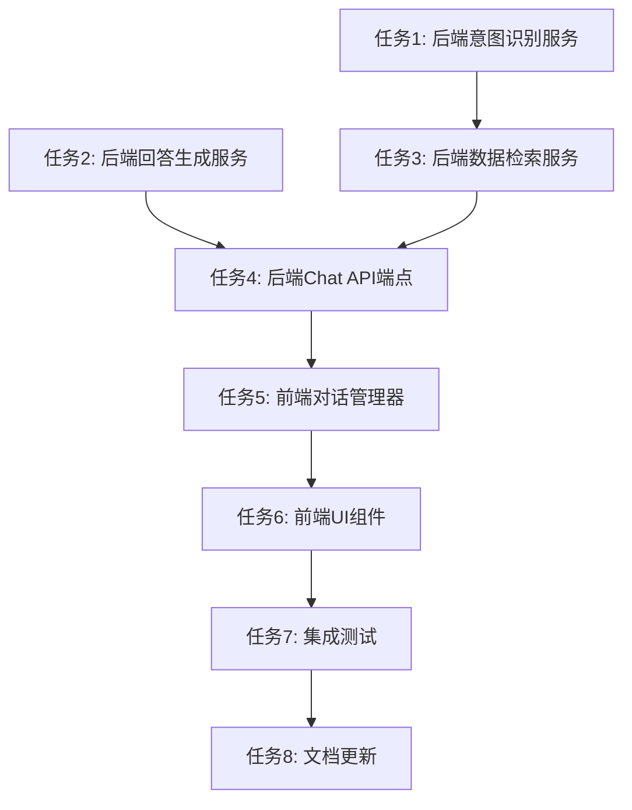

# AI对话问答功能 - 任务拆分文档

**创建时间**: 2025-11-02  
**任务名称**: AI对话问答功能  
**状态**: 原子化拆分

---

## 任务依赖图



---

## 任务列表

### 任务1: 后端意图识别服务 ⭐

**优先级**: 高  
**预估时间**: 1小时  
**依赖**: 无

#### 输入契约
- 用户问题（string）
- AI配置（model, apiKey）

#### 输出契约
- 意图类型（query_notes | query_projects | query_todos | statistics | general）
- 过滤条件（timeRange, priority, status, tags, keyword）

#### 实现约束
- 创建文件：`server/src/services/intentService.ts`
- 使用现有的AIService.generateText方法
- 通过prompt engineering实现意图识别
- 返回结构化的JSON结果

#### 验收标准
- ✅ 能正确识别5种意图类型
- ✅ 能提取时间范围、优先级、状态等过滤条件
- ✅ 能提取关键词用于搜索
- ✅ 处理异常情况（无法识别时返回general）

#### 测试用例
```typescript
// 测试用例1: 查询笔记
input: "关于React的笔记在哪里？"
expected: { type: 'query_notes', filters: { keyword: 'React' } }

// 测试用例2: 查询项目
input: "我最近的项目是什么？"
expected: { type: 'query_projects', filters: { timeRange: 'recent' } }

// 测试用例3: 查询待办
input: "有哪些高优先级的待办事项？"
expected: { type: 'query_todos', filters: { priority: 'high' } }

// 测试用例4: 统计分析
input: "本周完成了多少任务？"
expected: { type: 'statistics', filters: { timeRange: 'week' } }
```

---

### 任务2: 后端回答生成服务 ⭐

**优先级**: 高  
**预估时间**: 45分钟  
**依赖**: 无

#### 输入契约
- 用户问题（string）
- 数据上下文（string）
- 对话历史（array, 可选）
- AI配置（model, apiKey）

#### 输出契约
- 自然语言回答（string）

#### 实现约束
- 创建文件：`server/src/services/answerService.ts`
- 使用现有的AIService.generateText方法
- 通过prompt engineering生成友好的回答
- 支持对话上下文（最近3轮）

#### 验收标准
- ✅ 生成的回答准确、简洁、友好
- ✅ 回答基于提供的数据，不编造信息
- ✅ 支持多轮对话上下文
- ✅ 当没有数据时，礼貌地告知用户

#### 测试用例
```typescript
// 测试用例1: 有数据的情况
context: "项目列表: 1. AI Workbench - 进行中, 2. 知识库 - 已完成"
question: "我最近的项目是什么？"
expected: 包含项目名称和状态的自然语言回答

// 测试用例2: 无数据的情况
context: ""
question: "关于Python的笔记在哪里？"
expected: "抱歉，没有找到关于Python的笔记。"
```

---

### 任务3: 后端数据检索服务 ⭐

**优先级**: 高  
**预估时间**: 1.5小时  
**依赖**: 任务1（意图识别服务）

#### 输入契约
- 用户ID（string）
- 意图结果（IntentResult）

#### 输出契约
- 检索到的数据（notes[], projects[], todos[], statistics）
- 格式化的上下文文本（string）

#### 实现约束
- 创建文件：`server/src/services/dataRetrievalService.ts`
- 复用现有的NoteModel、ProjectModel、TodoModel
- 限制返回数量（最多20条）
- 支持时间范围过滤
- 支持优先级、状态、标签过滤
- 支持关键词搜索

#### 验收标准
- ✅ 能根据意图类型查询对应的数据
- ✅ 能正确应用过滤条件
- ✅ 返回数据不超过20条
- ✅ 能格式化数据为清晰的上下文文本
- ✅ 只返回当前用户的数据（安全性）

#### 测试用例
```typescript
// 测试用例1: 查询最近的笔记
intent: { type: 'query_notes', filters: { timeRange: 'recent' } }
expected: 返回最近7天的笔记，按updated_at排序

// 测试用例2: 查询高优先级待办
intent: { type: 'query_todos', filters: { priority: 'high' } }
expected: 返回priority='高'且completed=false的待办

// 测试用例3: 搜索笔记
intent: { type: 'query_notes', filters: { keyword: 'React' } }
expected: 返回标题或内容包含"React"的笔记
```

---

### 任务4: 后端Chat API端点 ⭐

**优先级**: 高  
**预估时间**: 1小时  
**依赖**: 任务1、任务2、任务3

#### 输入契约
- HTTP POST请求到 `/api/ai/chat`
- 请求体：{ question, conversationId?, context?, model?, apiKey? }
- 认证token（必需）

#### 输出契约
- 响应体：{ success, message, data: { answer, conversationId, metadata } }

#### 实现约束
- 修改文件：`server/src/routes/ai.ts`
- 创建文件：`server/src/controllers/aiController.ts`（添加chat方法）
- 添加请求验证（validate）
- 记录AI使用日志（action_type='assistant_qa'）
- 错误处理和异常捕获

#### 验收标准
- ✅ API端点正常工作
- ✅ 请求验证正确
- ✅ 认证检查正确
- ✅ 调用意图识别、数据检索、回答生成服务
- ✅ 记录使用日志
- ✅ 返回正确的响应格式
- ✅ 错误处理完善

#### 测试用例
```bash
# 测试用例1: 正常请求
curl -X POST http://localhost:3000/api/ai/chat \
  -H "Authorization: Bearer <token>" \
  -H "Content-Type: application/json" \
  -d '{"question": "我最近的项目是什么？"}'

# 测试用例2: 未认证
curl -X POST http://localhost:3000/api/ai/chat \
  -H "Content-Type: application/json" \
  -d '{"question": "测试"}'
# 期望: 401 Unauthorized

# 测试用例3: 缺少问题
curl -X POST http://localhost:3000/api/ai/chat \
  -H "Authorization: Bearer <token>" \
  -H "Content-Type: application/json" \
  -d '{}'
# 期望: 400 Bad Request
```

---

### 任务5: 前端对话管理器 ⭐

**优先级**: 高  
**预估时间**: 1.5小时  
**依赖**: 任务4（后端API完成）

#### 输入契约
- 用户操作（创建对话、添加消息、删除对话等）

#### 输出契约
- 对话列表（Conversation[]）
- 当前对话（Conversation）
- 对话上下文（最近3轮）

#### 实现约束
- 创建文件：`client/src/utils/conversationManager.ts`
- 使用localStorage存储对话历史
- 最多保留20条对话
- 自动生成对话标题（从第一条消息提取）
- 提供完整的CRUD操作

#### 验收标准
- ✅ 能创建新对话
- ✅ 能添加消息到对话
- ✅ 能获取对话列表（最多20条）
- ✅ 能切换当前对话
- ✅ 能删除单个对话
- ✅ 能清空所有对话
- ✅ 能自动生成对话标题
- ✅ 能获取对话上下文（最近3轮）
- ✅ 超过20条时自动删除最旧的

#### 测试用例
```typescript
// 测试用例1: 创建对话
const conv = ConversationManager.createConversation();
expect(conv.id).toBeDefined();
expect(conv.messages).toEqual([]);

// 测试用例2: 添加消息
ConversationManager.addMessage(conv.id, {
  role: 'user',
  content: '我最近的项目是什么？'
});
expect(conv.messages.length).toBe(1);

// 测试用例3: 生成标题
const title = ConversationManager.generateTitle('我最近的项目是什么？');
expect(title).toBe('查询最近项目');

// 测试用例4: 超过20条对话
for (let i = 0; i < 25; i++) {
  ConversationManager.createConversation();
}
const conversations = ConversationManager.getConversations();
expect(conversations.length).toBe(20);
```

---

### 任务6: 前端UI组件（ChatGPT风格） ⭐⭐

**优先级**: 高  
**预估时间**: 2.5小时  
**依赖**: 任务5（对话管理器）

#### 输入契约
- 用户输入（问题）
- 对话列表
- 当前对话

#### 输出契约
- 渲染的对话界面
- 用户交互反馈

#### 实现约束
- 修改文件：`client/src/pages/ai/AIAssistantPage.tsx`
- 参考ChatGPT界面设计
- 左侧：对话列表（最多20条）
- 右侧：当前对话区域
- 底部：输入框 + 发送按钮
- 添加"智能问答"工具到aiTools数组
- 使用现有的UI组件（Button, Input, Card等）
- 响应式设计（移动端适配）

#### 验收标准
- ✅ 界面美观，参考ChatGPT风格
- ✅ 左侧显示对话列表，可点击切换
- ✅ 右侧显示当前对话内容
- ✅ 支持新建对话
- ✅ 支持删除对话
- ✅ 支持清空历史
- ✅ 输入框支持多行文本
- ✅ 发送按钮状态管理（loading时禁用）
- ✅ 消息自动滚动到底部
- ✅ 支持复制AI回答
- ✅ 错误提示友好
- ✅ 移动端适配良好

#### UI结构
```tsx
<div className="flex h-full">
  {/* 左侧对话列表 */}
  <div className="w-64 border-r">
    <Button onClick={createNewConversation}>+ 新对话</Button>
    <div className="conversation-list">
      {conversations.map(conv => (
        <ConversationItem 
          key={conv.id}
          conversation={conv}
          active={conv.id === currentConversation.id}
          onClick={() => switchConversation(conv.id)}
          onDelete={() => deleteConversation(conv.id)}
        />
      ))}
    </div>
    <Button onClick={clearAllConversations}>清空历史</Button>
  </div>
  
  {/* 右侧对话区域 */}
  <div className="flex-1 flex flex-col">
    <div className="flex-1 overflow-y-auto">
      {currentConversation.messages.map(msg => (
        <MessageBubble key={msg.id} message={msg} />
      ))}
    </div>
    <div className="border-t p-4">
      <textarea 
        value={inputText}
        onChange={e => setInputText(e.target.value)}
        placeholder="输入您的问题..."
      />
      <Button onClick={sendMessage} disabled={loading}>
        发送
      </Button>
    </div>
  </div>
</div>
```

---

### 任务7: 集成测试 ⭐

**优先级**: 中  
**预估时间**: 1小时  
**依赖**: 任务6（前端UI完成）

#### 输入契约
- 完整的前后端系统

#### 输出契约
- 测试报告
- 发现的问题列表

#### 实现约束
- 手动测试完整的对话流程
- 测试多轮对话
- 测试对话历史管理
- 测试错误处理
- 测试边界情况

#### 验收标准
- ✅ 完整对话流程正常
- ✅ 多轮对话上下文正确
- ✅ 对话历史保存和加载正常
- ✅ 超过20条对话自动删除最旧的
- ✅ 错误提示友好
- ✅ 性能符合要求（响应时间<5秒）
- ✅ 移动端体验良好

#### 测试场景
```
场景1: 完整对话流程
1. 打开AI助手页面
2. 选择"智能问答"工具
3. 输入"我最近的项目是什么？"
4. 验证AI回答正确
5. 追问"第一个项目的详细信息"
6. 验证AI理解上下文

场景2: 对话历史管理
1. 创建多个对话（超过20个）
2. 验证只保留最近20条
3. 切换不同对话
4. 验证对话内容正确
5. 删除单个对话
6. 清空所有对话

场景3: 错误处理
1. 未登录时访问
2. 输入空问题
3. 输入超长问题（>500字）
4. 网络错误时的表现
5. API错误时的表现
```

---

### 任务8: 文档更新 ⭐

**优先级**: 低  
**预估时间**: 30分钟  
**依赖**: 任务7（测试完成）

#### 输入契约
- 完成的功能
- 测试结果

#### 输出契约
- 用户使用指南
- API文档
- 开发文档

#### 实现约束
- 更新README.md
- 创建用户使用指南
- 更新API文档
- 记录已知问题和限制

#### 验收标准
- ✅ README.md包含新功能说明
- ✅ 用户使用指南清晰易懂
- ✅ API文档完整准确
- ✅ 记录已知问题和限制

---

## 任务统计

| 任务 | 优先级 | 预估时间 | 依赖 | 状态 |
|------|--------|----------|------|------|
| 任务1: 后端意图识别服务 | 高 | 1小时 | 无 | 待开始 |
| 任务2: 后端回答生成服务 | 高 | 45分钟 | 无 | 待开始 |
| 任务3: 后端数据检索服务 | 高 | 1.5小时 | 任务1 | 待开始 |
| 任务4: 后端Chat API端点 | 高 | 1小时 | 任务1,2,3 | 待开始 |
| 任务5: 前端对话管理器 | 高 | 1.5小时 | 任务4 | 待开始 |
| 任务6: 前端UI组件 | 高 | 2.5小时 | 任务5 | 待开始 |
| 任务7: 集成测试 | 中 | 1小时 | 任务6 | 待开始 |
| 任务8: 文档更新 | 低 | 30分钟 | 任务7 | 待开始 |

**总预估时间**: 约10小时

---

## 实施顺序

### 第一阶段：后端服务（并行）
- 任务1: 意图识别服务
- 任务2: 回答生成服务

### 第二阶段：后端集成（串行）
- 任务3: 数据检索服务（依赖任务1）
- 任务4: Chat API端点（依赖任务1,2,3）

### 第三阶段：前端开发（串行）
- 任务5: 对话管理器（依赖任务4）
- 任务6: UI组件（依赖任务5）

### 第四阶段：测试和文档（串行）
- 任务7: 集成测试（依赖任务6）
- 任务8: 文档更新（依赖任务7）

---

**文档状态**: ✅ 任务拆分完成  
**下一步**: 进入Approve（审批阶段），等待用户确认实施计划

