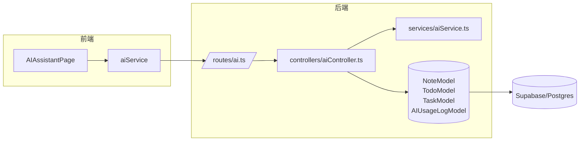
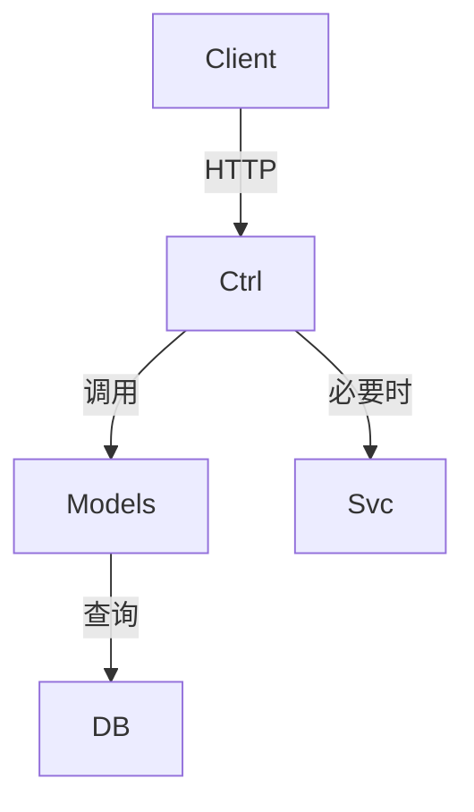

# DESIGN — AI应用功能

## 架构总览

## 分层与核心组件

- Client
  - `aiService.getRecommendations()`：获取个性化建议。
  - `aiService.getPredictiveInsights()`：获取统计预测结果。

- Server
  - `aiController.getRecommendations`：基于标签/时效与交互频次生成建议。
  - `aiController.getPredictiveInsights`：基于历史完成率与到期分布生成轻量预测。
  - `aiService`：外部模型调用与通用 NLP 能力（保持已有实现）。

## 模块依赖关系

## 接口契约定义

- `GET /api/ai/recommendations`
  - Request: 认证上下文（JWT）；可选 `limit`（默认 5）。
  - Response:
    - `items[]`: `{ type, title, reason, source, priority, link? }`

- `GET /api/ai/predict`
  - Request: 认证上下文（JWT）；可选 `windowDays`（默认 14）。
  - Response:
    - `stats`: `{ avgCompletionPerDay, overdueCount, upcomingCount }`
    - `forecast`: `{ next7Days[], confidence }`

## 数据流向

- 推荐：Controller 从 Notes/Todos/Tasks 汇总特征 → 生成建议项 → 返回 JSON。
- 预测：Controller 统计近期完成/到期数据 → 计算均值/趋势 → 返回 JSON。

## 异常处理策略

- 数据不足：返回 `success: true` 与 `items: []` 或提示字段 `message`。
- 外部模型不可用：降级到启发式方案；若必要，返回安全错误信息。
- 统一错误处理：沿用 `app.ts` 全局错误中间件。