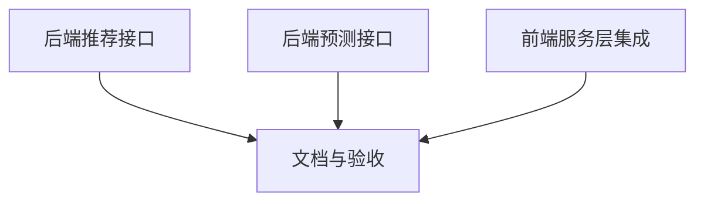

# TASK — AI应用功能

## 原子任务拆分

1. 后端新增推荐接口
   - 输入契约：认证用户上下文，`limit` 可选；数据库存在笔记/任务数据。
   - 输出契约：`items[]` 列表（类型/标题/理由/来源/优先级/可选链接）。
   - 约束：不依赖外部模型，启发式生成；100ms–800ms 响应。
   - 依赖：NoteModel、TodoModel。

2. 后端新增预测接口
   - 输入契约：认证用户上下文，`windowDays` 可选。
   - 输出契约：`stats` 与 `forecast` 结构，数据不足需返回安全值。
   - 约束：统计方法（均值、简单趋势），无外部依赖。
   - 依赖：TaskModel 或 TodoModel 完成状态与到期字段。

3. 前端服务层集成
   - 输入契约：无额外参数或轻量参数（与后端一致）。
   - 输出契约：结构化 JSON，供 UI 调用。
   - 约束：不改 UI，仅添方法；保持类型与错误处理风格。
   - 依赖：`apiClient` 与认证态。

4. 文档与验收
   - 输入契约：项目说明与 6A 文档框架完整。
   - 输出契约：ACCEPTANCE 更新执行记录；FINAL 总结与 TODO 列表。
   - 约束：与实际实现保持一致；内容清晰可测试。
   - 依赖：上述任务完成。

## 任务依赖图

