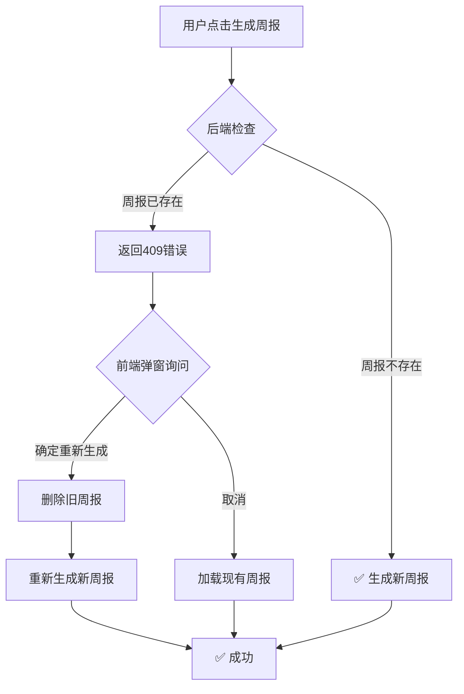

# 周报生成问题修复说明

**修复日期**: 2025-11-02  
**问题描述**: 不使用AI优化时无法生成周报，预览显示旧周报  
**状态**: ✅ 已修复

---

## 🐛 问题分析

### 根本原因

**周报重复检查机制** - 后端会检查同一时间段是否已存在周报，如果存在则拒绝生成新周报。

#### 问题代码位置

```typescript:29:41:server/src/controllers/weeklyReportController.ts
// 检查是否已存在该周期的周报
const existingReport = await WeeklyReportModel.findByWeekRange(
  userId,
  week_start_date,
  week_end_date
);

if (existingReport) {
  return res.status(409).json({
    error: 'Weekly report for this period already exists',
    report_id: existingReport.id,
  });
}
```

### 问题流程

1. **第一次生成**（开启 AI 优化）
   - ✅ 成功生成周报 A
   - ✅ 保存到数据库

2. **第二次生成**（不开启 AI 优化）
   - ❌ 后端检测到同时间段周报已存在
   - ❌ 返回 **409 Conflict** 错误
   - ❌ 前端未正确处理错误
   - ❌ 预览界面仍显示旧周报 A

3. **用户体验问题**
   - 🤔 用户以为"无法生成"
   - 🤔 没有明确的错误提示
   - 🤔 不知道如何处理

---

## ✅ 修复方案

### 方案概述

**优化前端错误处理** - 当检测到周报已存在时，提供友好的用户交互：

1. **弹出确认对话框** - 询问用户是否要重新生成
2. **自动删除旧周报** - 如果用户选择重新生成
3. **自动加载旧周报** - 如果用户选择查看现有周报

### 修改文件

`client/src/pages/reports/WeeklyReportPage.tsx` - `handleGenerate` 函数的错误处理部分

### 修复后的流程



---

## 🎯 用户体验改进

### 修复前

```
[用户操作] 点击"生成周报"
[系统响应] ...沉默...
[用户感受] ？？？发生了什么？
[实际情况] 后端返回409错误，前端未处理
```

### 修复后

```
[用户操作] 点击"生成周报"
[系统响应] 弹窗："该时间段的周报已存在。是否删除旧周报并重新生成？"
[用户选择] 
  - 点击"确定" → 自动删除旧周报 → 生成新周报 ✅
  - 点击"取消" → 自动加载现有周报 ✅
[用户感受] 😊 清晰明了，操作流畅
```

---

## 🔄 完整的错误处理逻辑

```typescript
catch (error: any) {
  // 1. 判断是否是"周报已存在"错误
  if (error.response?.status === 409) {
    const existingReportId = error.response?.data?.report_id;
    
    // 2. 弹出确认对话框
    const shouldRegenerate = window.confirm(
      '该时间段的周报已存在。\n\n' +
      '是否删除旧周报并重新生成？\n' +
      '点击"确定"重新生成，点击"取消"查看现有周报。'
    );
    
    if (shouldRegenerate && existingReportId) {
      // 3. 用户选择重新生成
      await reportService.deleteReport(existingReportId);
      const report = await reportService.generateReport(request);
      setCurrentReport(report);
      setActiveTab('preview');
      toast.success('周报生成成功！');
    } else if (existingReportId) {
      // 4. 用户选择查看现有周报
      const report = await reportService.getReport(existingReportId);
      setCurrentReport(report);
      setActiveTab('preview');
      toast.success('已加载现有周报');
    }
  } else {
    // 5. 其他错误正常处理
    toast.error('生成周报失败');
  }
}
```

---

## 📋 测试验证

### 测试场景 1：首次生成周报

**步骤**：
1. 选择时间范围：2024-10-28 到 2024-11-03
2. 开启 AI 优化
3. 点击"生成周报"

**预期结果**：
- ✅ 成功生成周报
- ✅ 自动跳转到预览页面
- ✅ 显示新生成的周报内容

### 测试场景 2：重复生成周报（选择重新生成）

**步骤**：
1. 选择相同时间范围：2024-10-28 到 2024-11-03
2. 不开启 AI 优化
3. 点击"生成周报"
4. 在弹窗中点击"确定"

**预期结果**：
- ✅ 弹出确认对话框
- ✅ 自动删除旧周报
- ✅ 生成新周报
- ✅ 显示新周报内容
- ✅ Toast 提示"周报生成成功"

### 测试场景 3：重复生成周报（选择查看现有）

**步骤**：
1. 选择相同时间范围：2024-10-28 到 2024-11-03
2. 点击"生成周报"
3. 在弹窗中点击"取消"

**预期结果**：
- ✅ 弹出确认对话框
- ✅ 加载现有周报
- ✅ 跳转到预览页面
- ✅ Toast 提示"已加载现有周报"

---

## 🚀 如何测试

### 1. 启动项目

```bash
# 启动后端
cd server
npm run dev

# 启动前端
cd client
npm run dev
```

### 2. 执行测试

1. 登录系统
2. 进入"周报管理"页面
3. 按照上述测试场景进行操作
4. 验证每个场景的预期结果

---

## 💡 额外优化建议

### 建议 1：添加"强制重新生成"选项

在生成表单中添加一个复选框：

```tsx
<label className="flex items-center space-x-2 cursor-pointer">
  <input
    type="checkbox"
    checked={forceRegenerate}
    onChange={(e) => setForceRegenerate(e.target.checked)}
    className="rounded border-gray-300 text-blue-600 focus:ring-blue-500"
  />
  <span className="text-sm text-gray-700">
    强制重新生成（覆盖已有周报）
  </span>
</label>
```

### 建议 2：优化缓存策略

当前周报数据缓存 5 分钟，可以考虑：

1. **缩短缓存时间** - 改为 1-2 分钟
2. **提供"刷新数据"按钮** - 让用户手动清除缓存
3. **智能缓存失效** - 当数据源有更新时自动失效

### 建议 3：改进提示信息

使用更友好的 UI 组件替代 `window.confirm`：

```tsx
// 使用自定义弹窗组件
<ConfirmDialog
  title="周报已存在"
  message="该时间段的周报已存在，您希望："
  options={[
    { label: '重新生成', value: 'regenerate', variant: 'primary' },
    { label: '查看现有', value: 'view', variant: 'secondary' },
    { label: '取消', value: 'cancel', variant: 'ghost' }
  ]}
  onConfirm={handleChoice}
/>
```

---

## 📊 相关问题

### Q1: 为什么要有重复检查？

**A**: 防止用户误操作创建重复周报，保证数据一致性。

### Q2: 能否允许同一时间段有多个周报？

**A**: 可以，但需要修改后端逻辑和数据库设计。建议保持当前设计，通过版本控制来管理修改历史。

### Q3: AI 优化与不优化的周报有什么区别？

**A**: 
- **内容相同** - 基础数据和结构一样
- **表达不同** - AI 优化后语言更流畅、专业
- **建议不同** - AI 优化会生成改进建议

---

## 🎉 总结

这次修复解决了一个**用户体验问题** - 虽然系统功能正常（正确拒绝重复生成），但用户不知道发生了什么。

**修复的本质**：
- 不是修复 bug（系统本身没问题）
- 而是**改进用户体验**（让用户理解系统行为）
- 并提供**清晰的操作选项**（重新生成 vs 查看现有）

**关键收获**：
1. ✅ 良好的错误处理不仅是技术问题，更是用户体验问题
2. ✅ 适当的用户交互可以化解系统限制
3. ✅ 清晰的提示信息比沉默的失败更重要

---

## 📞 支持

如有问题，请联系开发团队或提交 Issue。

