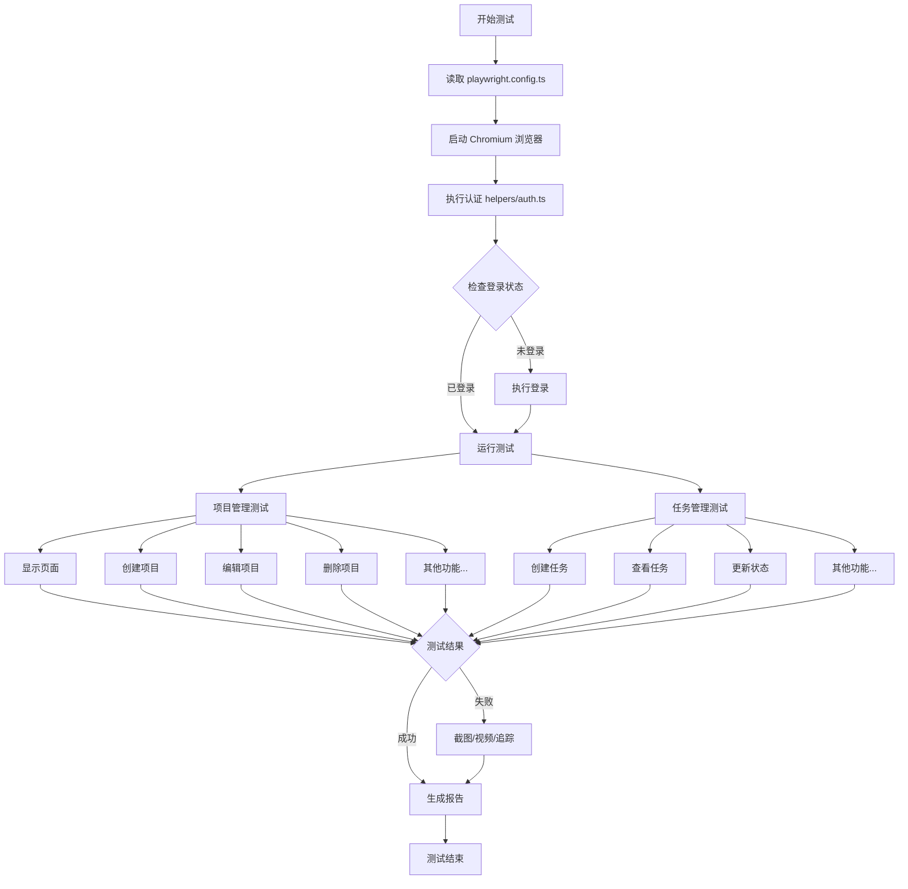
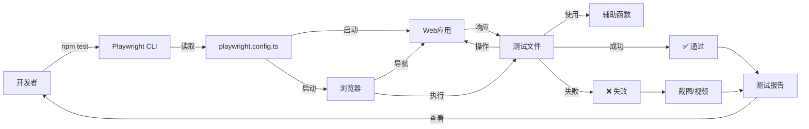
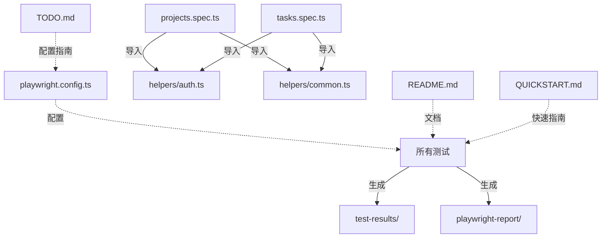

# 📁 E2E 测试项目结构

## 完整目录树

```
AI_Workbench/
├── tests/                              # 测试根目录
│   ├── e2e/                           # E2E 测试
│   │   ├── helpers/                   # 测试辅助工具
│   │   │   ├── auth.ts               # 🔐 认证工具（登录/注册/登出）
│   │   │   └── common.ts             # 🛠️ 通用工具（等待/生成数据）
│   │   ├── projects.spec.ts          # ✅ 项目管理测试套件（8个测试）
│   │   └── tasks.spec.ts             # ✅ 任务管理测试套件（8个测试）
│   ├── README.md                      # 📖 完整测试文档
│   └── QUICKSTART.md                  # 🚀 快速入门指南
│
├── docs/                              # 项目文档
│   └── E2E测试/                       # E2E测试相关文档
│       ├── ALIGNMENT_E2E测试.md       # 对齐文档
│       ├── CONSENSUS_E2E测试.md       # 共识文档
│       ├── DESIGN_E2E测试.md          # 设计文档
│       ├── TASK_E2E测试.md            # 任务拆分文档
│       ├── ACCEPTANCE_E2E测试.md      # 验收文档
│       ├── FINAL_E2E测试实施.md       # ✅ 最终总结报告
│       ├── TODO_E2E测试配置.md        # ⚠️ 待办配置清单
│       └── STRUCTURE.md               # 📁 本文件
│
├── playwright.config.ts               # ⚙️ Playwright 配置文件
├── package.json                       # 📦 项目依赖（含测试脚本）
│
├── playwright-report/                 # 📊 测试报告（自动生成）
│   └── index.html                    # HTML 测试报告
│
└── test-results/                      # 📸 测试结果（自动生成）
    ├── screenshots/                   # 失败截图
    ├── videos/                        # 执行视频
    └── traces/                        # 追踪文件
```

---

## 核心文件说明

### 🔧 配置文件

#### `playwright.config.ts`
```typescript
// Playwright 主配置文件
- 测试目录: ./tests
- 基础 URL: http://localhost:5173
- 超时时间: 30秒
- 重试次数: 1次
- 浏览器: Chromium
- 截图/视频: 失败时保存
- 报告: HTML 格式
```

#### `package.json` (新增脚本)
```json
{
  "scripts": {
    "test": "playwright test",
    "test:ui": "playwright test --ui",
    "test:headed": "playwright test --headed",
    "test:debug": "playwright test --debug",
    "test:projects": "playwright test tests/e2e/projects.spec.ts",
    "test:tasks": "playwright test tests/e2e/tasks.spec.ts",
    "test:report": "playwright show-report",
    "test:install": "playwright install"
  }
}
```

---

### 🛠️ 辅助工具

#### `tests/e2e/helpers/auth.ts` (认证工具)

**导出函数**:
```typescript
✅ login(page, email, password)          // 用户登录
✅ logout(page)                          // 用户登出
✅ register(page, name, email, password) // 用户注册
✅ ensureLoggedIn(page)                  // 确保已登录
✅ isLoggedIn(page)                      // 检查登录状态
```

**使用示例**:
```typescript
import { ensureLoggedIn } from './helpers/auth';

test.beforeEach(async ({ page }) => {
  await page.goto('/');
  await ensureLoggedIn(page);
});
```

#### `tests/e2e/helpers/common.ts` (通用工具)

**导出函数**:
```typescript
✅ waitAndClick(page, selector)           // 等待并点击
✅ waitAndFill(page, selector, text)      // 等待并填写
✅ waitForText(page, text)                // 等待文本出现
✅ waitForLoadingToFinish(page)           // 等待加载完成
✅ waitForApiResponse(page, url, action)  // 等待API响应
✅ generateProjectName(prefix)            // 生成项目名
✅ generateTaskName(prefix)               // 生成任务名
```

**使用示例**:
```typescript
import { waitAndClick, generateProjectName } from './helpers/common';

const projectName = generateProjectName('测试项目');
await waitAndClick(page, 'button:has-text("创建")');
```

---

### ✅ 测试套件

#### `tests/e2e/projects.spec.ts` (项目管理)

**测试用例 (8个)**:
```
1. ✅ 应该显示项目页面
2. ✅ 应该成功创建新项目
3. ✅ 应该显示项目列表
4. ✅ 应该成功编辑项目
5. ✅ 应该成功删除项目
6. ✅ 应该能够切换不同的视图模式
7. ✅ 应该能够搜索项目
8. ✅ 应该能够通过状态筛选项目
```

**测试结构**:
```typescript
test.describe('项目管理功能', () => {
  test.beforeEach(async ({ page }) => {
    // 前置操作：登录并导航
  });

  test('测试用例描述', async ({ page }) => {
    // 1. 执行操作
    // 2. 验证结果
  });
});
```

#### `tests/e2e/tasks.spec.ts` (任务管理)

**测试用例 (8个)**:
```
1. ✅ 应该成功在项目中创建任务
2. ✅ 应该成功查看任务详情
3. ✅ 应该成功更新任务状态
4. ✅ 应该成功编辑任务
5. ✅ 应该成功删除任务
6. ✅ 应该能够在看板视图中显示不同状态的任务
7. ✅ 应该能够为任务设置优先级
```

**特殊功能**:
- 看板拖拽测试
- 状态更新测试
- 优先级设置

---

### 📖 文档文件

#### `tests/README.md` (完整文档)

**章节结构**:
```
1. 📋 简介 - 项目概述
2. 🚀 快速开始 - 安装和配置
3. 📁 测试结构 - 目录说明
4. 🏃 运行测试 - 运行命令
5. 📊 测试覆盖 - 测试用例清单
6. ✍️ 编写测试 - 最佳实践
7. 🐛 调试技巧 - 调试方法
8. 🔄 CI/CD 集成 - GitHub Actions
9. 📈 查看报告 - 报告类型
10. 🆘 常见问题 - 问题排查
```

#### `tests/QUICKSTART.md` (快速入门)

**内容**:
```
- ⚡ 前置准备
- 🚀 运行测试命令
- 🎯 常见场景
- 🐞 快速排查
- 📊 命令速查表
```

#### `docs/E2E测试/FINAL_E2E测试实施.md` (总结报告)

**内容**:
```
- ✅ 完成的工作
- 📊 测试统计
- 🛠️ 技术实现
- 📦 交付清单
- 🎯 验收标准
- 💡 技术亮点
```

#### `docs/E2E测试/TODO_E2E测试配置.md` (待办清单)

**内容**:
```
- 🔥 高优先级（必须）
  - 确认测试用户
  - 验证端口配置
  - 首次测试运行
  
- 📌 中优先级（建议）
  - 数据库清理
  - 选择器调整
  - CI/CD 集成
  
- 📝 低优先级（可选）
  - 多浏览器测试
  - 覆盖率报告
  - 性能测试
```

---

## 测试执行流程图



---

## 数据流图



---

## 文件依赖关系



---

## 快速导航

### 🎯 我想...

| 需求 | 去哪里 | 文件 |
|------|--------|------|
| 快速开始测试 | 快速入门 | `tests/QUICKSTART.md` |
| 了解详细信息 | 完整文档 | `tests/README.md` |
| 查看实施总结 | 总结报告 | `docs/E2E测试/FINAL_E2E测试实施.md` |
| 配置测试环境 | 待办清单 | `docs/E2E测试/TODO_E2E测试配置.md` |
| 修改配置 | 配置文件 | `playwright.config.ts` |
| 添加项目测试 | 测试文件 | `tests/e2e/projects.spec.ts` |
| 添加任务测试 | 测试文件 | `tests/e2e/tasks.spec.ts` |
| 添加辅助函数 | 工具文件 | `tests/e2e/helpers/` |

---

## 关键路径

### 新手路径 🌱

```
1. tests/QUICKSTART.md (快速入门)
   ↓
2. 运行 npm run test:ui (UI 模式体验)
   ↓
3. docs/E2E测试/TODO_E2E测试配置.md (完成配置)
   ↓
4. 运行 npm test (验证所有测试)
```

### 开发者路径 💻

```
1. tests/README.md (了解架构)
   ↓
2. tests/e2e/helpers/ (理解辅助工具)
   ↓
3. tests/e2e/*.spec.ts (查看测试示例)
   ↓
4. 编写新测试用例
```

### 维护者路径 🔧

```
1. docs/E2E测试/FINAL_E2E测试实施.md (全局理解)
   ↓
2. playwright.config.ts (调整配置)
   ↓
3. 监控测试报告
   ↓
4. 更新测试用例
```

---

## 文件大小统计

| 文件 | 行数 | 说明 |
|------|------|------|
| `playwright.config.ts` | ~50 | 配置文件 |
| `helpers/auth.ts` | ~100 | 认证工具 |
| `helpers/common.ts` | ~120 | 通用工具 |
| `projects.spec.ts` | ~400 | 项目测试 |
| `tasks.spec.ts` | ~450 | 任务测试 |
| `README.md` | ~600 | 完整文档 |
| `QUICKSTART.md` | ~300 | 快速指南 |
| **总计** | **~2020** | **代码+文档** |

---

## 总结

### ✅ 已实现
- 完整的测试框架配置
- 16 个端到端测试用例
- 10+ 个辅助工具函数
- 3 份详细文档
- CI/CD 就绪配置

### 🎯 使用建议
1. 新手从 `QUICKSTART.md` 开始
2. 遇到问题查看 `README.md`
3. 配置环境参考 `TODO.md`
4. 了解实现查看 `FINAL.md`

### 📚 文档层次
```
QUICKSTART.md  →  快速入门（10分钟）
README.md      →  完整参考（全面了解）
FINAL.md       →  实施总结（技术细节）
TODO.md        →  配置指南（必要设置）
STRUCTURE.md   →  项目结构（本文档）
```

---

**最后更新**: 2025-10-31  
**版本**: 1.0.0  
**维护者**: AI Workbench Team

