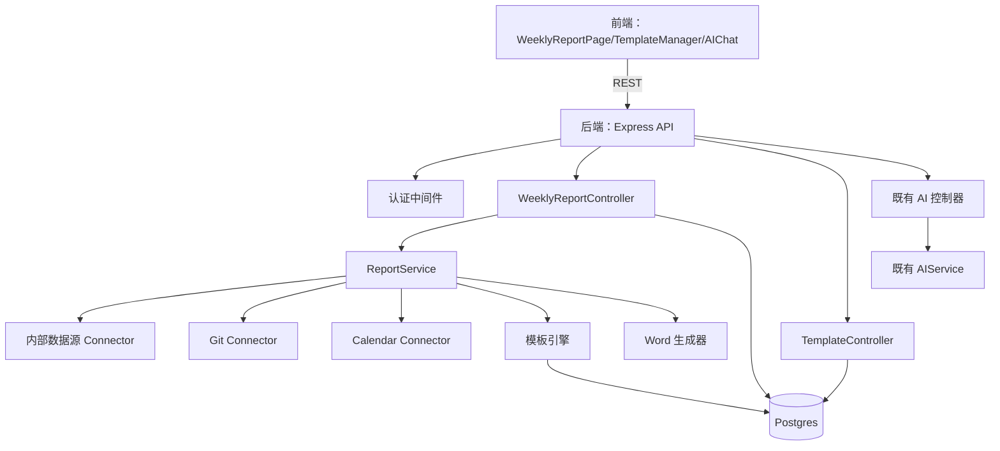
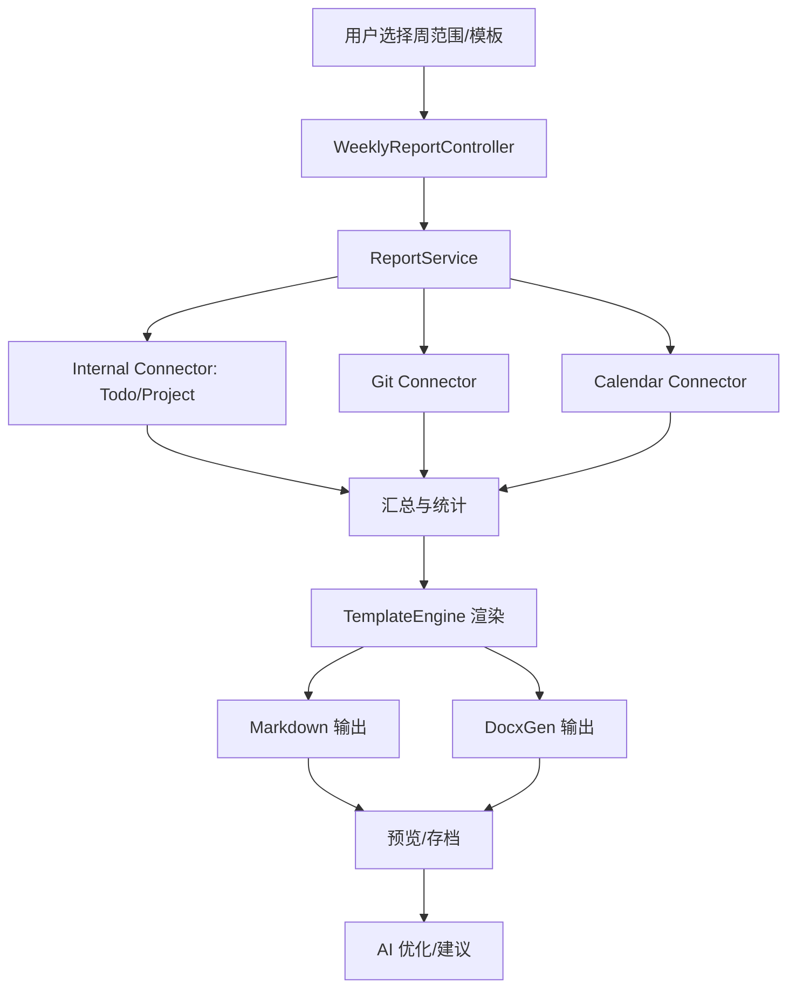

# DESIGN：周报自动生成功能

## 整体架构



## 分层设计与核心组件
- 前端页面与组件
  - `WeeklyReportPage`：周报生成入口、时间范围选择、一键生成、预览与导出。
  - `TemplateManager`：模板列表、创建/编辑、占位符提示、预览。
  - `AIChat`：对话式补充与优化（调用后端 AI 端点）。
- 后端控制器
  - `WeeklyReportController`：周报聚合与生成、预览、历史列表与详情。
  - `TemplateController`：模板 CRUD、占位符校验、示例渲染。
- 后端服务
  - `ReportService`：汇总数据、应用模板、生成 Markdown/Word、调用 AI 优化。
  - `TemplateEngine`：解析与渲染占位符（`{{placeholder}}`）、支持简单管道格式化。
  - `DocxGen`：将周报结构渲染为 `.docx`（使用 `docx` 库）。
  - `Connectors`：数据源插件（内部、Git、Calendar），统一接口 `collect(weekRange, user)`。
- 数据层
  - 新表：`weekly_reports`（存档）、`report_templates`（模板）、`report_sources`（来源配置）。
  - 复用：`todos/tasks/projects` 等既有数据模型。

## 模块依赖关系图

```mermaid
graph LR
  WRController --> ReportService
  ReportService --> TemplateEngine
  ReportService --> DocxGen
  ReportService --> Connectors
  Connectors --> (Internal/DB)
  Connectors --> (Git API)
  Connectors --> (Calendar API)
  TemplateEngine --> report_templates
  WRController --> weekly_reports
  TplController --> report_templates
```

## 接口契约定义（API）
- 周报生成与管理
  - `GET /api/reports/weekly?week_start=YYYY-MM-DD&week_end=YYYY-MM-DD`：预览聚合数据与渲染后的 Markdown；
  - `POST /api/reports/weekly/generate`：入参 `{ week_start, week_end, template_id, format:'md'|'docx' }`，返回文件下载信息与存档 ID；
  - `GET /api/reports/weekly/history?page&limit`：历史周报分页列表；
  - `GET /api/reports/weekly/:id`：获取某次周报详情（结构化数据 + 内容快照）。
- 模板管理
  - `GET /api/report-templates?page&limit`：模板列表；
  - `POST /api/report-templates`：创建模板 `{ name, format:'md'|'docx', content, placeholders?: string[] }`；
  - `PUT /api/report-templates/:id`：更新模板；
  - `DELETE /api/report-templates/:id`：删除模板；
  - `POST /api/report-templates/:id/render-preview`：示例数据渲染预览。
- AI 能力（复用及新增）
  - 复用：`POST /api/ai/rewrite`、`POST /api/ai/summarize`、`POST /api/ai/analyze`；
  - 新增：`POST /api/reports/weekly/ai/optimize`：对生成的周报进行风格/结构优化；
  - 新增：`POST /api/reports/weekly/ai/suggestions`：依据数据生成改进建议与任务优先级建议。

### 接口示例（约定）
```json
// POST /api/reports/weekly/generate
{
  "week_start": "2025-10-20",
  "week_end": "2025-10-26",
  "template_id": "tpl_123",
  "format": "md"
}
```
返回：
```json
{
  "success": true,
  "data": {
    "report_id": "wr_456",
    "download_url": "/api/reports/weekly/wr_456/download?format=md",
    "preview_markdown": "# 本周工作概览..."
  }
}
```

## 数据流向图



## 异常处理策略
- 鉴权失败：统一返回 401，前端提示登录；
- 数据源不可用：Connector 级退化与告警（返回部分数据并标注来源异常）；
- 模板渲染错误：返回详细错误信息与占位符校验结果，提示修正；
- 文件生成失败：回滚存档并返回可读错误；
- AI 失败：记录日志与退化输出（保留原始周报内容）。

## 安全与隐私
- 环境变量管理第三方密钥（`.env`）；最小化数据收集；对敏感字段（如客户名）支持脱敏；
- 端点限流与使用日志；对导出文件设置有效期或权限控制；
- OAuth/Token 接入第三方平台，遵循平台合规要求。

## 技术选型建议
- 后端：`Express + TypeScript`（与现有一致），模板引擎自研轻量 `{{}}` 占位解析，Word 使用 `docx`；
- 前端：`React + Tailwind`，图表使用 `Chart.js` 或 `ECharts`；
- 数据层：`Postgres`，历史周报存档表结构简洁；
- AI：复用 `AIService`，优先轻量模型；后续对预测可引入更稳定时序模型（如 Prophet），与 `FINAL` 文档规划一致。