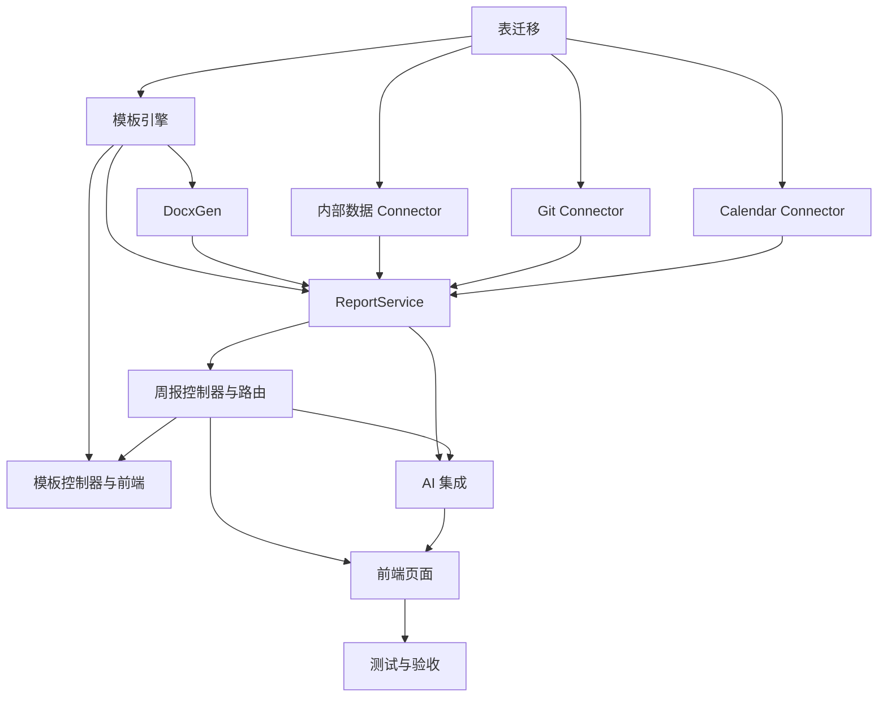

# TASK：周报自动生成功能

## 原子任务拆分
每个任务给出输入契约、输出契约、实现约束与依赖关系。

1) 定义数据表与迁移
- 输入：数据库连接、表设计草案。
- 输出：`weekly_reports`、`report_templates`、`report_sources` 迁移脚本与落库。
- 约束：复用现有命名与审计字段；避免复杂外键；保留 JSON 字段存档快照。
- 依赖：无；为后续任务提供基础。

2) TemplateEngine 占位解析实现
- 输入：模板内容（Markdown/Docx 结构化）、占位符规范。
- 输出：渲染函数 `render(template, data, options)` 与校验函数 `validatePlaceholders`。
- 约束：支持 `{{name}}` 与简单格式化管道；错误信息可读。
- 依赖：任务 1。

3) DocxGen 输出模块
- 输入：渲染后的结构化周报数据。
- 输出：生成 `.docx` 文件流与下载链接。
- 约束：采用 `docx` 库；保留表格与段落样式；失败回滚。
- 依赖：任务 2。

4) Internal Connector（Todo/Project）
- 输入：用户与周范围。
- 输出：本周任务统计（完成率、到期/延期）、项目进度快照与关键事项列表。
- 约束：查询优化与边界处理；空数据返回空结构。
- 依赖：任务 1。

5) Git Connector（提交统计）
- 输入：用户配置的仓库标识与周范围。
- 输出：提交次数、合并请求数量、主要变更目录与关键词（可选）。
- 约束：本地或 GitHub/GitLab API；鉴权通过 `.env` 或用户配置。
- 依赖：任务 1。

6) Calendar Connector（占位实现）
- 输入：OAuth/Token 与周范围。
- 输出：会议时长、关键日程与工时估算（简化版）。
- 约束：初版可返回空；后续迭代接入。
- 依赖：任务 1。

7) ReportService 汇总与统计
- 输入：各 Connector 输出与模板。
- 输出：结构化周报数据（概览、任务、项目、工时、风险与改进建议入口）。
- 约束：健壮性与退化策略；日志记录；可配置周定义。
- 依赖：任务 2、3、4、5、6。

8) WeeklyReportController 与路由
- 输入：HTTP 请求、鉴权用户、查询参数。
- 输出：预览、生成、历史与详情端点；下载接口。
- 约束：统一鉴权与错误处理；分页与限流；返回规范一致。
- 依赖：任务 7。

9) TemplateController 与前端 TemplateManager
- 输入：模板 CRUD 请求与前端交互。
- 输出：模板管理 UI 与后端端点；预览渲染。
- 约束：防止 XSS；占位符校验；版本化（可选）。
- 依赖：任务 2、8。

10) AI 集成：优化与建议
- 输入：结构化周报数据与用户偏好。
- 输出：优化后的文本段落、改进建议列表与优先级排序。
- 约束：复用 `AIService`；记录使用日志；失败退化为原始内容。
- 依赖：任务 7、8。

11) 前端 WeeklyReportPage 与 AIChat
- 输入：后端 API 响应。
- 输出：预览、导出、一键生成；对话式补充与优化。
- 约束：UI 简洁直观；状态清晰；错误提示友好。
- 依赖：任务 8、10。

12) 测试与验收
- 输入：接口规范与测试用例清单。
- 输出：单元/集成测试；端到端验收；文档更新。
- 约束：覆盖正常与异常路径；不修复无关问题。
- 依赖：所有实现任务。

## 任务依赖图
