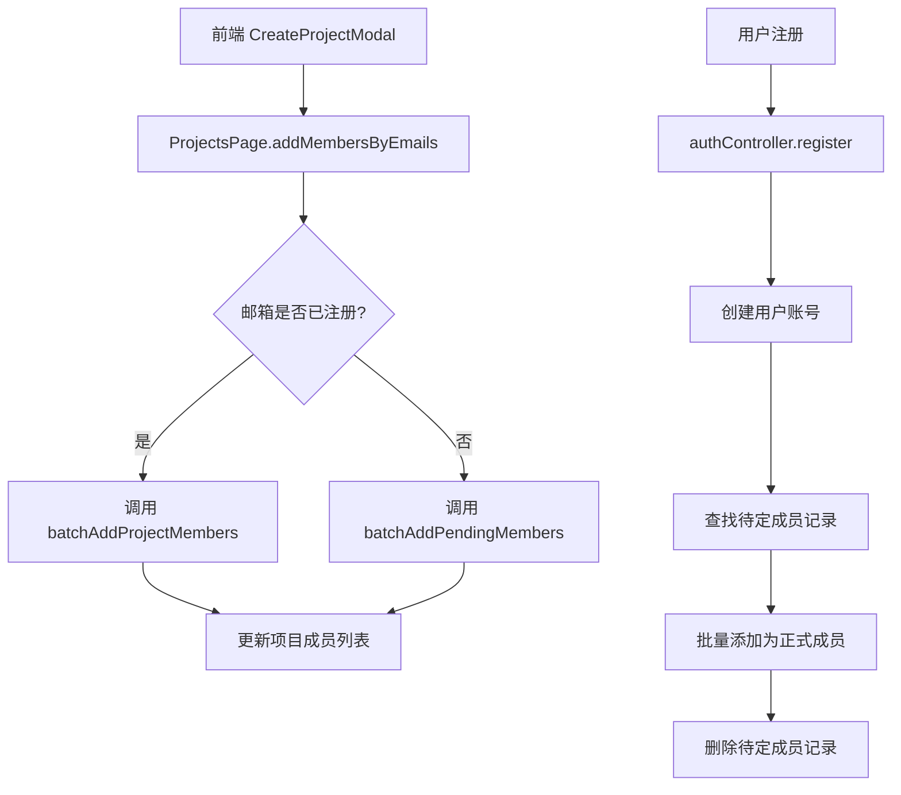
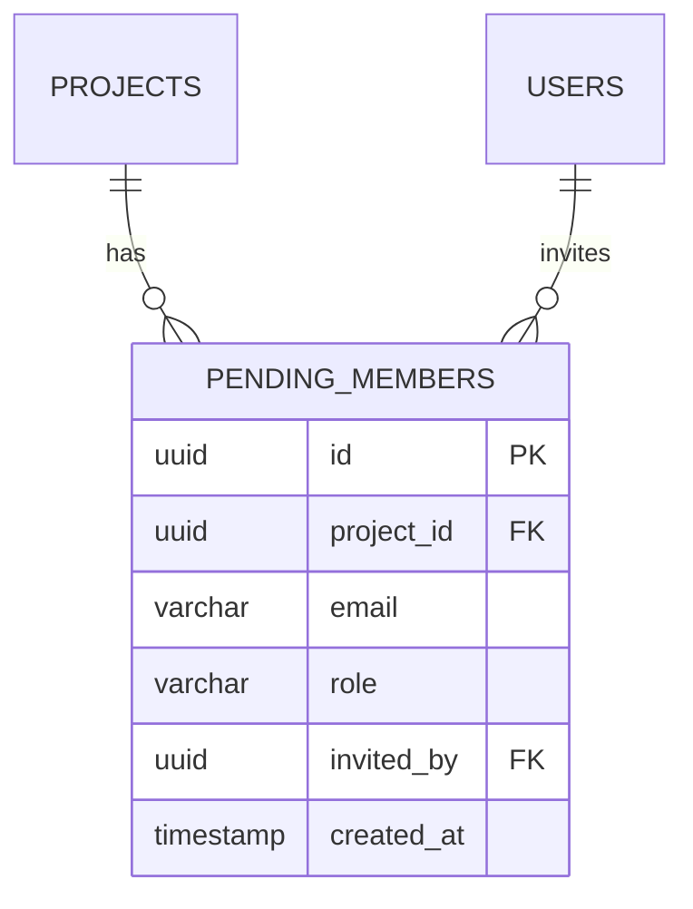
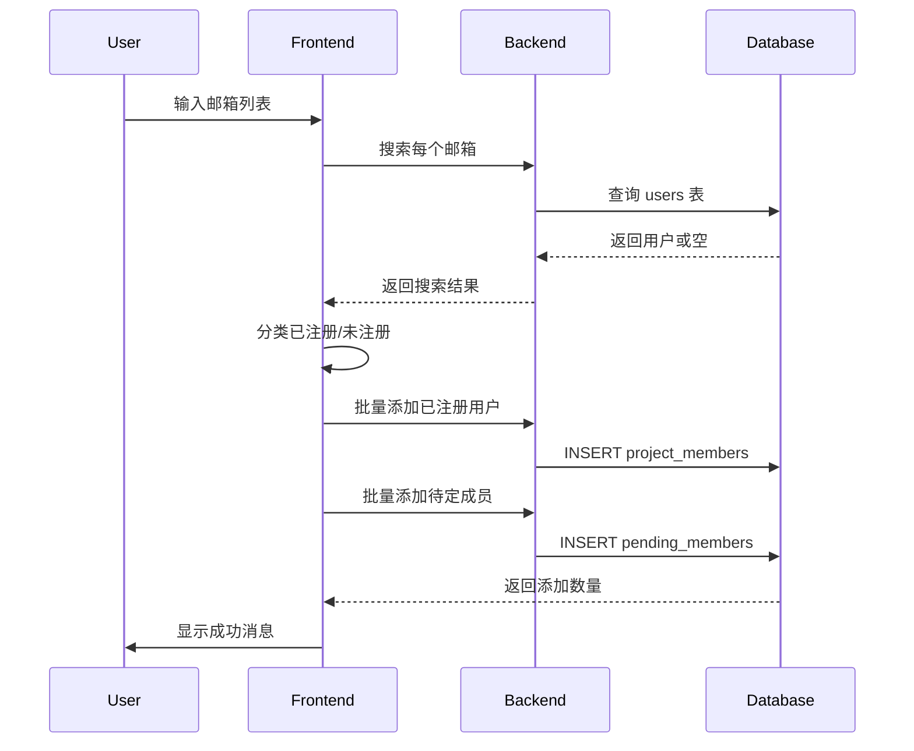
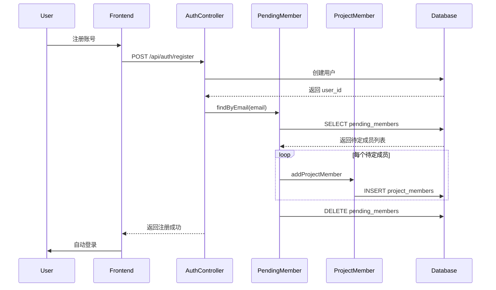

# DESIGN - 待定成员功能

## 整体架构



## 数据库设计

### 新增表: pending_members

```sql
CREATE TABLE pending_members (
  id UUID PRIMARY KEY DEFAULT uuid_generate_v4(),
  project_id UUID NOT NULL REFERENCES projects(id) ON DELETE CASCADE,
  email VARCHAR(255) NOT NULL,
  role VARCHAR(20) NOT NULL DEFAULT 'member',
  invited_by UUID REFERENCES users(id) ON DELETE SET NULL,
  created_at TIMESTAMP WITH TIME ZONE DEFAULT NOW(),
  CONSTRAINT unique_project_email UNIQUE(project_id, email)
);

-- 索引优化
CREATE INDEX idx_pending_members_email ON pending_members(LOWER(email));
CREATE INDEX idx_pending_members_project ON pending_members(project_id);
```

### 数据关系图



## 核心模块设计

### 1. 数据模型层 (PendingMember.ts)

```typescript
class PendingMember {
  // 批量添加待定成员
  static async batchAddPendingMembers(
    projectId: string,
    emails: string[],
    role: string,
    invitedBy: string
  ): Promise<{ added_count: number }>

  // 获取项目的待定成员
  static async getPendingMembers(projectId: string): Promise<PendingMember[]>

  // 删除待定成员
  static async deletePendingMember(id: string): Promise<void>

  // 根据邮箱查找待定成员（用于注册转换）
  static async findByEmail(email: string): Promise<PendingMember[]>

  // 转换待定成员为正式成员（事务）
  static async convertToMembers(
    userId: string,
    email: string
  ): Promise<{ converted_count: number }>
}
```

### 2. 控制器层 (pendingMemberController.ts)

```typescript
// 批量添加待定成员
export async function batchAddPendingMembers(req: Request, res: Response): Promise<Response>

// 获取待定成员列表
export async function getPendingMembers(req: Request, res: Response): Promise<Response>

// 删除待定成员
export async function deletePendingMember(req: Request, res: Response): Promise<Response>
```

### 3. 路由层 (projects.ts)

```typescript
// 新增路由
router.post('/:project_id/pending-members/batch', batchAddPendingMembers);
router.get('/:project_id/pending-members', getPendingMembers);
router.delete('/:project_id/pending-members/:id', deletePendingMember);
```

### 4. 前端服务层 (projectService.ts)

```typescript
class ProjectService {
  // 批量添加待定成员
  async batchAddPendingMembers(
    projectId: string,
    requests: Array<{ email: string; role: string }>
  ): Promise<{ added_count: number }>
}
```

### 5. 前端业务层 (ProjectsPage.tsx)

修改 `addMembersByEmails` 函数:
```typescript
const addMembersByEmails = async (
  projectId: string,
  emails: string[],
  role: 'admin' | 'member' | 'observer'
) => {
  const registeredUsers = [];
  const unregisteredEmails = [];

  // 分类邮箱
  for (const email of emails) {
    const users = await searchAvailableUsers(projectId, email, 1);
    if (users.length > 0) {
      registeredUsers.push({ user_id: users[0].id, role });
    } else {
      unregisteredEmails.push(email);
    }
  }

  let totalAdded = 0;

  // 添加已注册用户
  if (registeredUsers.length > 0) {
    const res1 = await batchAddProjectMembers(projectId, registeredUsers);
    totalAdded += res1.added_count;
  }

  // 添加待定成员
  if (unregisteredEmails.length > 0) {
    const res2 = await batchAddPendingMembers(projectId, unregisteredEmails, role);
    totalAdded += res2.added_count;
  }

  return { added_count: totalAdded };
}
```

## 关键流程设计

### 流程 1: 添加成员（包含待定）



### 流程 2: 注册转换



## 异常处理策略

### 1. 重复添加
- **场景**: 同一邮箱多次添加到同一项目
- **处理**: 数据库 UNIQUE 约束 + 后端捕获错误，返回友好提示
- **代码**: 使用 `ON CONFLICT DO NOTHING` 或捕获 `23505` 错误码

### 2. 邮箱格式错误
- **场景**: 输入无效邮箱格式
- **处理**: 前后端都进行格式验证
- **前端**: 使用 regex 验证
- **后端**: 使用 validator 库

### 3. 注册转换失败
- **场景**: 添加正式成员时出错
- **处理**: 事务回滚，保留待定成员记录
- **日志**: 记录错误信息用于排查

### 4. 项目删除
- **场景**: 项目被删除
- **处理**: 使用 `ON DELETE CASCADE` 自动删除待定成员

## 性能优化

1. **批量操作**: 使用 Supabase 的批量插入 API
2. **索引优化**: 在 email 字段创建索引（不区分大小写）
3. **事务处理**: 注册转换使用事务确保原子性
4. **缓存策略**: 待定成员数量较少，暂不需要缓存

## 安全考虑

1. **权限验证**: 只有项目成员可以添加待定成员
2. **邮箱验证**: 后端验证邮箱格式
3. **防注入**: 使用参数化查询
4. **日志记录**: 记录所有待定成员操作用于审计

## 接口规范

### API 1: 批量添加待定成员

**请求**:
```
POST /api/projects/:project_id/pending-members/batch
Authorization: Bearer <token>

{
  "members": [
    { "email": "user1@example.com", "role": "member" },
    { "email": "user2@example.com", "role": "admin" }
  ]
}
```

**响应**:
```json
{
  "added_count": 2,
  "skipped": []
}
```

### API 2: 获取待定成员列表

**请求**:
```
GET /api/projects/:project_id/pending-members
Authorization: Bearer <token>
```

**响应**:
```json
{
  "pending_members": [
    {
      "id": "uuid",
      "email": "user1@example.com",
      "role": "member",
      "created_at": "2025-11-01T10:00:00Z"
    }
  ]
}
```

## 可扩展性设计

### 未来扩展点
1. **邮箱通知**: 添加邮件服务发送邀请
2. **邀请过期**: 添加 `expires_at` 字段
3. **邀请状态**: 添加 `status` 字段 (pending/accepted/expired)
4. **UI 管理**: 项目详情页显示和管理待定成员
5. **批量操作**: 批量删除/重新邀请


