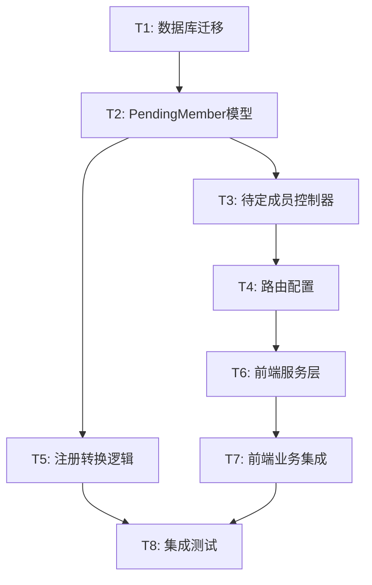

# TASK - 待定成员功能

## 任务依赖图

## 任务列表

### T1: 创建数据库迁移 ⚡ [高优先级]

**输入契约**:
- 现有的 migrations 目录结构
- Supabase 数据库连接

**输出契约**:
- 创建 `server/src/migrations/YYYYMMDD_create_pending_members.sql`
- 包含表创建、索引、约束
- 可独立执行的 SQL 脚本

**实现约束**:
- 使用 UUID 主键
- 外键级联删除
- 唯一约束 (project_id, email)
- 索引优化查询性能

**验收标准**:
- ✅ SQL 脚本语法正确
- ✅ 执行后表结构符合设计
- ✅ 索引创建成功
- ✅ 约束生效

**依赖关系**:
- 前置: 无
- 后置: T2

---

### T2: 实现 PendingMember 模型 ⚡ [核心任务]

**输入契约**:
- pending_members 表已创建
- 现有的 ProjectMember 模型作为参考
- Supabase Admin 客户端

**输出契约**:
- 创建 `server/src/models/PendingMember.ts`
- 实现方法:
  - `batchAddPendingMembers()` - 批量添加
  - `getPendingMembers()` - 获取列表
  - `deletePendingMember()` - 删除
  - `findByEmail()` - 根据邮箱查找
  - `convertToMembers()` - 转换为正式成员

**实现约束**:
- TypeScript 类型定义完整
- 使用 Supabase 客户端操作数据库
- 错误处理完善
- 邮箱匹配不区分大小写

**验收标准**:
- ✅ TypeScript 编译无错误
- ✅ 所有方法实现完整
- ✅ 错误处理覆盖边界情况
- ✅ 代码符合现有规范

**依赖关系**:
- 前置: T1
- 后置: T3, T5

---

### T3: 实现待定成员控制器 🔵 [API层]

**输入契约**:
- PendingMember 模型已实现
- 现有的 projectMemberController 作为参考
- Express Request/Response 类型

**输出契约**:
- 创建 `server/src/controllers/pendingMemberController.ts`
- 实现控制器方法:
  - `batchAddPendingMembers()` - POST 批量添加
  - `getPendingMembers()` - GET 获取列表
  - `deletePendingMember()` - DELETE 删除

**实现约束**:
- 使用 JWT 认证
- 验证用户是否有权限操作项目
- 请求参数验证
- 统一错误响应格式

**验收标准**:
- ✅ 认证中间件生效
- ✅ 权限验证正确
- ✅ 参数验证完整
- ✅ 错误处理友好

**依赖关系**:
- 前置: T2
- 后置: T4

---

### T4: 配置路由 🟢 [配置任务]

**输入契约**:
- pendingMemberController 已实现
- 现有的 `server/src/routes/projects.ts`

**输出契约**:
- 修改 `server/src/routes/projects.ts`
- 添加路由:
  - `POST /:project_id/pending-members/batch`
  - `GET /:project_id/pending-members`
  - `DELETE /:project_id/pending-members/:id`

**实现约束**:
- 使用现有的 authenticateToken 中间件
- 路由命名遵循 RESTful 规范
- 保持路由顺序合理（避免冲突）

**验收标准**:
- ✅ 路由注册成功
- ✅ 中间件正确应用
- ✅ 路径参数解析正确
- ✅ 不影响现有路由

**依赖关系**:
- 前置: T3
- 后置: T6

---

### T5: 实现注册转换逻辑 ⚡ [核心任务]

**输入契约**:
- PendingMember 模型已实现
- 现有的 `server/src/controllers/authController.ts`
- ProjectMember 模型

**输出契约**:
- 修改 `authController.ts` 的 `register` 函数
- 在用户注册成功后:
  1. 查找匹配邮箱的待定成员
  2. 批量添加为正式成员
  3. 删除待定成员记录
- 使用事务确保原子性

**实现约束**:
- 不影响现有注册流程
- 转换失败不阻断注册（记录日志）
- 邮箱匹配不区分大小写
- 使用 Supabase 事务

**验收标准**:
- ✅ 注册成功后自动转换
- ✅ 事务处理正确
- ✅ 转换失败有日志
- ✅ 不阻断正常注册

**依赖关系**:
- 前置: T2
- 后置: T8

---

### T6: 实现前端服务层 🟡 [前端API]

**输入契约**:
- 后端 API 已实现并可访问
- 现有的 `client/src/services/projectService.ts`
- apiClient 配置

**输出契约**:
- 修改 `projectService.ts` 添加方法:
  - `batchAddPendingMembers()` - 批量添加待定成员

**实现约束**:
- 使用现有的 apiClient
- TypeScript 类型定义完整
- 错误处理统一
- 遵循现有命名规范

**验收标准**:
- ✅ TypeScript 编译无错误
- ✅ API 调用参数正确
- ✅ 返回类型定义完整
- ✅ 错误处理完善

**依赖关系**:
- 前置: T4
- 后置: T7

---

### T7: 前端业务集成 🔵 [UI集成]

**输入契约**:
- 前端服务层已实现
- 现有的 `client/src/pages/ProjectsPage.tsx`
- CreateProjectModal 组件

**输出契约**:
- 修改 `ProjectsPage.tsx` 的 `addMembersByEmails` 函数
- 逻辑:
  1. 遍历邮箱列表
  2. 搜索已注册用户
  3. 已注册用户 → 添加为正式成员
  4. 未注册邮箱 → 添加为待定成员
  5. 返回总添加数量

**实现约束**:
- 不修改 CreateProjectModal 组件
- 保持现有函数签名
- 错误处理友好
- 显示正确的成员数量

**验收标准**:
- ✅ 可以添加未注册邮箱
- ✅ 已注册用户正常添加
- ✅ 成员数量统计正确
- ✅ 错误提示友好
- ✅ 不影响现有功能

**依赖关系**:
- 前置: T6
- 后置: T8

---

### T8: 集成测试验证 🟢 [测试任务]

**输入契约**:
- 所有功能已实现
- 后端服务运行中
- 前端应用运行中

**输出契约**:
- 测试用例:
  1. 添加未注册邮箱为待定成员
  2. 添加已注册用户为正式成员
  3. 混合添加（部分注册、部分未注册）
  4. 用户注册后自动转换
  5. 重复添加的处理
- 创建测试报告文档

**实现约束**:
- 使用真实数据库测试
- 测试数据清理
- 覆盖正常流程和异常情况

**验收标准**:
- ✅ 所有测试用例通过
- ✅ 功能符合验收标准
- ✅ 无遗留测试数据
- ✅ 测试报告完整

**依赖关系**:
- 前置: T5, T7
- 后置: 无

---

## 任务执行顺序

**阶段 1: 数据层** (顺序执行)
1. T1: 数据库迁移
2. T2: PendingMember 模型

**阶段 2: API层** (顺序执行)
3. T3: 待定成员控制器
4. T4: 路由配置

**阶段 3: 业务逻辑** (并行执行)
5. T5: 注册转换逻辑 ⚡ (并行)
6. T6: 前端服务层 ⚡ (并行)

**阶段 4: 集成** (顺序执行)
7. T7: 前端业务集成
8. T8: 集成测试验证

## 风险评估

- **高风险**: T2 (核心模型), T5 (注册转换)
- **中风险**: T3 (控制器), T7 (前端集成)
- **低风险**: T1 (迁移), T4 (路由), T6 (服务层), T8 (测试)

## 预估工作量

- 总任务数: 8
- 预估时间: 1.5-2 小时
- 核心任务: 4 个
- 测试验证: 1 个

