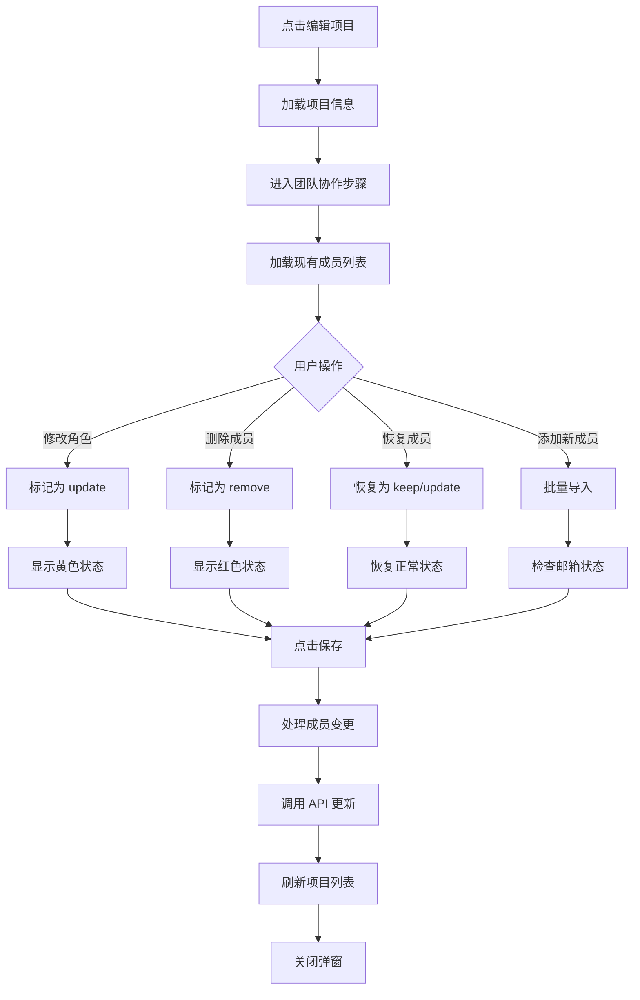

# 成员管理功能实现总结

## 🎯 功能概述

在项目编辑模式下，成功实现了完整的成员管理功能，包括：
- ✅ 查看所有现有成员
- ✅ 修改成员角色（管理员/成员/观察者）
- ✅ 删除成员
- ✅ 恢复误删成员
- ✅ 批量添加新成员
- ✅ 实时状态追踪和变更统计

---

## 📋 核心实现

### 1. 数据结构设计

#### MemberChange 接口
```typescript
interface MemberChange {
  memberId: string;              // 成员ID
  userId: string;                // 用户ID
  email: string;                 // 邮箱
  displayName: string;           // 显示名称
  originalRole: 'admin' | 'member' | 'observer';  // 原始角色
  newRole: 'admin' | 'member' | 'observer';       // 新角色
  action: 'keep' | 'update' | 'remove';           // 操作类型
}
```

### 2. 状态管理

```typescript
// 现有成员列表
const [existingMembers, setExistingMembers] = useState<MemberChange[]>([]);

// 加载状态
const [loadingMembers, setLoadingMembers] = useState(false);
```

### 3. 核心功能实现

#### 3.1 加载现有成员
```typescript
const loadExistingMembers = async (projectId: string) => {
  setLoadingMembers(true);
  try {
    const members = await projectService.getProjectMembers(projectId);
    const memberChanges: MemberChange[] = members.map(m => ({
      memberId: m.id,
      userId: m.user_id,
      email: m.email,
      displayName: m.display_name || m.email.split('@')[0],
      originalRole: m.role,
      newRole: m.role,
      action: 'keep'
    }));
    setExistingMembers(memberChanges);
  } catch (error) {
    console.error('加载成员失败:', error);
  } finally {
    setLoadingMembers(false);
  }
};
```

#### 3.2 修改成员角色
```typescript
const handleMemberRoleChange = (memberId: string, newRole: 'admin' | 'member' | 'observer') => {
  setExistingMembers(prev => prev.map(m => {
    if (m.memberId === memberId) {
      return {
        ...m,
        newRole,
        action: newRole !== m.originalRole ? 'update' : 'keep'
      };
    }
    return m;
  }));
};
```

#### 3.3 删除成员
```typescript
const handleMemberRemove = (memberId: string) => {
  setExistingMembers(prev => prev.map(m =>
    m.memberId === memberId ? { ...m, action: 'remove' } : m
  ));
};
```

#### 3.4 恢复成员
```typescript
const handleMemberRestore = (memberId: string) => {
  setExistingMembers(prev => prev.map(m => {
    if (m.memberId === memberId) {
      return {
        ...m,
        action: m.newRole !== m.originalRole ? 'update' : 'keep'
      };
    }
    return m;
  }));
};
```

#### 3.5 提交成员变更
```typescript
const processMemberChanges = async (projectId: string) => {
  const changes = existingMembers.filter(m => m.action !== 'keep');
  
  if (changes.length === 0) {
    return;
  }

  let successCount = 0;
  let errorCount = 0;

  for (const change of changes) {
    try {
      if (change.action === 'remove') {
        await projectService.removeMember(projectId, change.memberId);
        successCount++;
      } else if (change.action === 'update') {
        await projectService.updateMemberRole(projectId, change.memberId, change.newRole);
        successCount++;
      }
    } catch (error) {
      console.error(`处理成员 ${change.email} 失败:`, error);
      errorCount++;
    }
  }

  console.log(`成功处理 ${successCount} 个成员变更，失败 ${errorCount} 个`);
};
```

---

## 🎨 UI 设计

### 视觉状态

| 状态 | 背景色 | 边框色 | 说明 |
|------|--------|--------|------|
| 正常 | 白色 | 灰色 | 无变更 |
| 角色已修改 | 黄色浅色 | 黄色 | 角色被修改但未删除 |
| 待删除 | 红色浅色 | 红色 | 标记为删除，半透明 |

### 成员卡片结构

```
┌─────────────────────────────────────────────────────────┐
│ [头像] [姓名]              [角色选择器]  [状态标签]  [删除] │
│        [邮箱]                                            │
└─────────────────────────────────────────────────────────┘
```

### 交互元素

1. **头像**：显示用户姓名首字母
2. **角色选择器**：下拉菜单（管理员/成员/观察者）
3. **状态标签**：
   - 黄色："角色已修改"
   - 红色："待删除"
4. **操作按钮**：
   - 删除：垃圾桶图标
   - 恢复：旋转的 X 图标（绿色）

---

## 📊 变更统计

在成员列表底部显示实时统计：

```typescript
{existingMembers.filter(m => m.action === 'update').length > 0 && (
  <span className="text-yellow-600">
    {existingMembers.filter(m => m.action === 'update').length} 个角色变更
  </span>
)}
{existingMembers.filter(m => m.action === 'remove').length > 0 && (
  <span className="text-red-600">
    {existingMembers.filter(m => m.action === 'remove').length} 个待删除
  </span>
)}
```

---

## 🔄 完整流程

### 编辑项目时的成员管理流程



---

## 🛠️ 技术细节

### 1. 状态同步

- 使用 `useEffect` 在弹窗打开时加载成员
- 使用 `useState` 管理成员变更状态
- 使用 `action` 字段追踪每个成员的操作类型

### 2. 性能优化

- 只在编辑模式下加载成员列表
- 使用 `loadingMembers` 状态显示加载动画
- 批量处理成员变更，减少 API 调用

### 3. 错误处理

- API 调用失败时显示错误信息
- 逐个处理成员变更，单个失败不影响其他操作
- 记录成功和失败数量

### 4. 用户体验

- 实时视觉反馈（颜色变化）
- 清晰的状态标签
- 可撤销的删除操作
- 变更统计显示

---

## 📝 代码变更摘要

### 修改的文件

1. **client/src/components/projects/ProjectCreateModal.tsx**
   - 新增 `MemberChange` 接口
   - 新增 `existingMembers` 状态
   - 新增 `loadExistingMembers` 函数
   - 新增成员管理 UI 区域
   - 新增成员操作处理函数
   - 修改提交逻辑，处理成员变更

### 新增的功能

- ✅ 现有成员列表展示
- ✅ 角色修改功能
- ✅ 成员删除功能
- ✅ 删除恢复功能
- ✅ 变更状态追踪
- ✅ 实时统计显示

---

## 🧪 测试建议

### 功能测试

1. **查看成员**
   - 编辑有成员的项目
   - 编辑无成员的项目
   - 检查加载状态

2. **修改角色**
   - 修改单个成员角色
   - 修改多个成员角色
   - 取消修改（改回原角色）

3. **删除成员**
   - 删除单个成员
   - 删除多个成员
   - 恢复删除的成员

4. **组合操作**
   - 同时修改、删除、添加
   - 提交后验证变更
   - 重新打开检查持久化

### 边界测试

- 删除所有成员
- 修改自己的角色
- 网络错误处理
- 权限不足处理

---

## 🎉 功能亮点

1. **直观的视觉反馈**
   - 颜色编码清晰
   - 状态标签明确
   - 实时统计显示

2. **灵活的操作方式**
   - 支持撤销删除
   - 支持批量操作
   - 支持角色快速切换

3. **完善的错误处理**
   - API 失败不影响其他操作
   - 清晰的错误提示
   - 操作可追溯

4. **优秀的用户体验**
   - 加载状态提示
   - 空状态友好提示
   - 操作即时反馈

---

## 📚 相关文档

- [成员管理功能测试指南](./成员管理功能测试指南.md)
- [FINAL_批量导入成员优化.md](./FINAL_批量导入成员优化.md)
- [TODO_批量导入成员优化.md](./TODO_批量导入成员优化.md)

---

## 🚀 后续优化建议

1. **性能优化**
   - 考虑使用虚拟滚动处理大量成员
   - 批量 API 调用优化

2. **功能增强**
   - 添加成员搜索功能
   - 支持成员排序
   - 添加批量角色修改

3. **用户体验**
   - 添加操作确认对话框
   - 支持拖拽排序
   - 添加成员详情查看

---

**实现完成时间：** 2025-11-01  
**实现状态：** ✅ 完成  
**测试状态：** 📋 待用户测试

