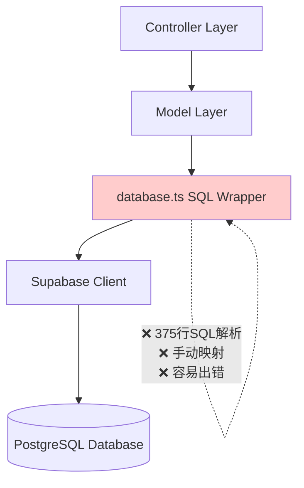
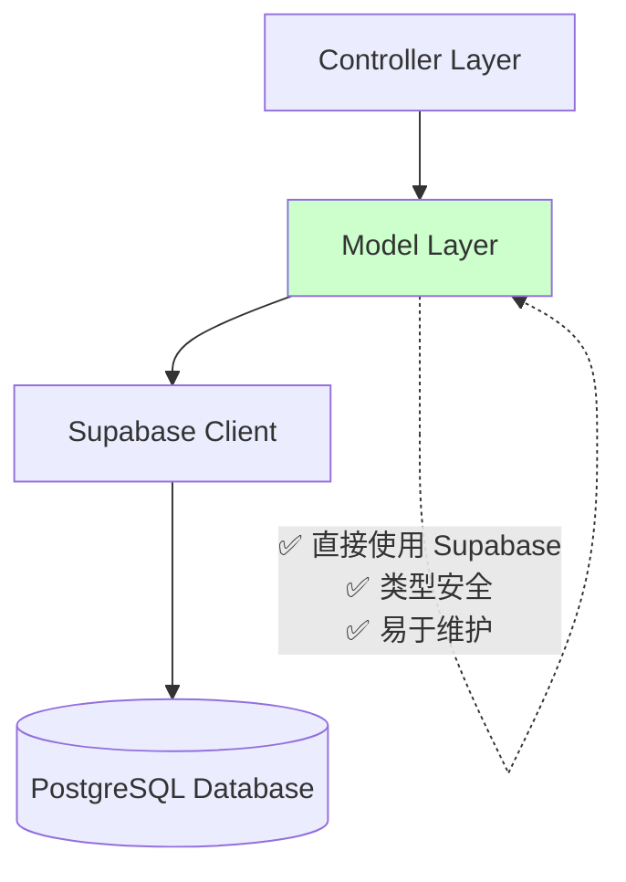
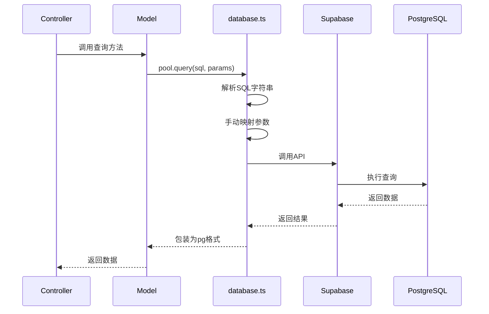
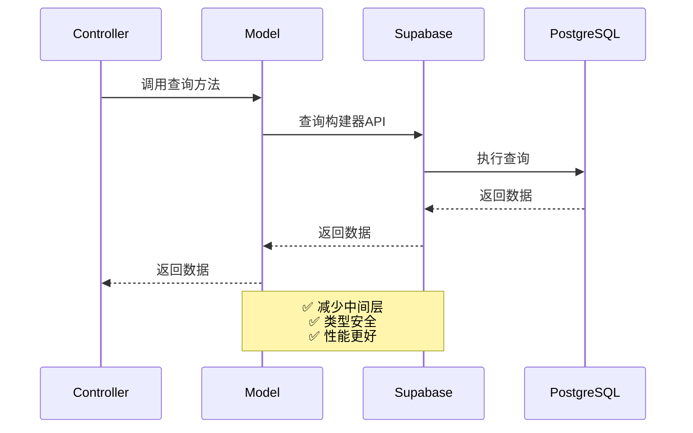

# DESIGN：数据库架构重构 - 迁移到 Supabase 客户端

**日期**: 2025-10-31  
**基于**: CONSENSUS_数据库架构重构.md

---

## 整体架构设计

### 当前架构（Before）



### 目标架构（After）



---

## 核心组件设计

### 1. 配置层简化

#### `server/src/config/database.ts`

**修改前（375行）：**
```typescript
export class SupabaseDatabase {
  static async query(text: string, params: any[]) {
    // 375行的SQL解析逻辑...
  }
}
export default supabasePool;
```

**修改后（3行）：**
```typescript
import { supabaseAdmin } from './supabase';
export default supabaseAdmin;
export { supabaseAdmin };
```

#### `server/src/config/supabase.ts` - 保持不变

```typescript
import { createClient } from '@supabase/supabase-js';

export const supabaseAdmin = createClient(
  process.env.SUPABASE_URL!,
  process.env.SUPABASE_SERVICE_KEY!
);
```

---

## Model 层重写设计

### 2. UserModel 重写（简单查询）

**优先级**: 🔥🔥🔥 高（认证核心）  
**复杂度**: ⭐ 低

#### 现有方法

| 方法 | SQL 类型 | 复杂度 |
|------|---------|--------|
| `findById()` | SELECT + WHERE | 简单 |
| `findByEmail()` | SELECT + WHERE | 简单 |
| `create()` | INSERT | 简单 |
| `update()` | UPDATE | 简单 |

#### 重写示例

**修改前：**
```typescript
static async findById(id: string): Promise<User | null> {
  const query = 'SELECT * FROM users WHERE id = $1';
  const result = await pool.query(query, [id]);
  return result.rows[0] || null;
}
```

**修改后：**
```typescript
static async findById(id: string): Promise<User | null> {
  const { data, error } = await supabaseAdmin
    .from('users')
    .select('*')
    .eq('id', id)
    .single();
  
  if (error) {
    if (error.code === 'PGRST116') return null; // Not found
    throw error;
  }
  
  return data;
}
```

---

### 3. NoteModel 重写（复杂筛选）

**优先级**: 🔥🔥🔥 高（已暴露BUG）  
**复杂度**: ⭐⭐⭐⭐ 高

#### 现有方法

| 方法 | 功能 | 复杂度 |
|------|------|--------|
| `findByUserId()` | 列表查询+筛选+分页 | 高 |
| `findById()` | 单个查询 | 低 |
| `create()` | 创建笔记 | 中 |
| `update()` | 更新笔记 | 中 |
| `delete()` | 删除笔记 | 低 |
| `count()` | 计数查询 | 中 |

#### 关键功能：findByUserId() 重写

**筛选条件支持：**
- ✅ `user_id` - 用户过滤
- ✅ `notebook_id` - 笔记本过滤
- ✅ `tags` - 标签数组重叠筛选
- ✅ `is_favorite` - 收藏筛选
- ✅ `is_archived` - 归档筛选
- ✅ `search` - 标题和内容搜索
- ✅ `order_by` - 排序
- ✅ `limit` / `offset` - 分页

**修改后：**
```typescript
static async findByUserId(
  userId: string, 
  options: FilterOptions = {}
): Promise<Note[]> {
  let query = supabaseAdmin
    .from('notes')
    .select('*')
    .eq('user_id', userId);

  // 笔记本筛选
  if (options.notebook_id) {
    query = query.eq('notebook_id', options.notebook_id);
  }

  // 标签筛选 - 数组重叠
  if (options.tags && options.tags.length > 0) {
    query = query.overlaps('tags', options.tags);
  }

  // 收藏筛选
  if (options.is_favorite !== undefined) {
    query = query.eq('is_favorite', options.is_favorite);
  }

  // 归档筛选
  if (options.is_archived !== undefined) {
    query = query.eq('is_archived', options.is_archived);
  }

  // 搜索 - 标题或内容
  if (options.search) {
    query = query.or(
      `title.ilike.%${options.search}%,content_text.ilike.%${options.search}%`
    );
  }

  // 排序
  const orderBy = options.order_by || 'updated_at';
  const ascending = options.order_direction === 'asc';
  query = query.order(orderBy, { ascending });

  // 分页
  if (options.limit) {
    query = query.limit(options.limit);
  }
  if (options.offset) {
    const end = options.offset + (options.limit || 20) - 1;
    query = query.range(options.offset, end);
  }

  const { data, error } = await query;
  
  if (error) throw error;
  return data || [];
}
```

#### 计数查询重写

**修改后：**
```typescript
static async count(userId: string, options: FilterOptions = {}): Promise<number> {
  let query = supabaseAdmin
    .from('notes')
    .select('*', { count: 'exact', head: true })
    .eq('user_id', userId);

  // 应用相同的筛选条件
  if (options.notebook_id) {
    query = query.eq('notebook_id', options.notebook_id);
  }
  if (options.tags && options.tags.length > 0) {
    query = query.overlaps('tags', options.tags);
  }
  if (options.is_favorite !== undefined) {
    query = query.eq('is_favorite', options.is_favorite);
  }
  if (options.is_archived !== undefined) {
    query = query.eq('is_archived', options.is_archived);
  }
  if (options.search) {
    query = query.or(
      `title.ilike.%${options.search}%,content_text.ilike.%${options.search}%`
    );
  }

  const { count, error } = await query;
  
  if (error) throw error;
  return count || 0;
}
```

---

### 4. TodoModel 重写（复杂业务逻辑）

**优先级**: 🔥🔥 中高  
**复杂度**: ⭐⭐⭐⭐ 高

#### 现有方法

| 方法 | 功能 | 复杂度 |
|------|------|--------|
| `findByUserId()` | 列表查询+筛选 | 高 |
| `findById()` | 单个查询 | 低 |
| `create()` | 创建待办 | 中 |
| `update()` | 更新待办 | 中 |
| `delete()` | 删除待办 | 低 |
| `updateStatus()` | 状态更新 | 中 |

#### 重写策略

类似 NoteModel，使用 Supabase 查询构建器：
```typescript
static async findByUserId(userId: string, filters: any = {}) {
  let query = supabaseAdmin
    .from('todos')
    .select('*')
    .eq('user_id', userId);

  if (filters.status) {
    query = query.eq('status', filters.status);
  }
  if (filters.priority) {
    query = query.eq('priority', filters.priority);
  }
  if (filters.due_date_before) {
    query = query.lt('due_date', filters.due_date_before);
  }
  // ... 其他筛选条件

  const { data, error } = await query;
  if (error) throw error;
  return data || [];
}
```

---

### 5. ProjectModel 重写（JOIN 查询）

**优先级**: 🔥🔥 中高  
**复杂度**: ⭐⭐⭐⭐⭐ 非常高

#### 挑战：复杂 JOIN 和聚合查询

**原 SQL：**
```sql
SELECT p.*, 
       COUNT(pm.user_id) as member_count,
       COUNT(t.id) as task_count,
       COUNT(CASE WHEN t.status = 'completed' THEN 1 END) as tasks_completed,
       ROUND(...) as progress
FROM projects p
LEFT JOIN project_members pm ON p.id = pm.project_id
LEFT JOIN tasks t ON p.id = t.project_id
WHERE (p.owner_id = $1 OR p.id IN (...))
GROUP BY p.id
```

#### 解决方案1：使用 Supabase 外键关系

```typescript
static async findByUserId(userId: string, filters: any = {}) {
  const { data, error } = await supabaseAdmin
    .from('projects')
    .select(`
      *,
      project_members(count),
      tasks(id, status)
    `)
    .or(`owner_id.eq.${userId},id.in.(
      select project_id from project_members where user_id = ${userId}
    )`);
  
  if (error) throw error;
  
  // 手动计算统计数据
  return data.map(project => ({
    ...project,
    member_count: project.project_members.length,
    task_count: project.tasks.length,
    tasks_completed: project.tasks.filter(t => t.status === 'completed').length,
    progress: project.tasks.length > 0
      ? Math.round((project.tasks.filter(t => t.status === 'completed').length / project.tasks.length) * 100)
      : 0
  }));
}
```

#### 解决方案2：使用 RPC 调用数据库函数（推荐）

**创建数据库函数：**
```sql
CREATE OR REPLACE FUNCTION get_user_projects(user_id_param UUID)
RETURNS TABLE (
  -- 项目字段
  id UUID,
  name TEXT,
  -- ... 其他字段
  -- 统计字段
  member_count BIGINT,
  task_count BIGINT,
  tasks_completed BIGINT,
  progress NUMERIC
) AS $$
BEGIN
  RETURN QUERY
  SELECT p.*, 
         COUNT(DISTINCT pm.user_id) as member_count,
         COUNT(t.id) as task_count,
         COUNT(CASE WHEN t.status = 'completed' THEN 1 END) as tasks_completed,
         COALESCE(
           CASE 
             WHEN COUNT(t.id) = 0 THEN 0
             ELSE ROUND((COUNT(CASE WHEN t.status = 'completed' THEN 1 END) * 100.0 / COUNT(t.id))::numeric, 2)
           END, 0
         ) as progress
  FROM projects p
  LEFT JOIN project_members pm ON p.id = pm.project_id
  LEFT JOIN tasks t ON p.id = t.project_id
  WHERE (p.owner_id = user_id_param OR p.id IN (
    SELECT project_id FROM project_members WHERE user_id = user_id_param
  ))
  GROUP BY p.id;
END;
$$ LANGUAGE plpgsql;
```

**在 Model 中调用：**
```typescript
static async findByUserId(userId: string, filters: any = {}) {
  const { data, error } = await supabaseAdmin
    .rpc('get_user_projects', { user_id_param: userId });
  
  if (error) throw error;
  
  // 应用额外的筛选条件
  let result = data || [];
  if (filters.status) {
    result = result.filter(p => p.status === filters.status);
  }
  // ... 其他筛选
  
  return result;
}
```

---

### 6. 其他 Models 重写（中低复杂度）

#### TaskModel
- 类似 TodoModel，简单查询和筛选
- 使用 Supabase 查询构建器

#### ProjectMemberModel
- 简单的关系表查询
- 使用 `.eq()`, `.in()` 等方法

#### NotificationModel
- 通知查询和更新
- 使用 Supabase 查询构建器

#### AIUsageLogModel
- 日志查询和统计
- 使用 Supabase 查询构建器

---

## 数据流设计

### 查询流程（Before）



### 查询流程（After）



---

## 异常处理策略

### 统一错误处理

```typescript
// 通用错误处理函数
function handleSupabaseError(error: any): never {
  console.error('Supabase error:', error);
  
  if (error.code === 'PGRST116') {
    throw new Error('Record not found');
  } else if (error.code === '23505') {
    throw new Error('Duplicate record');
  } else if (error.code === '23503') {
    throw new Error('Foreign key violation');
  } else {
    throw new Error('Database error: ' + error.message);
  }
}

// 在 Model 中使用
static async findById(id: string): Promise<Note | null> {
  const { data, error } = await supabaseAdmin
    .from('notes')
    .select('*')
    .eq('id', id)
    .single();
  
  if (error) {
    if (error.code === 'PGRST116') return null;
    handleSupabaseError(error);
  }
  
  return data;
}
```

---

## 接口契约定义

### Model 层返回格式保持不变

所有 Model 方法的返回格式与原有保持一致，确保 Controller 层无需修改。

**示例：**
```typescript
// 原有格式
interface Note {
  id: string;
  user_id: string;
  title: string;
  content: string;
  tags: string[];
  created_at: Date;
  updated_at: Date;
}

// 新实现返回相同格式
static async findById(id: string): Promise<Note | null> {
  // ... Supabase 查询
  return data; // 格式完全一致
}
```

---

## 性能优化设计

### 1. 减少查询次数

使用 Supabase 的关系查询减少 N+1 问题：

```typescript
// ❌ N+1 查询
const notes = await NoteModel.findByUserId(userId);
for (const note of notes) {
  note.notebook = await NotebookModel.findById(note.notebook_id);
}

// ✅ 单次查询
const { data } = await supabaseAdmin
  .from('notes')
  .select(`
    *,
    notebooks!inner(id, name)
  `)
  .eq('user_id', userId);
```

### 2. 使用索引

确保数据库表有适当的索引：
- `notes(user_id)` - 用户查询
- `notes(tags)` - 标签筛选（GIN 索引）
- `notes(created_at)` - 时间排序

### 3. 分页优化

使用 `.range()` 而不是 `LIMIT/OFFSET`：
```typescript
query = query.range(offset, offset + limit - 1);
```

---

## 设计原则

### 1. 简洁性
- 直接使用 Supabase API
- 避免不必要的抽象层
- 代码易读易维护

### 2. 类型安全
- 充分利用 TypeScript
- 定义清晰的接口
- 避免 `any` 类型

### 3. 一致性
- 统一的错误处理
- 统一的查询模式
- 统一的返回格式

### 4. 性能
- 减少查询次数
- 使用索引优化
- 避免 N+1 问题

---

## 下一步

进入 **Atomize（原子化阶段）**，将设计拆分为具体的可执行任务。

