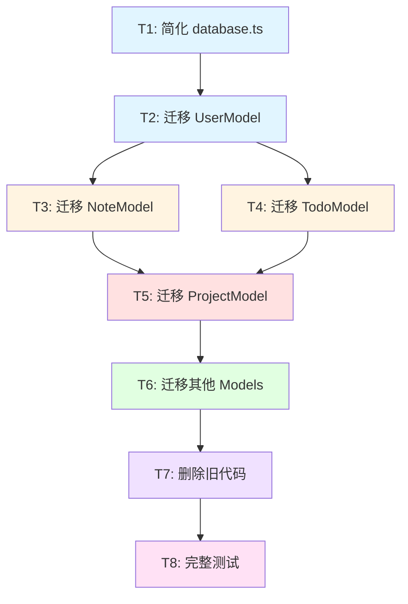

# TASK：数据库架构重构 - 任务拆分

**日期**: 2025-10-31  
**基于**: DESIGN_数据库架构重构.md

---

## 任务依赖关系图



**图例：**
- 🔵 蓝色 - 基础配置（简单）
- 🟡 黄色 - 核心功能（中等）
- 🔴 红色 - 复杂功能（困难）
- 🟢 绿色 - 批量迁移
- 🟣 紫色 - 清理工作
- 🟪 粉色 - 验收测试

---

## 任务 1: 简化 database.ts

### 输入契约
- **前置依赖**: 无
- **输入数据**: 现有 `database.ts` (375行)
- **环境依赖**: Supabase 配置已存在

### 任务描述
删除 `database.ts` 中的 SQL 包装器逻辑，简化为纯配置文件。

### 具体步骤
1. 备份当前 `database.ts` 代码（git commit）
2. 删除 `SupabaseDatabase` 类的所有方法
3. 删除 `supabasePool` 对象
4. 保留简单的导出语句
5. 确保 `supabase.ts` 配置文件存在

### 输出契约
- **输出数据**: 简化的 `database.ts` (3行)
- **交付物**: 
  ```typescript
  import { supabaseAdmin } from './supabase';
  export default supabaseAdmin;
  export { supabaseAdmin };
  ```
- **验收标准**:
  - ✅ 文件只包含导入和导出语句
  - ✅ 删除所有 SQL 解析逻辑
  - ✅ 代码可以编译（即使其他文件暂时报错）

### 实现约束
- **技术栈**: TypeScript
- **代码规范**: ESLint + Prettier
- **质量要求**: 代码简洁清晰

### 依赖关系
- **后置任务**: T2, T3, T4
- **并行任务**: 无

---

## 任务 2: 迁移 UserModel

### 输入契约
- **前置依赖**: T1 完成
- **输入数据**: 现有 `UserModel` 代码
- **环境依赖**: Supabase 客户端可用

### 任务描述
重写 `UserModel` 的所有方法，使用 Supabase 客户端替代 SQL 查询。

### 具体步骤

#### 1. 更新导入语句
```typescript
// 删除
import pool from '../config/database';

// 添加
import { supabaseAdmin } from '../config/database';
```

#### 2. 重写 `findById()`
```typescript
static async findById(id: string): Promise<User | null> {
  const { data, error } = await supabaseAdmin
    .from('users')
    .select('*')
    .eq('id', id)
    .single();
  
  if (error) {
    if (error.code === 'PGRST116') return null;
    throw error;
  }
  
  return data;
}
```

#### 3. 重写 `findByEmail()`
```typescript
static async findByEmail(email: string): Promise<User | null> {
  const { data, error } = await supabaseAdmin
    .from('users')
    .select('*')
    .eq('email', email)
    .single();
  
  if (error) {
    if (error.code === 'PGRST116') return null;
    throw error;
  }
  
  return data;
}
```

#### 4. 重写 `create()`
```typescript
static async create(userData: CreateUserData): Promise<User> {
  const { data, error } = await supabaseAdmin
    .from('users')
    .insert({
      email: userData.email,
      password_hash: userData.password_hash,
      display_name: userData.display_name,
      auth_provider: userData.auth_provider || 'local'
    })
    .select()
    .single();
  
  if (error) throw error;
  return data;
}
```

#### 5. 重写 `update()`
```typescript
static async update(id: string, updates: Partial<User>): Promise<User> {
  const { data, error } = await supabaseAdmin
    .from('users')
    .update(updates)
    .eq('id', id)
    .select()
    .single();
  
  if (error) throw error;
  return data;
}
```

### 输出契约
- **输出数据**: 重写的 `UserModel`
- **交付物**: `server/src/models/User.ts`
- **验收标准**:
  - ✅ 所有方法使用 Supabase 客户端
  - ✅ 没有 SQL 字符串
  - ✅ 错误处理正确
  - ✅ 用户登录功能正常
  - ✅ 用户注册功能正常

### 实现约束
- **接口规范**: 保持原有方法签名不变
- **错误处理**: 统一处理 Supabase 错误
- **质量要求**: TypeScript 类型安全

### 依赖关系
- **后置任务**: T3, T4
- **并行任务**: 无

---

## 任务 3: 迁移 NoteModel

### 输入契约
- **前置依赖**: T2 完成（确保认证可用）
- **输入数据**: 现有 `NoteModel` 代码
- **环境依赖**: Supabase 客户端可用

### 任务描述
重写 `NoteModel` 的所有方法，这是最复杂的迁移任务。

### 具体步骤

#### 1. 更新导入语句
```typescript
import { supabaseAdmin } from '../config/database';
```

#### 2. 重写 `findByUserId()` - 核心方法

**要求：支持以下筛选条件**
- `notebook_id` - 笔记本过滤
- `tags` - 标签数组重叠
- `is_favorite` - 收藏过滤
- `is_archived` - 归档过滤
- `search` - 标题和内容搜索
- `order_by` - 排序
- `limit` / `offset` - 分页

**实现：**
```typescript
static async findByUserId(
  userId: string, 
  options: FilterOptions = {}
): Promise<Note[]> {
  let query = supabaseAdmin
    .from('notes')
    .select('*')
    .eq('user_id', userId);

  if (options.notebook_id) {
    query = query.eq('notebook_id', options.notebook_id);
  }

  if (options.tags && options.tags.length > 0) {
    query = query.overlaps('tags', options.tags);
  }

  if (options.is_favorite !== undefined) {
    query = query.eq('is_favorite', options.is_favorite);
  }

  if (options.is_archived !== undefined) {
    query = query.eq('is_archived', options.is_archived);
  }

  if (options.search) {
    query = query.or(
      `title.ilike.%${options.search}%,content_text.ilike.%${options.search}%`
    );
  }

  const orderBy = options.order_by || 'updated_at';
  const ascending = options.order_direction === 'asc';
  query = query.order(orderBy, { ascending });

  if (options.limit) {
    query = query.limit(options.limit);
  }
  
  if (options.offset) {
    const end = options.offset + (options.limit || 20) - 1;
    query = query.range(options.offset, end);
  }

  const { data, error } = await query;
  
  if (error) throw error;
  return data || [];
}
```

#### 3. 重写 `count()` 方法

```typescript
static async count(userId: string, options: FilterOptions = {}): Promise<number> {
  let query = supabaseAdmin
    .from('notes')
    .select('*', { count: 'exact', head: true })
    .eq('user_id', userId);

  // 应用与 findByUserId 相同的筛选条件
  if (options.notebook_id) {
    query = query.eq('notebook_id', options.notebook_id);
  }
  if (options.tags && options.tags.length > 0) {
    query = query.overlaps('tags', options.tags);
  }
  if (options.is_favorite !== undefined) {
    query = query.eq('is_favorite', options.is_favorite);
  }
  if (options.is_archived !== undefined) {
    query = query.eq('is_archived', options.is_archived);
  }
  if (options.search) {
    query = query.or(
      `title.ilike.%${options.search}%,content_text.ilike.%${options.search}%`
    );
  }

  const { count, error } = await query;
  
  if (error) throw error;
  return count || 0;
}
```

#### 4. 重写 `findById()`
```typescript
static async findById(id: string, userId: string): Promise<Note | null> {
  const { data, error } = await supabaseAdmin
    .from('notes')
    .select('*')
    .eq('id', id)
    .eq('user_id', userId)
    .single();
  
  if (error) {
    if (error.code === 'PGRST116') return null;
    throw error;
  }
  
  return data;
}
```

#### 5. 重写 `create()`
```typescript
static async create(noteData: CreateNoteData): Promise<Note> {
  const { data, error } = await supabaseAdmin
    .from('notes')
    .insert({
      user_id: noteData.user_id,
      title: noteData.title,
      content: noteData.content,
      content_text: noteData.content_text,
      notebook_id: noteData.notebook_id,
      tags: noteData.tags || []
    })
    .select()
    .single();
  
  if (error) throw error;
  return data;
}
```

#### 6. 重写 `update()`
```typescript
static async update(
  id: string, 
  userId: string, 
  updates: Partial<Note>
): Promise<Note> {
  const { data, error } = await supabaseAdmin
    .from('notes')
    .update(updates)
    .eq('id', id)
    .eq('user_id', userId)
    .select()
    .single();
  
  if (error) throw error;
  return data;
}
```

#### 7. 重写 `delete()`
```typescript
static async delete(id: string, userId: string): Promise<void> {
  const { error } = await supabaseAdmin
    .from('notes')
    .delete()
    .eq('id', id)
    .eq('user_id', userId);
  
  if (error) throw error;
}
```

### 输出契约
- **输出数据**: 重写的 `NoteModel`
- **交付物**: `server/src/models/Note.ts`
- **验收标准**:
  - ✅ 笔记 CRUD 功能正常
  - ✅ 标签筛选功能正常
  - ✅ 收藏/归档筛选正常
  - ✅ 搜索功能正常
  - ✅ 分页功能正常
  - ✅ 计数查询准确

### 实现约束
- **接口规范**: 保持原有方法签名
- **性能要求**: 查询时间不增加
- **质量要求**: 完整的错误处理

### 依赖关系
- **后置任务**: T5
- **并行任务**: T4

---

## 任务 4: 迁移 TodoModel

### 输入契约
- **前置依赖**: T2 完成
- **输入数据**: 现有 `TodoModel` 代码
- **环境依赖**: Supabase 客户端可用

### 任务描述
重写 `TodoModel` 的所有方法。

### 具体步骤

#### 1. 更新导入语句
```typescript
import { supabaseAdmin } from '../config/database';
```

#### 2. 重写主要方法

使用与 NoteModel 类似的模式：
- `findByUserId()` - 支持筛选和分页
- `findById()` - 单个查询
- `create()` - 创建待办
- `update()` - 更新待办
- `delete()` - 删除待办
- `updateStatus()` - 状态更新

### 输出契约
- **输出数据**: 重写的 `TodoModel`
- **交付物**: `server/src/models/Todo.ts`
- **验收标准**:
  - ✅ 待办事项 CRUD 正常
  - ✅ 状态筛选正常
  - ✅ 通知调度正常

### 依赖关系
- **后置任务**: T5
- **并行任务**: T3

---

## 任务 5: 迁移 ProjectModel

### 输入契约
- **前置依赖**: T3, T4 完成
- **输入数据**: 现有 `ProjectModel` 代码
- **环境依赖**: Supabase 客户端可用

### 任务描述
重写 `ProjectModel`，处理复杂的 JOIN 查询和聚合统计。

### 具体步骤

#### 1. 评估 JOIN 查询复杂度

**原 SQL：**
```sql
SELECT p.*, 
       COUNT(pm.user_id) as member_count,
       COUNT(t.id) as task_count,
       ROUND(...) as progress
FROM projects p
LEFT JOIN project_members pm ON p.id = pm.project_id
LEFT JOIN tasks t ON p.id = t.project_id
GROUP BY p.id
```

#### 2. 选择实现方案

**方案 A：Supabase 关系查询 + 手动聚合**
```typescript
static async findByUserId(userId: string) {
  const { data, error } = await supabaseAdmin
    .from('projects')
    .select(`
      *,
      project_members(user_id),
      tasks(id, status)
    `)
    .or(`owner_id.eq.${userId},id.in.(
      select project_id from project_members where user_id = '${userId}'
    )`);
  
  if (error) throw error;
  
  return data.map(project => ({
    ...project,
    member_count: project.project_members.length,
    task_count: project.tasks.length,
    tasks_completed: project.tasks.filter(t => t.status === 'completed').length,
    progress: project.tasks.length > 0
      ? Math.round((project.tasks.filter(t => t.status === 'completed').length / project.tasks.length) * 100)
      : 0
  }));
}
```

**方案 B：RPC 调用（如果方案A性能不佳）**

创建数据库函数后使用：
```typescript
static async findByUserId(userId: string) {
  const { data, error } = await supabaseAdmin
    .rpc('get_user_projects', { user_id_param: userId });
  
  if (error) throw error;
  return data;
}
```

#### 3. 重写其他方法
- `findById()`
- `create()`
- `update()`
- `delete()`

### 输出契约
- **输出数据**: 重写的 `ProjectModel`
- **交付物**: `server/src/models/Project.ts`
- **验收标准**:
  - ✅ 项目查询功能正常
  - ✅ 统计数据准确（成员数、任务数、进度）
  - ✅ 性能可接受

### 实现约束
- **性能要求**: 查询时间 < 500ms
- **质量要求**: 统计数据准确

### 依赖关系
- **后置任务**: T6
- **并行任务**: 无

---

## 任务 6: 迁移其他 Models

### 输入契约
- **前置依赖**: T5 完成
- **输入数据**: 其他 Model 文件

### 任务描述
批量迁移剩余的 Model 文件。

### 包含的文件
1. `TaskModel` - 任务管理
2. `ProjectMemberModel` - 成员管理
3. `NotificationModel` - 通知管理
4. `AIUsageLogModel` - AI 使用日志
5. `ProjectProgressUpdater` - 进度更新工具
6. `ReportTemplate` - 报告模板

### 具体步骤

对每个 Model：
1. 更新导入语句
2. 重写查询方法
3. 测试基本功能

### 输出契约
- **输出数据**: 所有 Model 已迁移
- **交付物**: 更新的 Model 文件
- **验收标准**:
  - ✅ 所有 Model 使用 Supabase 客户端
  - ✅ 编译无错误
  - ✅ 基本功能测试通过

### 依赖关系
- **后置任务**: T7
- **并行任务**: 无

---

## 任务 7: 删除旧代码

### 输入契约
- **前置依赖**: T6 完成（所有 Model 已迁移）
- **输入数据**: 简化后的 `database.ts`

### 任务描述
确认所有 Model 已迁移后，彻底删除旧的 SQL 包装器代码。

### 具体步骤

#### 1. 验证没有引用旧代码
```bash
# 搜索 pool.query 的引用
grep -r "pool.query" server/src/models/
```

#### 2. 最终简化 database.ts

**最终版本：**
```typescript
// server/src/config/database.ts
import { supabaseAdmin } from './supabase';

// 导出 Supabase 客户端
export default supabaseAdmin;
export { supabaseAdmin };
```

#### 3. 删除不需要的导入

检查并删除：
- `import { Pool } from 'pg'` - 不再需要
- `import pool from '../config/database'` - 改为 `import { supabaseAdmin }`

### 输出契约
- **输出数据**: 干净的代码库
- **交付物**: 
  - 简化的 `database.ts` (3行)
  - 所有 Model 使用 Supabase
- **验收标准**:
  - ✅ 没有 SQL 字符串
  - ✅ 没有 `pool.query` 调用
  - ✅ 编译无错误
  - ✅ 代码库整洁

### 依赖关系
- **后置任务**: T8
- **并行任务**: 无

---

## 任务 8: 完整功能测试

### 输入契约
- **前置依赖**: T7 完成（所有代码已迁移）
- **输入数据**: 完整的应用程序
- **环境依赖**: 前后端服务运行

### 任务描述
对所有核心功能进行完整的端到端测试。

### 测试清单

#### 1. 用户认证测试
- [ ] 用户注册
- [ ] 用户登录
- [ ] Token 验证
- [ ] 用户信息查询

#### 2. 笔记功能测试
- [ ] 创建笔记（验证返回 ID）
- [ ] 查询笔记列表
- [ ] 更新笔记标题
- [ ] 更新笔记内容
- [ ] 添加/修改标签
- [ ] 标签筛选（单标签）
- [ ] 标签筛选（多标签）
- [ ] 收藏/取消收藏
- [ ] 归档/取消归档
- [ ] 分类筛选（收藏的笔记）
- [ ] 分类筛选（归档的笔记）
- [ ] 搜索功能（标题）
- [ ] 搜索功能（内容）
- [ ] 分页功能
- [ ] 删除笔记

#### 3. 待办事项测试
- [ ] 创建待办
- [ ] 查询待办列表
- [ ] 更新待办状态
- [ ] 状态筛选
- [ ] 通知调度
- [ ] 删除待办

#### 4. 项目管理测试
- [ ] 创建项目
- [ ] 查询项目列表
- [ ] 成员统计正确
- [ ] 任务统计正确
- [ ] 进度计算正确
- [ ] 更新项目
- [ ] 删除项目

#### 5. 性能测试
- [ ] 笔记列表加载时间 < 500ms
- [ ] 搜索响应时间 < 500ms
- [ ] 项目列表加载时间 < 1s

#### 6. 错误处理测试
- [ ] 查询不存在的记录
- [ ] 无权访问的记录
- [ ] 数据库连接失败

### 输出契约
- **输出数据**: 测试报告
- **交付物**: `docs/数据库架构重构/ACCEPTANCE_数据库架构重构.md`
- **验收标准**:
  - ✅ 所有测试用例通过
  - ✅ 无功能回归
  - ✅ 性能达标
  - ✅ 错误处理正确

### 实现约束
- **测试方法**: 手动测试 + 前端验证
- **质量要求**: 100% 测试用例通过

### 依赖关系
- **后置任务**: 无（最终任务）
- **并行任务**: 无

---

## 任务优先级总结

| 任务 | 优先级 | 复杂度 | 预估时间 |
|------|-------|--------|---------|
| T1: 简化 database.ts | P0 | ⭐ | 10分钟 |
| T2: 迁移 UserModel | P0 | ⭐⭐ | 30分钟 |
| T3: 迁移 NoteModel | P1 | ⭐⭐⭐⭐ | 2小时 |
| T4: 迁移 TodoModel | P1 | ⭐⭐⭐ | 1.5小时 |
| T5: 迁移 ProjectModel | P2 | ⭐⭐⭐⭐⭐ | 3小时 |
| T6: 迁移其他 Models | P2 | ⭐⭐⭐ | 2小时 |
| T7: 删除旧代码 | P3 | ⭐ | 20分钟 |
| T8: 完整测试 | P3 | ⭐⭐ | 1.5小时 |

**总计预估时间**: 约 10.5 小时

---

## 风险管理

### 高风险任务
1. **T3: 迁移 NoteModel** - 复杂的筛选和分页逻辑
2. **T5: 迁移 ProjectModel** - 复杂的 JOIN 和聚合查询

### 缓解措施
- 充分测试每个功能点
- 对比迁移前后的查询结果
- 保留 git 历史记录以便回滚

---

## 下一步

等待用户审批后，进入 **Automate（自动化执行阶段）**，按顺序执行任务。

