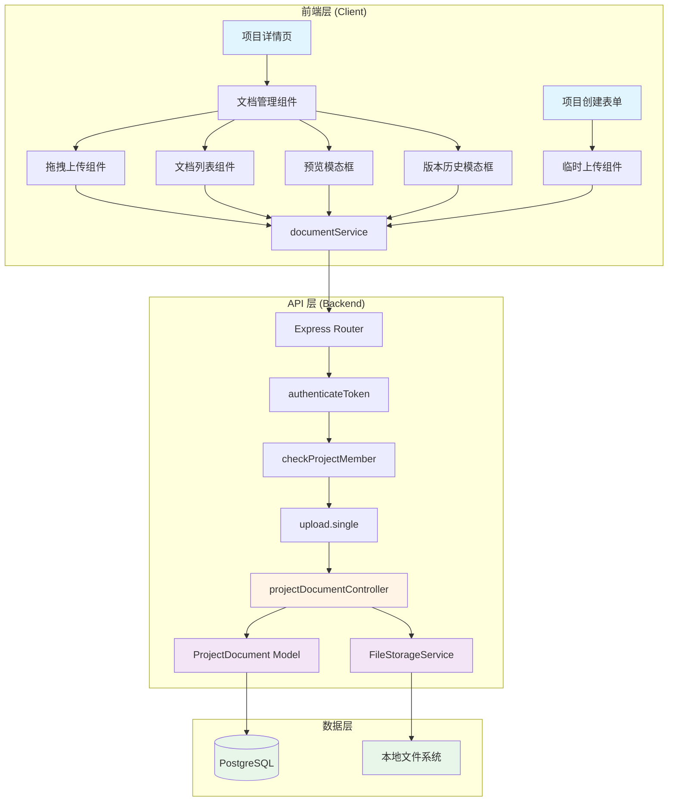
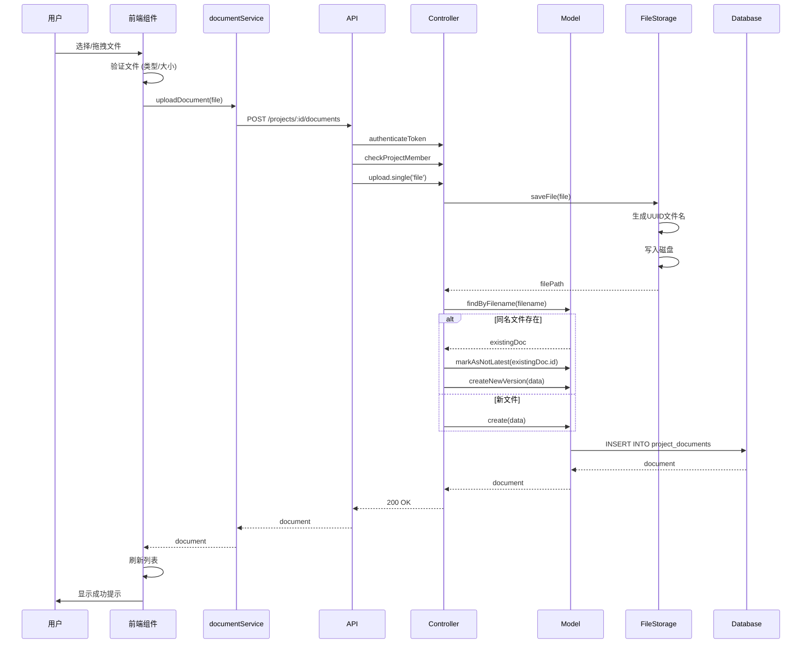
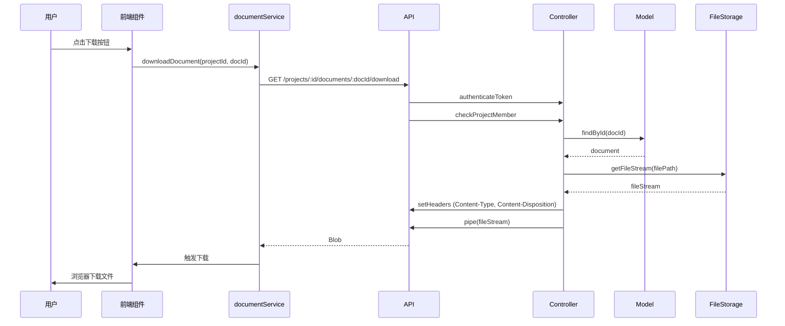
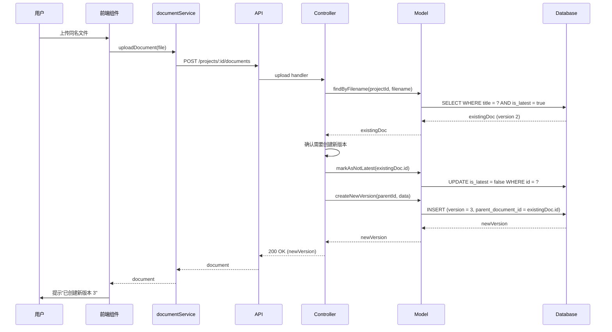
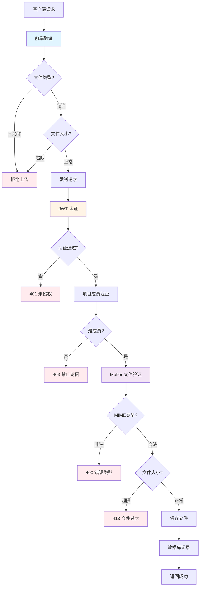

# 项目文档上传功能 - 架构设计文档 (DESIGN)

## 📋 文档信息

**任务名称**: 项目文档上传功能实现  
**设计日期**: 2025-11-01  
**设计版本**: v2.0 (完整增强版)  
**参考文档**: 
- ALIGNMENT_项目文档上传功能.md
- CONSENSUS_项目文档上传功能.md

---

## 🎯 设计目标

### 核心目标
1. ✅ 实现完整的项目文档管理功能
2. ✅ 支持拖拽上传和在线预览
3. ✅ 实现版本管理和历史追踪
4. ✅ 确保系统安全性和可扩展性

### 设计原则
- **简洁性**: 接口设计简洁明了
- **安全性**: 多层防护，权限严格控制
- **可扩展性**: 预留云存储迁移接口
- **用户体验**: 流畅的上传和预览体验

---

## 🏗️ 系统架构

### 整体架构图



---

## 📦 模块设计

### 1. 后端模块

#### 1.1 文件上传中间件 (Upload Middleware)

**文件**: `server/src/middleware/upload.ts`

**职责**:
- 配置 multer 文件上传
- 限制文件类型和大小
- 处理文件存储路径

**关键逻辑**:
```typescript
// 文件过滤器
const fileFilter = (req, file, cb) => {
  if (ALLOWED_MIME_TYPES.includes(file.mimetype)) {
    cb(null, true);
  } else {
    cb(new Error('不支持的文件类型'), false);
  }
};

// 存储配置
const storage = multer.diskStorage({
  destination: (req, file, cb) => {
    const uploadDir = path.join('uploads', 'projects', projectId, 'documents');
    fs.mkdirSync(uploadDir, { recursive: true });
    cb(null, uploadDir);
  },
  filename: (req, file, cb) => {
    const uniqueName = `${uuidv4()}${path.extname(file.originalname)}`;
    cb(null, uniqueName);
  }
});

// multer 实例
const upload = multer({
  storage,
  fileFilter,
  limits: { fileSize: 20 * 1024 * 1024 } // 20MB
});
```

**输入**: multipart/form-data 请求  
**输出**: req.file 对象

---

#### 1.2 文件存储服务 (FileStorageService)

**文件**: `server/src/services/FileStorageService.ts`

**职责**:
- 管理文件存储和删除
- 提供文件读取接口
- 处理临时文件管理

**接口设计**:
```typescript
class FileStorageService {
  // 保存文件
  async saveFile(file: Express.Multer.File, projectId: string): Promise<string>
  
  // 删除文件
  async deleteFile(filePath: string): Promise<void>
  
  // 读取文件流
  async getFileStream(filePath: string): Promise<ReadStream>
  
  // 临时文件管理
  async saveTempFile(file: Express.Multer.File): Promise<string>
  async moveTempFile(tempId: string, projectId: string): Promise<string>
  async cleanTempFiles(olderThan: Date): Promise<number>
}
```

**文件路径规范**:
```
uploads/
├── temp/                           # 临时文件
│   └── {temp_id}.{ext}
└── projects/                       # 项目文件
    └── {project_id}/
        └── documents/
            └── {uuid}.{ext}
```

---

#### 1.3 文档模型 (ProjectDocument Model)

**文件**: `server/src/models/ProjectDocument.ts`

**职责**:
- 数据库 CRUD 操作
- 版本管理逻辑
- 数据验证和转换

**接口设计**:
```typescript
class ProjectDocument {
  // 创建文档
  static async create(data: CreateDocumentDTO): Promise<Document>
  
  // 获取项目文档列表 (仅最新版本)
  static async findByProjectId(projectId: string, latestOnly?: boolean): Promise<Document[]>
  
  // 获取单个文档
  static async findById(id: string): Promise<Document | null>
  
  // 删除文档
  static async delete(id: string): Promise<void>
  
  // 版本管理
  static async createNewVersion(parentId: string, data: CreateDocumentDTO): Promise<Document>
  static async findVersions(documentId: string): Promise<Document[]>
  static async restoreVersion(versionId: string, userId: string): Promise<Document>
  static async markAsNotLatest(documentId: string): Promise<void>
  
  // 查找同名文档
  static async findByFilename(projectId: string, filename: string): Promise<Document | null>
}
```

**数据库表结构**:
```sql
CREATE TABLE project_documents (
    id UUID PRIMARY KEY DEFAULT gen_random_uuid(),
    project_id UUID NOT NULL REFERENCES projects(id) ON DELETE CASCADE,
    title VARCHAR(255) NOT NULL,
    file_path VARCHAR(500) NOT NULL,
    file_size INTEGER NOT NULL,
    mime_type VARCHAR(100) NOT NULL,
    version INTEGER NOT NULL DEFAULT 1,
    parent_document_id UUID REFERENCES project_documents(id) ON DELETE SET NULL,
    is_latest BOOLEAN DEFAULT TRUE,
    creator_id UUID NOT NULL REFERENCES users(id) ON DELETE CASCADE,
    created_at TIMESTAMPTZ DEFAULT NOW(),
    updated_at TIMESTAMPTZ DEFAULT NOW()
);

CREATE INDEX idx_project_documents_project ON project_documents(project_id);
CREATE INDEX idx_project_documents_parent ON project_documents(parent_document_id);
CREATE INDEX idx_project_documents_latest ON project_documents(project_id, is_latest);
```

---

#### 1.4 文档控制器 (ProjectDocumentController)

**文件**: `server/src/controllers/projectDocumentController.ts`

**职责**:
- 处理所有文档相关 HTTP 请求
- 业务逻辑编排
- 错误处理和响应

**接口实现**:
```typescript
class ProjectDocumentController {
  // 上传文档
  async uploadDocument(req: Request, res: Response): Promise<void>
  
  // 获取文档列表
  async getDocuments(req: Request, res: Response): Promise<void>
  
  // 下载文档
  async downloadDocument(req: Request, res: Response): Promise<void>
  
  // 删除文档
  async deleteDocument(req: Request, res: Response): Promise<void>
  
  // 预览文档
  async previewDocument(req: Request, res: Response): Promise<void>
  
  // 获取版本列表
  async getVersions(req: Request, res: Response): Promise<void>
  
  // 恢复版本
  async restoreVersion(req: Request, res: Response): Promise<void>
  
  // 临时上传
  async uploadTemp(req: Request, res: Response): Promise<void>
  
  // 关联临时文件
  async attachTempFiles(req: Request, res: Response): Promise<void>
}
```

---

#### 1.5 路由配置 (Routes)

**文件**: `server/src/routes/projectDocuments.ts`

**路由表**:
```typescript
// 项目文档路由
router.post(
  '/projects/:projectId/documents',
  authenticateToken,
  checkProjectMember,
  upload.single('file'),
  controller.uploadDocument
);

router.get(
  '/projects/:projectId/documents',
  authenticateToken,
  checkProjectMember,
  controller.getDocuments
);

router.get(
  '/projects/:projectId/documents/:documentId/download',
  authenticateToken,
  checkProjectMember,
  controller.downloadDocument
);

router.delete(
  '/projects/:projectId/documents/:documentId',
  authenticateToken,
  checkProjectMember,
  checkDocumentOwner,
  controller.deleteDocument
);

router.get(
  '/projects/:projectId/documents/:documentId/preview',
  authenticateToken,
  checkProjectMember,
  controller.previewDocument
);

router.get(
  '/projects/:projectId/documents/:documentId/versions',
  authenticateToken,
  checkProjectMember,
  controller.getVersions
);

router.post(
  '/projects/:projectId/documents/:documentId/restore',
  authenticateToken,
  checkProjectMember,
  controller.restoreVersion
);

// 临时文件路由
router.post(
  '/uploads/temp',
  authenticateToken,
  upload.single('file'),
  controller.uploadTemp
);

router.post(
  '/projects/:projectId/documents/attach',
  authenticateToken,
  checkProjectMember,
  controller.attachTempFiles
);
```

---

### 2. 前端模块

#### 2.1 文档服务 (documentService)

**文件**: `client/src/services/documentService.ts`

**职责**:
- 封装所有文档相关 API 调用
- 处理文件上传和下载
- 管理请求和响应

**接口设计**:
```typescript
class DocumentService {
  // 上传文档
  async uploadDocument(projectId: string, file: File): Promise<Document>
  
  // 获取文档列表
  async getDocuments(projectId: string): Promise<Document[]>
  
  // 下载文档
  async downloadDocument(projectId: string, documentId: string): Promise<Blob>
  
  // 删除文档
  async deleteDocument(projectId: string, documentId: string): Promise<void>
  
  // 预览文档 (获取URL)
  getPreviewUrl(projectId: string, documentId: string): string
  
  // 获取版本列表
  async getVersions(projectId: string, documentId: string): Promise<DocumentVersion[]>
  
  // 恢复版本
  async restoreVersion(projectId: string, documentId: string, versionId: string): Promise<Document>
  
  // 临时上传
  async uploadTemp(file: File): Promise<TempFile>
  
  // 关联临时文件
  async attachTempFiles(projectId: string, tempIds: string[]): Promise<void>
}
```

---

#### 2.2 拖拽上传组件 (DragDropUpload)

**文件**: `client/src/components/projects/DragDropUpload.tsx`

**职责**:
- 提供拖拽上传界面
- 处理文件选择和验证
- 显示上传进度

**组件结构**:
```tsx
interface DragDropUploadProps {
  projectId: string;
  onUploadSuccess: (document: Document) => void;
  onUploadError: (error: string) => void;
}

const DragDropUpload: React.FC<DragDropUploadProps> = ({
  projectId,
  onUploadSuccess,
  onUploadError
}) => {
  const [isDragging, setIsDragging] = useState(false);
  const [uploadProgress, setUploadProgress] = useState(0);
  const [isUploading, setIsUploading] = useState(false);
  
  // 拖拽事件处理
  const handleDragEnter = (e: DragEvent) => { ... };
  const handleDragLeave = (e: DragEvent) => { ... };
  const handleDrop = (e: DragEvent) => { ... };
  
  // 文件选择
  const handleFileSelect = (e: ChangeEvent<HTMLInputElement>) => { ... };
  
  // 文件上传
  const uploadFile = async (file: File) => { ... };
  
  // 文件验证
  const validateFile = (file: File): boolean => { ... };
  
  return (
    <div 
      className={`upload-zone ${isDragging ? 'dragging' : ''}`}
      onDragEnter={handleDragEnter}
      onDragLeave={handleDragLeave}
      onDrop={handleDrop}
    >
      {isUploading ? (
        <UploadProgress progress={uploadProgress} />
      ) : (
        <>
          <FiUpload size={48} />
          <p>拖拽文件到此处或点击选择</p>
          <input type="file" onChange={handleFileSelect} />
        </>
      )}
    </div>
  );
};
```

**样式设计**:
```css
.upload-zone {
  border: 2px dashed #ccc;
  border-radius: 8px;
  padding: 40px;
  text-align: center;
  transition: all 0.3s;
}

.upload-zone.dragging {
  border-color: #007bff;
  background-color: #e7f3ff;
}
```

---

#### 2.3 文档列表组件 (DocumentList)

**文件**: `client/src/components/projects/DocumentList.tsx`

**职责**:
- 展示文档列表
- 提供下载、预览、删除操作
- 显示版本信息

**组件结构**:
```tsx
interface DocumentListProps {
  projectId: string;
  documents: Document[];
  currentUserId: string;
  isAdmin: boolean;
  onDocumentDeleted: (documentId: string) => void;
}

const DocumentList: React.FC<DocumentListProps> = ({
  projectId,
  documents,
  currentUserId,
  isAdmin,
  onDocumentDeleted
}) => {
  const [selectedDocument, setSelectedDocument] = useState<Document | null>(null);
  const [showPreview, setShowPreview] = useState(false);
  const [showVersions, setShowVersions] = useState(false);
  
  // 预览文档
  const handlePreview = (doc: Document) => { ... };
  
  // 下载文档
  const handleDownload = async (doc: Document) => { ... };
  
  // 删除文档
  const handleDelete = async (doc: Document) => { ... };
  
  // 查看版本
  const handleViewVersions = (doc: Document) => { ... };
  
  // 权限检查
  const canDelete = (doc: Document): boolean => {
    return isAdmin || doc.creator_id === currentUserId;
  };
  
  const canPreview = (doc: Document): boolean => {
    return doc.mime_type.startsWith('image/') || doc.mime_type === 'application/pdf';
  };
  
  return (
    <div className="document-list">
      {documents.map(doc => (
        <DocumentListItem
          key={doc.id}
          document={doc}
          canDelete={canDelete(doc)}
          canPreview={canPreview(doc)}
          onPreview={() => handlePreview(doc)}
          onDownload={() => handleDownload(doc)}
          onDelete={() => handleDelete(doc)}
          onViewVersions={() => handleViewVersions(doc)}
        />
      ))}
      
      {showPreview && selectedDocument && (
        <DocumentPreviewModal
          document={selectedDocument}
          projectId={projectId}
          onClose={() => setShowPreview(false)}
        />
      )}
      
      {showVersions && selectedDocument && (
        <DocumentVersionModal
          document={selectedDocument}
          projectId={projectId}
          onClose={() => setShowVersions(false)}
        />
      )}
    </div>
  );
};
```

---

#### 2.4 文档预览模态框 (DocumentPreviewModal)

**文件**: `client/src/components/projects/DocumentPreviewModal.tsx`

**职责**:
- 预览 PDF 和图片文件
- 提供缩放、翻页等控制
- 提供下载功能

**组件结构**:
```tsx
interface DocumentPreviewModalProps {
  document: Document;
  projectId: string;
  onClose: () => void;
}

const DocumentPreviewModal: React.FC<DocumentPreviewModalProps> = ({
  document,
  projectId,
  onClose
}) => {
  const [numPages, setNumPages] = useState<number>(0);
  const [pageNumber, setPageNumber] = useState<number>(1);
  const [scale, setScale] = useState<number>(1.0);
  
  const previewUrl = documentService.getPreviewUrl(projectId, document.id);
  
  const renderPreview = () => {
    if (document.mime_type === 'application/pdf') {
      return (
        <PDFViewer
          file={previewUrl}
          page={pageNumber}
          scale={scale}
          onLoadSuccess={({ numPages }) => setNumPages(numPages)}
        />
      );
    } else if (document.mime_type.startsWith('image/')) {
      return (
        
      );
    } else {
      return <p>不支持预览此文件类型</p>;
    }
  };
  
  return (
    <Modal open onClose={onClose} size="large">
      <Modal.Header>
        {document.title}
        <Button onClick={handleDownload}>
          <FiDownload /> 下载
        </Button>
      </Modal.Header>
      
      <Modal.Content>
        {renderPreview()}
      </Modal.Content>
      
      <Modal.Footer>
        {document.mime_type === 'application/pdf' && (
          <div className="pdf-controls">
            <Button onClick={() => setPageNumber(p => Math.max(1, p - 1))}>
              上一页
            </Button>
            <span>{pageNumber} / {numPages}</span>
            <Button onClick={() => setPageNumber(p => Math.min(numPages, p + 1))}>
              下一页
            </Button>
            
            <Button onClick={() => setScale(s => Math.max(0.5, s - 0.1))}>
              缩小
            </Button>
            <span>{Math.round(scale * 100)}%</span>
            <Button onClick={() => setScale(s => Math.min(2.0, s + 0.1))}>
              放大
            </Button>
          </div>
        )}
      </Modal.Footer>
    </Modal>
  );
};
```

**PDF 预览依赖**:
```typescript
import { Document, Page } from 'react-pdf';
import 'react-pdf/dist/esm/Page/AnnotationLayer.css';
import 'react-pdf/dist/esm/Page/TextLayer.css';
```

---

#### 2.5 版本历史模态框 (DocumentVersionModal)

**文件**: `client/src/components/projects/DocumentVersionModal.tsx`

**职责**:
- 显示文档所有版本
- 提供版本预览和下载
- 支持版本恢复

**组件结构**:
```tsx
interface DocumentVersionModalProps {
  document: Document;
  projectId: string;
  onClose: () => void;
}

const DocumentVersionModal: React.FC<DocumentVersionModalProps> = ({
  document,
  projectId,
  onClose
}) => {
  const [versions, setVersions] = useState<DocumentVersion[]>([]);
  const [loading, setLoading] = useState(true);
  
  useEffect(() => {
    loadVersions();
  }, [document.id]);
  
  const loadVersions = async () => {
    try {
      const data = await documentService.getVersions(projectId, document.id);
      setVersions(data);
    } catch (error) {
      console.error('加载版本失败', error);
    } finally {
      setLoading(false);
    }
  };
  
  const handleRestore = async (versionId: string) => {
    if (!confirm('确定要恢复此版本吗？这将创建一个新的最新版本。')) {
      return;
    }
    
    try {
      await documentService.restoreVersion(projectId, document.id, versionId);
      toast.success('版本已恢复');
      onClose();
    } catch (error) {
      toast.error('恢复失败');
    }
  };
  
  return (
    <Modal open onClose={onClose}>
      <Modal.Header>
        版本历史 - {document.title}
      </Modal.Header>
      
      <Modal.Content>
        {loading ? (
          <Spinner />
        ) : (
          <div className="version-list">
            {versions.map(version => (
              <VersionListItem
                key={version.id}
                version={version}
                isLatest={version.is_latest}
                onPreview={() => handlePreview(version)}
                onDownload={() => handleDownload(version)}
                onRestore={() => handleRestore(version.id)}
              />
            ))}
          </div>
        )}
      </Modal.Content>
      
      <Modal.Footer>
        <p className="text-muted">
          💡 恢复历史版本将创建一个新的最新版本
        </p>
      </Modal.Footer>
    </Modal>
  );
};
```

---

#### 2.6 项目详情页集成

**文件**: `client/src/components/projects/ProjectDetailModal.tsx`

**修改内容**:
```tsx
// 添加文档标签页
const tabs = [
  { id: 'info', label: '基本信息', icon: <FiInfo /> },
  { id: 'members', label: '成员管理', icon: <FiUsers /> },
  { id: 'tasks', label: '任务列表', icon: <FiCheckSquare /> },
  { id: 'documents', label: '项目文档', icon: <FiFileText /> }, // 新增
];

// 文档标签页内容
const renderDocumentsTab = () => {
  return (
    <div className="documents-tab">
      <DragDropUpload
        projectId={project.id}
        onUploadSuccess={handleDocumentUploaded}
        onUploadError={handleUploadError}
      />
      
      <Divider />
      
      <DocumentList
        projectId={project.id}
        documents={documents}
        currentUserId={currentUser.id}
        isAdmin={isProjectAdmin}
        onDocumentDeleted={handleDocumentDeleted}
      />
    </div>
  );
};
```

---

#### 2.7 项目创建表单集成

**文件**: `client/src/components/projects/CreateProjectModal.tsx`

**修改内容**:
```tsx
const CreateProjectModal: React.FC = () => {
  const [projectData, setProjectData] = useState({ ... });
  const [tempFiles, setTempFiles] = useState<TempFile[]>([]);
  
  // 临时文件上传
  const handleTempFileUpload = async (file: File) => {
    try {
      const tempFile = await documentService.uploadTemp(file);
      setTempFiles(prev => [...prev, tempFile]);
      toast.success('文件上传成功');
    } catch (error) {
      toast.error('文件上传失败');
    }
  };
  
  // 删除临时文件
  const handleRemoveTempFile = (tempId: string) => {
    setTempFiles(prev => prev.filter(f => f.temp_id !== tempId));
  };
  
  // 创建项目
  const handleCreateProject = async () => {
    try {
      // 1. 创建项目
      const project = await projectService.createProject(projectData);
      
      // 2. 关联临时文件
      if (tempFiles.length > 0) {
        const tempIds = tempFiles.map(f => f.temp_id);
        await documentService.attachTempFiles(project.id, tempIds);
      }
      
      toast.success('项目创建成功');
      onClose();
    } catch (error) {
      toast.error('项目创建失败');
    }
  };
  
  return (
    <Modal open onClose={onClose}>
      <Modal.Header>创建新项目</Modal.Header>
      
      <Modal.Content>
        {/* 基本信息表单 */}
        <FormSection title="基本信息">
          ...
        </FormSection>
        
        {/* 项目文档 */}
        <FormSection title="项目文档">
          <DragDropUpload
            projectId={null} // 临时上传
            onUploadSuccess={(file) => handleTempFileUpload(file)}
            onUploadError={(error) => toast.error(error)}
          />
          
          <div className="temp-file-list">
            {tempFiles.map(file => (
              <TempFileItem
                key={file.temp_id}
                file={file}
                onRemove={() => handleRemoveTempFile(file.temp_id)}
              />
            ))}
          </div>
          
          <p className="text-muted">
            💡 文件将在项目创建后自动关联
          </p>
        </FormSection>
      </Modal.Content>
      
      <Modal.Footer>
        <Button onClick={handleCreateProject}>创建项目</Button>
      </Modal.Footer>
    </Modal>
  );
};
```

---

## 🔄 数据流设计

### 文件上传流程



### 文件下载流程



### 版本管理流程



### 版本恢复流程

```mermaid
sequenceDiagram
    participant U as 用户
    participant C as VersionModal
    participant S as documentService
    participant A as API
    participant Ctrl as Controller
    participant M as Model
    participant FS as FileStorage
    participant DB as Database
    
    U->>C: 点击"恢复版本 1"
    C->>C: 显示确认对话框
    U->>C: 确认
    
    C->>S: restoreVersion(projectId, docId, versionId)
    S->>A: POST /projects/:id/documents/:docId/restore
    
    A->>Ctrl: restore handler
    
    Ctrl->>M: findById(versionId)
    M-->>Ctrl: oldVersion (version 1)
    
    Ctrl->>M: findById(currentDocId)
    M-->>Ctrl: currentVersion (version 3)
    
    Ctrl->>M: markAsNotLatest(currentDocId)
    M->>DB: UPDATE is_latest = false
    
    Ctrl->>FS: copyFile(oldVersion.file_path)
    FS-->>Ctrl: newFilePath
    
    Ctrl->>M: createNewVersion({
      parent_id: currentDocId,
      version: 4,
      file_path: newFilePath,
      ...
    })
    M->>DB: INSERT new version
    DB-->>M: restoredVersion
    M-->>Ctrl: restoredVersion
    
    Ctrl-->>A: 200 OK
    A-->>S: restoredVersion
    S-->>C: restoredVersion
    C->>U: 提示"已恢复为版本 4"
    C->>C: 刷新版本列表
```

---

## 🛡️ 安全设计

### 多层防护策略



### 权限控制矩阵

| 操作 | 项目管理员 | 项目成员 | 文档上传者 | 非成员 |
|------|----------|---------|----------|--------|
| 上传文档 | ✅ | ✅ | ✅ | ❌ |
| 查看列表 | ✅ | ✅ | ✅ | ❌ |
| 下载文档 | ✅ | ✅ | ✅ | ❌ |
| 预览文档 | ✅ | ✅ | ✅ | ❌ |
| 删除任意文档 | ✅ | ❌ | ❌ | ❌ |
| 删除自己的文档 | ✅ | ✅ | ✅ | ❌ |
| 版本管理 | ✅ | ✅ | ✅ | ❌ |

### 文件验证规则

```typescript
// 前端验证 (用户体验)
const validateFile = (file: File): { valid: boolean; error?: string } => {
  // 检查文件大小
  if (file.size > MAX_FILE_SIZE) {
    return { valid: false, error: '文件不能超过 20MB' };
  }
  
  // 检查文件类型
  const ext = file.name.split('.').pop()?.toLowerCase();
  if (!ALLOWED_EXTENSIONS.includes(`.${ext}`)) {
    return { valid: false, error: '不支持的文件类型' };
  }
  
  return { valid: true };
};

// 后端验证 (安全保障)
const fileFilter = (req: Request, file: Express.Multer.File, cb: FileFilterCallback) => {
  // MIME 类型验证
  if (!ALLOWED_MIME_TYPES.includes(file.mimetype)) {
    return cb(new Error('不支持的文件类型'));
  }
  
  // 文件扩展名验证
  const ext = path.extname(file.originalname).toLowerCase();
  if (!ALLOWED_EXTENSIONS.includes(ext)) {
    return cb(new Error('不支持的文件扩展名'));
  }
  
  cb(null, true);
};

// Magic Number 验证 (可选，增强安全)
const validateMagicNumber = async (filePath: string, mimeType: string): Promise<boolean> => {
  const buffer = await fs.readFile(filePath, { start: 0, end: 8 });
  
  const magicNumbers: Record<string, string[]> = {
    'application/pdf': ['255044462D'], // %PDF-
    'image/jpeg': ['FFD8FF'],
    'image/png': ['89504E47'],
    // ... 其他类型
  };
  
  const hex = buffer.toString('hex').toUpperCase();
  const expected = magicNumbers[mimeType];
  
  return expected?.some(magic => hex.startsWith(magic)) ?? false;
};
```

---

## 🧩 接口契约

### API 请求/响应规范

#### 通用响应格式
```typescript
interface ApiResponse<T> {
  success: boolean;
  data?: T;
  message?: string;
  error?: {
    code: string;
    message: string;
    details?: any;
  };
}
```

#### 文档数据模型
```typescript
interface Document {
  id: string;
  project_id: string;
  title: string;
  file_path: string;
  file_size: number;
  mime_type: string;
  version: number;
  parent_document_id: string | null;
  is_latest: boolean;
  creator_id: string;
  creator: {
    id: string;
    display_name: string;
    avatar_url?: string;
  };
  created_at: string;
  updated_at: string;
}

interface TempFile {
  temp_id: string;
  filename: string;
  file_size: number;
  mime_type: string;
  created_at: string;
}

interface DocumentVersion {
  id: string;
  version: number;
  file_size: number;
  creator: {
    id: string;
    display_name: string;
  };
  created_at: string;
  is_latest: boolean;
}
```

---

## 📊 性能优化

### 1. 文件上传优化
- 前端: 显示上传进度条
- 后端: 使用流式处理，避免内存溢出
- 限制并发上传数量

### 2. 文件下载优化
- 使用流式传输 (`res.pipe()`)
- 设置合理的缓存头
- 支持断点续传 (Range 请求)

### 3. 列表查询优化
- 默认只查询最新版本 (`is_latest = true`)
- 添加分页支持 (可选)
- 使用数据库索引

### 4. 预览优化
- PDF: 懒加载，按需加载每一页
- 图片: 使用合适的压缩和缓存
- 大文件提示下载而非预览

---

## 🔧 错误处理

### 错误码定义

```typescript
enum DocumentErrorCode {
  FILE_TOO_LARGE = 'FILE_TOO_LARGE',
  INVALID_FILE_TYPE = 'INVALID_FILE_TYPE',
  UPLOAD_FAILED = 'UPLOAD_FAILED',
  DOCUMENT_NOT_FOUND = 'DOCUMENT_NOT_FOUND',
  PERMISSION_DENIED = 'PERMISSION_DENIED',
  VERSION_NOT_FOUND = 'VERSION_NOT_FOUND',
  RESTORE_FAILED = 'RESTORE_FAILED',
  TEMP_FILE_NOT_FOUND = 'TEMP_FILE_NOT_FOUND',
  ATTACH_FAILED = 'ATTACH_FAILED'
}
```

### 错误处理策略

```typescript
// 控制器错误处理
try {
  // 业务逻辑
} catch (error) {
  logger.error('文档操作失败', { error, userId, projectId });
  
  if (error instanceof MulterError) {
    if (error.code === 'LIMIT_FILE_SIZE') {
      return res.status(413).json({
        success: false,
        error: {
          code: 'FILE_TOO_LARGE',
          message: '文件大小超过限制 (20MB)'
        }
      });
    }
  }
  
  return res.status(500).json({
    success: false,
    error: {
      code: 'UPLOAD_FAILED',
      message: '文件上传失败，请重试'
    }
  });
}
```

---

## 📝 日志记录

### 日志级别和内容

```typescript
// 文件上传日志
logger.info('文档上传', {
  userId,
  projectId,
  filename: file.originalname,
  fileSize: file.size,
  mimeType: file.mimetype
});

// 文件删除日志
logger.info('文档删除', {
  userId,
  projectId,
  documentId,
  filename: document.title
});

// 版本恢复日志
logger.info('版本恢复', {
  userId,
  projectId,
  documentId,
  fromVersion: oldVersion.version,
  toVersion: newVersion.version
});

// 错误日志
logger.error('文档操作失败', {
  userId,
  projectId,
  operation: 'upload',
  error: error.message,
  stack: error.stack
});
```

---

## 🧪 测试策略

### 单元测试
- 文件验证逻辑
- 版本号计算
- 权限检查函数

### 集成测试
- 完整上传流程
- 版本管理流程
- 权限控制验证

### 手动测试清单
- [ ] 上传各种文件类型
- [ ] 上传超大文件
- [ ] 拖拽上传
- [ ] 预览 PDF 和图片
- [ ] 版本管理
- [ ] 权限控制
- [ ] 错误处理

---

## 📐 扩展性设计

### 云存储迁移接口

```typescript
// 存储接口抽象
interface IStorageService {
  saveFile(file: Express.Multer.File, path: string): Promise<string>;
  deleteFile(path: string): Promise<void>;
  getFileStream(path: string): Promise<ReadStream>;
  getFileUrl(path: string): string;
}

// 本地存储实现
class LocalStorageService implements IStorageService {
  // ...
}

// Supabase 存储实现 (未来)
class SupabaseStorageService implements IStorageService {
  // ...
}

// 依赖注入
const storageService: IStorageService = 
  process.env.STORAGE_TYPE === 'supabase' 
    ? new SupabaseStorageService() 
    : new LocalStorageService();
```

---

## 🎯 设计验收

### 架构完整性
- [x] 所有模块设计完整
- [x] 接口定义清晰
- [x] 数据流设计合理
- [x] 安全机制完善

### 技术可行性
- [x] 技术栈匹配
- [x] 依赖可获取
- [x] 实现复杂度可控
- [x] 性能可接受

### 扩展性
- [x] 预留云存储接口
- [x] 支持功能扩展
- [x] 代码可维护

---

**文档状态**: ✅ 已完成  
**创建时间**: 2025-11-01  
**设计版本**: v2.0  
**下一步**: 创建任务拆分文档 (TASK)
