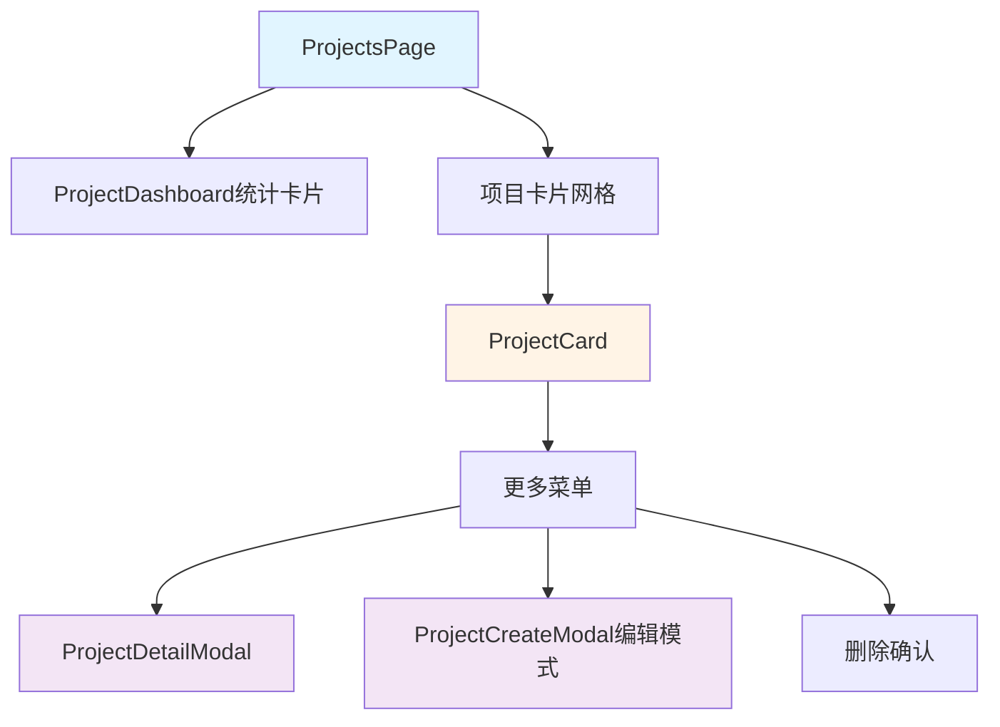
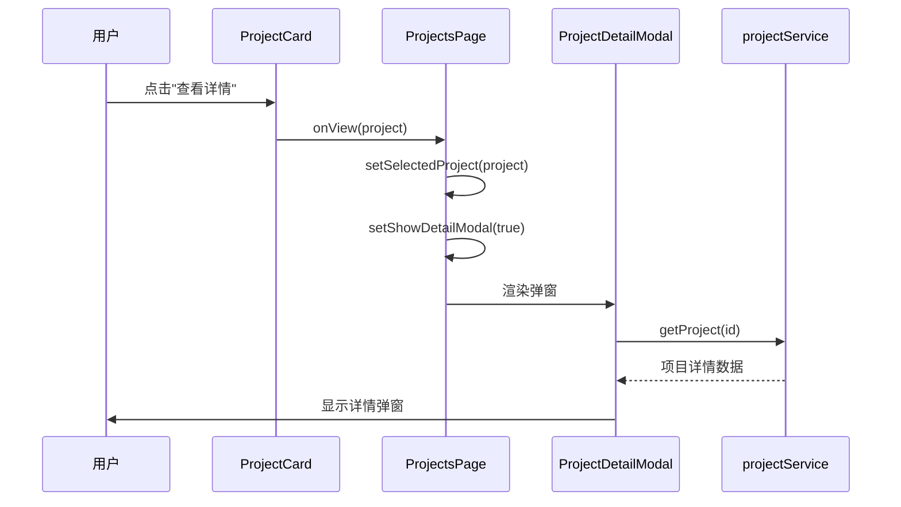
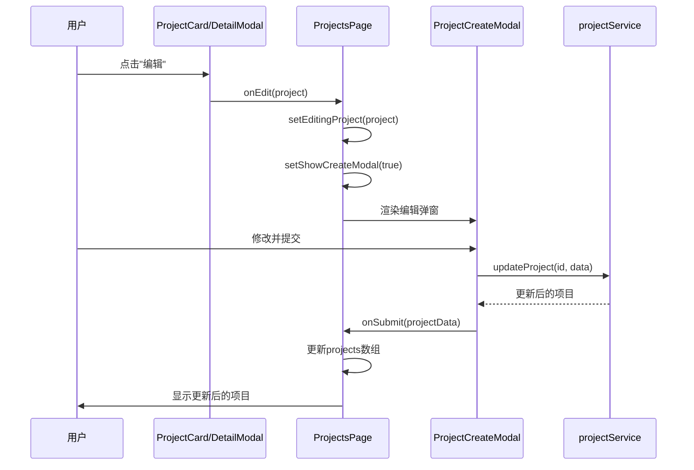
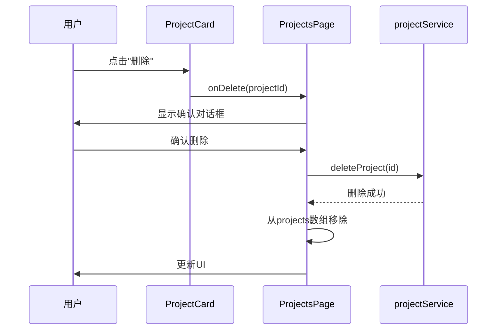

# 项目管理功能完善 - 设计文档

## 系统架构

### 整体架构图


### 组件层级
```
ProjectsPage (仪表盘视图模式)
├── ProjectDashboard (统计卡片)
├── 项目卡片网格容器
│   └── ProjectCard[] (项目卡片数组)
│       └── DropdownMenu (更多操作菜单)
├── ProjectDetailModal (详情弹窗)
├── ProjectCreateModal (创建/编辑弹窗)
└── 删除确认对话框
```

## 核心组件设计

### 1. ProjectCard 组件

#### 接口定义
```typescript
interface ProjectCardProps {
  project: Project;
  onView: (project: Project) => void;
  onEdit: (project: Project) => void;
  onDelete: (projectId: string) => void;
  onStatusChange?: (projectId: string, status: Project['status']) => void;
}
```

#### 视觉设计
```
┌─────────────────────────────────────────┐
│ 📋 项目名称              [高] [进行中] ⋮ │
│ 项目描述文字...                         │
│                                         │
│ ━━━━━━━━━━━━━━━━━━━━━━━ 75%            │
│                                         │
│ 👥 5人  ✓ 12/16  📅 2025-01-15 ~ 03-31 │
└─────────────────────────────────────────┘
```

#### 功能模块
- **头部区域**
  - 项目图标（可选）
  - 项目名称（加粗）
  - 优先级标签（high/medium/low）
  - 状态标签（planning/active/paused/completed/archived）
  - 更多按钮（⋮）

- **内容区域**
  - 项目描述（最多2行，超出显示省略号）
  - 进度条（基于任务完成率）

- **底部信息**
  - 团队成员数（图标 + 数字）
  - 任务统计（完成数/总数）
  - 日期范围（开始日期 ~ 结束日期）

- **下拉菜单**
  - 查看详情
  - 编辑项目
  - 删除项目

### 2. ProjectDetailModal 组件

#### 接口定义
```typescript
interface ProjectDetailModalProps {
  isOpen: boolean;
  project: Project | null;
  onClose: () => void;
  onEdit: (project: Project) => void;
}
```

#### 布局设计
```
┌─────────────────────────────────────────────┐
│ 项目详情                          [编辑] [X]│
├─────────────────────────────────────────────┤
│ 📋 项目名称                                 │
│ [高优先级] [进行中]                         │
│                                             │
│ 描述                                        │
│ ┌─────────────────────────────────────────┐ │
│ │ 项目的详细描述文字...                   │ │
│ └─────────────────────────────────────────┘ │
│                                             │
│ 项目统计                                    │
│ ┌──────┬──────┬──────┬──────┐              │
│ │任务总数│已完成 │进度   │团队  │             │
│ │  16  │  12  │ 75%  │  5  │              │
│ └──────┴──────┴──────┴──────┘              │
│                                             │
│ 时间信息                                    │
│ 开始: 2025-01-15                            │
│ 结束: 2025-03-31                            │
│ 剩余: 45天                                  │
│                                             │
│ 团队成员 (5)                         [查看全部]│
│ ┌─────┬─────┬─────┬─────┬─────┐            │
│ │ 👤  │ 👤  │ 👤  │ 👤  │ 👤  │            │
│ └─────┴─────┴─────┴─────┴─────┘            │
│                                             │
│ 最近任务 (3)                         [查看全部]│
│ • 完成前端开发 (已完成)                      │
│ • 后端API开发 (进行中)                       │
│ • 测试用例编写 (待办)                        │
└─────────────────────────────────────────────┘
```

#### 功能模块
- **头部**
  - 标题："项目详情"
  - 编辑按钮
  - 关闭按钮

- **项目信息区**
  - 项目名称
  - 状态和优先级标签
  - 项目描述（完整显示）

- **统计卡片区**
  - 任务总数
  - 已完成任务数
  - 完成进度百分比
  - 团队成员数

- **时间信息区**
  - 开始日期
  - 结束日期
  - 剩余天数

- **团队成员区**
  - 成员头像列表（最多显示5个）
  - "查看全部"链接

- **最近任务区**
  - 任务列表（最多显示3个）
  - "查看全部"链接

### 3. ProjectCreateModal 修改

#### 修改内容
```typescript
// 添加可访问性属性
<div 
  className="bg-white rounded-xl shadow-2xl w-full max-w-4xl max-h-[90vh] overflow-hidden flex flex-col"
  role="dialog"
  aria-modal="true"
  aria-labelledby="project-modal-title"
>
  <h2 
    id="project-modal-title"
    className="text-2xl font-bold text-gray-900"
  >
    {editProject ? '编辑项目' : parentProject ? '创建子项目' : '创建新项目'}
  </h2>
  ...
</div>
```

## 数据流设计

### 状态管理
```typescript
// ProjectsPage.tsx 新增状态
const [selectedProject, setSelectedProject] = useState<Project | null>(null);
const [showDetailModal, setShowDetailModal] = useState(false);
const [projects, setProjects] = useState<Project[]>([]);
```

### 交互流程

#### 查看详情流程


#### 编辑流程


#### 删除流程


## 接口契约定义

### ProjectCard Props
```typescript
interface ProjectCardProps {
  project: Project;           // 项目数据
  onView: (project: Project) => void;     // 查看详情回调
  onEdit: (project: Project) => void;     // 编辑回调
  onDelete: (projectId: string) => void;  // 删除回调
  onStatusChange?: (projectId: string, status: Project['status']) => void; // 可选：状态变更
}
```

### ProjectDetailModal Props
```typescript
interface ProjectDetailModalProps {
  isOpen: boolean;            // 是否打开
  project: Project | null;    // 项目数据（null时不渲染）
  onClose: () => void;        // 关闭回调
  onEdit: (project: Project) => void;  // 编辑回调
}
```

### ProjectCreateModal 修改
```typescript
// 无需修改接口，仅添加 HTML 属性
```

## 样式设计

### 颜色方案
```typescript
// 状态标签颜色
const statusColors = {
  planning: 'bg-gray-100 text-gray-700',
  active: 'bg-green-100 text-green-700',
  paused: 'bg-yellow-100 text-yellow-700',
  completed: 'bg-blue-100 text-blue-700',
  archived: 'bg-purple-100 text-purple-700'
};

// 优先级标签颜色
const priorityColors = {
  low: 'bg-blue-100 text-blue-700',
  medium: 'bg-orange-100 text-orange-700',
  high: 'bg-red-100 text-red-700'
};
```

### 响应式布局
```css
/* 项目卡片网格 */
.project-grid {
  grid-template-columns: 1fr;           /* 移动端：1列 */
}

@media (min-width: 768px) {
  .project-grid {
    grid-template-columns: repeat(2, 1fr);  /* 平板：2列 */
  }
}

@media (min-width: 1024px) {
  .project-grid {
    grid-template-columns: repeat(3, 1fr);  /* 桌面：3列 */
  }
}
```

## 异常处理策略

### API 调用错误
```typescript
try {
  const project = await projectService.getProject(id);
  // 成功处理
} catch (error) {
  console.error('获取项目详情失败:', error);
  alert('获取项目详情失败，请稍后重试');
}
```

### 删除确认
```typescript
const handleDelete = async (projectId: string) => {
  if (!confirm('确定要删除这个项目吗？此操作不可撤销。')) {
    return;
  }
  
  try {
    await projectService.deleteProject(projectId);
    setProjects(prev => prev.filter(p => p.id !== projectId));
    alert('项目已删除');
  } catch (error) {
    console.error('删除项目失败:', error);
    alert('删除项目失败，请稍后重试');
  }
};
```

### 空数据处理
```typescript
// 如果没有项目，显示空状态
{filteredProjects.length === 0 && (
  <div className="text-center py-12">
    <p className="text-gray-500">暂无项目</p>
    <button onClick={handleCreateProject}>创建项目</button>
  </div>
)}
```

## 可访问性设计

### ARIA 属性
```typescript
// 弹窗
<div role="dialog" aria-modal="true" aria-labelledby="modal-title">
  <h2 id="modal-title">项目详情</h2>
</div>

// 按钮
<button aria-label="更多操作">⋮</button>
<button aria-label="关闭弹窗">×</button>

// 进度条
<div role="progressbar" aria-valuenow={75} aria-valuemin={0} aria-valuemax={100}>
```

### 键盘导航
```typescript
// ESC 键关闭弹窗
useEffect(() => {
  const handleKeyDown = (e: KeyboardEvent) => {
    if (e.key === 'Escape') {
      onClose();
    }
  };
  
  if (isOpen) {
    window.addEventListener('keydown', handleKeyDown);
    return () => window.removeEventListener('keydown', handleKeyDown);
  }
}, [isOpen, onClose]);
```

## 性能优化

### 组件优化
```typescript
// 使用 React.memo 避免不必要的重渲染
export const ProjectCard = React.memo<ProjectCardProps>(({ project, ...props }) => {
  // ...
});

// 使用 useMemo 缓存计算结果
const progressPercentage = useMemo(() => {
  return Math.round((project.tasks_completed || 0) / Math.max(project.tasks_total || 1, 1) * 100);
}, [project.tasks_completed, project.tasks_total]);
```

## 测试策略

### E2E 测试覆盖
- ✅ 弹窗可通过 `[role="dialog"]` 找到
- ✅ 项目卡片可通过 `[data-testid="project-card"]` 找到
- ✅ 更多按钮可通过 `button[aria-label="更多"]` 找到
- ✅ 查看详情功能可正常触发
- ✅ 编辑功能可正常触发
- ✅ 删除功能可正常触发

