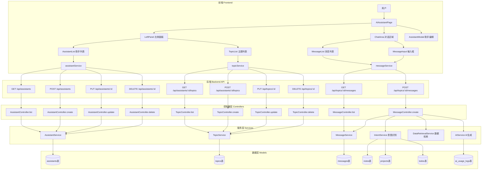
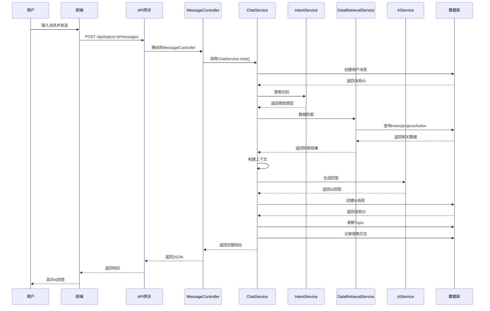
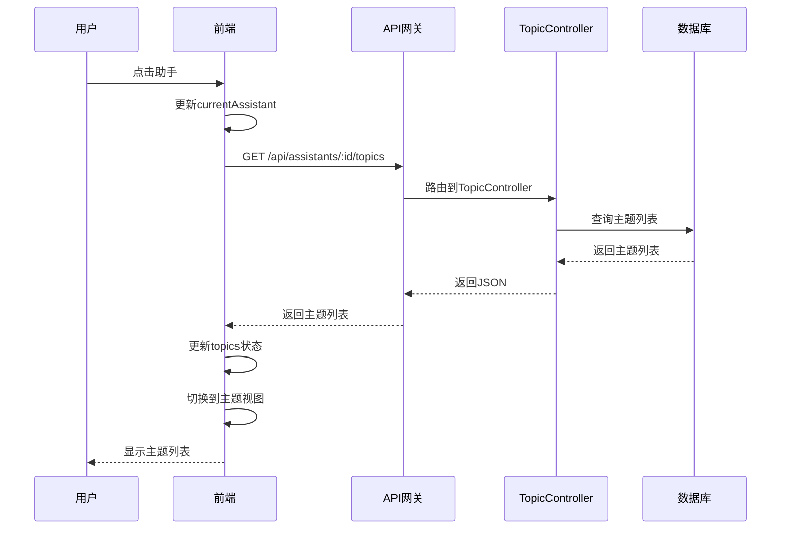

# 多助手系统 - 架构设计文档

**创建时间**: 2025-11-02  
**任务名称**: 多助手系统（参考CherryStudio）  
**状态**: 架构设计

---

## 1. 整体架构图



---

## 2. 系统分层设计

### 2.1 前端架构

#### 2.1.1 页面组件层级

```
AIAssistantPage (主页面)
│
├── LeftPanel (左侧面板 - 280px宽)
│   │
│   ├── PanelSwitcher (切换器)
│   │   ├── AssistantTab (助手标签)
│   │   └── TopicTab (主题标签)
│   │
│   ├── AssistantList (助手列表视图)
│   │   ├── AssistantItem (助手项)
│   │   │   ├── Icon (图标)
│   │   │   ├── Name (名称)
│   │   │   ├── Description (描述)
│   │   │   └── Actions (操作按钮)
│   │   │       ├── Edit (编辑)
│   │   │       └── Delete (删除)
│   │   └── CreateAssistantButton (新建按钮)
│   │
│   └── TopicList (主题列表视图)
│       ├── CurrentAssistantInfo (当前助手信息)
│       ├── TopicItem (主题项)
│       │   ├── Title (标题)
│       │   ├── MessageCount (消息数)
│       │   ├── UpdatedAt (更新时间)
│       │   └── Actions (操作按钮)
│       │       ├── Rename (重命名)
│       │       └── Delete (删除)
│       ├── CreateTopicButton (新建按钮)
│       └── BatchDeleteButton (批量删除)
│
├── ChatArea (对话区域)
│   │
│   ├── ChatHeader (对话头部)
│   │   ├── AssistantInfo (助手信息)
│   │   │   ├── Icon (图标)
│   │   │   ├── Name (名称)
│   │   │   └── EditButton (编辑按钮)
│   │   └── TopicInfo (主题信息)
│   │       ├── Title (标题)
│   │       └── RenameButton (重命名按钮)
│   │
│   ├── MessageList (消息列表)
│   │   ├── EmptyState (空状态)
│   │   │   ├── WelcomeMessage (欢迎消息)
│   │   │   └── SampleQuestions (示例问题)
│   │   └── MessageItem (消息项)
│   │       ├── Avatar (头像)
│   │       ├── Content (内容)
│   │       ├── Timestamp (时间戳)
│   │       ├── Metadata (元数据)
│   │       │   ├── Intent (意图)
│   │       │   ├── DataSource (数据来源)
│   │       │   └── ItemsFound (找到的数据)
│   │       └── Actions (操作)
│   │           └── Copy (复制)
│   │
│   └── MessageInput (输入区域)
│       ├── Textarea (输入框)
│       ├── SendButton (发送按钮)
│       └── Tips (提示文本)
│
└── Modals (弹窗)
    │
    ├── AssistantModal (助手编辑弹窗)
    │   ├── BasicInfo (基本信息)
    │   │   ├── NameInput (名称)
    │   │   ├── DescriptionInput (描述)
    │   │   └── IconPicker (图标选择器)
    │   ├── SystemPromptEditor (系统提示词)
    │   │   └── Textarea (多行文本框)
    │   └── AdvancedSettings (高级设置)
    │       ├── ModelSelect (模型选择)
    │       ├── TemperatureSlider (温度)
    │       └── TopPSlider (Top P)
    │
    ├── PresetModal (预设模板选择)
    │   └── PresetItem (模板项)
    │       ├── Icon (图标)
    │       ├── Name (名称)
    │       ├── Description (描述)
    │       └── SelectButton (选择按钮)
    │
    └── MigrationModal (迁移提示弹窗)
        ├── Message (提示消息)
        ├── ConversationList (对话列表)
        └── Actions (操作按钮)
            ├── MigrateButton (迁移)
            └── SkipButton (跳过)
```

#### 2.1.2 状态管理

```typescript
// 全局状态
interface AppState {
  // 助手相关
  assistants: Assistant[];
  currentAssistant: Assistant | null;
  assistantsLoading: boolean;
  
  // 主题相关
  topics: Topic[];
  currentTopic: Topic | null;
  topicsLoading: boolean;
  
  // 消息相关
  messages: Message[];
  messagesLoading: boolean;
  messageSending: boolean;
  
  // UI状态
  panelView: 'assistants' | 'topics';
  showAssistantModal: boolean;
  showPresetModal: boolean;
  showMigrationModal: boolean;
  editingAssistant: Assistant | null;
  
  // 批量操作
  selectedTopicIds: string[];
  batchDeleteMode: boolean;
}
```

#### 2.1.3 服务层（前端）

```typescript
// assistantService.ts
export const assistantService = {
  // 获取助手列表
  async getAssistants(): Promise<Assistant[]>
  
  // 创建助手
  async createAssistant(data: CreateAssistantDto): Promise<Assistant>
  
  // 更新助手
  async updateAssistant(id: string, data: UpdateAssistantDto): Promise<Assistant>
  
  // 删除助手
  async deleteAssistant(id: string): Promise<void>
  
  // 获取预设模板
  async getPresets(): Promise<AssistantPreset[]>
  
  // 迁移对话
  async migrateConversations(conversations: Conversation[]): Promise<MigrationResult>
}

// topicService.ts
export const topicService = {
  // 获取主题列表
  async getTopics(assistantId: string): Promise<Topic[]>
  
  // 创建主题
  async createTopic(assistantId: string, title?: string): Promise<Topic>
  
  // 更新主题
  async updateTopic(id: string, data: UpdateTopicDto): Promise<Topic>
  
  // 删除主题
  async deleteTopic(id: string): Promise<void>
  
  // 批量删除主题
  async batchDeleteTopics(ids: string[]): Promise<number>
}

// messageService.ts
export const messageService = {
  // 获取消息列表
  async getMessages(topicId: string, limit?: number, offset?: number): Promise<MessageListResponse>
  
  // 发送消息
  async sendMessage(topicId: string, content: string): Promise<SendMessageResponse>
}
```

### 2.2 后端架构

#### 2.2.1 控制器层（Controllers）

```typescript
// AssistantController.ts
export class AssistantController {
  // GET /api/assistants
  static async list(req: Request, res: Response): Promise<void>
  
  // POST /api/assistants
  static async create(req: Request, res: Response): Promise<void>
  
  // PUT /api/assistants/:id
  static async update(req: Request, res: Response): Promise<void>
  
  // DELETE /api/assistants/:id
  static async delete(req: Request, res: Response): Promise<void>
  
  // GET /api/assistants/presets
  static async getPresets(req: Request, res: Response): Promise<void>
  
  // POST /api/assistants/migrate
  static async migrate(req: Request, res: Response): Promise<void>
}

// TopicController.ts
export class TopicController {
  // GET /api/assistants/:assistantId/topics
  static async list(req: Request, res: Response): Promise<void>
  
  // POST /api/assistants/:assistantId/topics
  static async create(req: Request, res: Response): Promise<void>
  
  // PUT /api/topics/:id
  static async update(req: Request, res: Response): Promise<void>
  
  // DELETE /api/topics/:id
  static async delete(req: Request, res: Response): Promise<void>
  
  // DELETE /api/topics/batch
  static async batchDelete(req: Request, res: Response): Promise<void>
}

// MessageController.ts
export class MessageController {
  // GET /api/topics/:topicId/messages
  static async list(req: Request, res: Response): Promise<void>
  
  // POST /api/topics/:topicId/messages
  static async create(req: Request, res: Response): Promise<void>
}
```

#### 2.2.2 服务层（Services）

```typescript
// AssistantService.ts
export class AssistantService {
  // 获取用户的助手列表
  static async getUserAssistants(userId: string): Promise<Assistant[]>
  
  // 创建助手
  static async createAssistant(userId: string, data: CreateAssistantDto): Promise<Assistant>
  
  // 更新助手
  static async updateAssistant(id: string, userId: string, data: UpdateAssistantDto): Promise<Assistant>
  
  // 删除助手
  static async deleteAssistant(id: string, userId: string): Promise<void>
  
  // 初始化默认助手
  static async initializeDefaultAssistant(userId: string): Promise<Assistant>
  
  // 获取预设模板
  static getPresets(): AssistantPreset[]
  
  // 从模板创建助手
  static async createFromPreset(userId: string, presetId: string): Promise<Assistant>
}

// TopicService.ts
export class TopicService {
  // 获取助手的主题列表
  static async getAssistantTopics(assistantId: string, userId: string): Promise<Topic[]>
  
  // 创建主题
  static async createTopic(assistantId: string, userId: string, title?: string): Promise<Topic>
  
  // 更新主题
  static async updateTopic(id: string, userId: string, data: UpdateTopicDto): Promise<Topic>
  
  // 删除主题
  static async deleteTopic(id: string, userId: string): Promise<void>
  
  // 批量删除主题
  static async batchDeleteTopics(ids: string[], userId: string): Promise<number>
  
  // 自动生成主题标题
  static async generateTitle(firstMessage: string): Promise<string>
  
  // 更新消息计数
  static async updateMessageCount(topicId: string): Promise<void>
}

// MessageService.ts
export class MessageService {
  // 获取主题的消息列表
  static async getTopicMessages(
    topicId: string, 
    userId: string, 
    limit: number = 50, 
    offset: number = 0
  ): Promise<{ messages: Message[], total: number, hasMore: boolean }>
  
  // 创建用户消息
  static async createUserMessage(topicId: string, content: string): Promise<Message>
  
  // 创建AI消息
  static async createAssistantMessage(
    topicId: string, 
    content: string, 
    metadata?: any
  ): Promise<Message>
  
  // 处理对话（完整流程）
  static async processConversation(
    topicId: string,
    userId: string,
    userMessage: string
  ): Promise<{
    userMessage: Message,
    assistantMessage: Message,
    metadata: any
  }>
}

// ChatService.ts (整合对话逻辑)
export class ChatService {
  // 处理对话的完整流程
  static async chat(
    topicId: string,
    userId: string,
    userMessage: string
  ): Promise<ChatResponse> {
    // 1. 获取主题和助手信息
    const topic = await TopicModel.findById(topicId);
    const assistant = await AssistantModel.findById(topic.assistant_id);
    
    // 2. 创建用户消息
    const userMsg = await MessageService.createUserMessage(topicId, userMessage);
    
    // 3. 意图识别
    const intent = await IntentService.detectIntent(userMessage);
    
    // 4. 数据检索
    const retrievedData = await DataRetrievalService.retrieve(intent, userId);
    
    // 5. 构建上下文
    const context = await this.buildContext(topicId, assistant, retrievedData);
    
    // 6. 调用AI生成回答
    const aiResponse = await AIService.generateResponse(context);
    
    // 7. 创建AI消息
    const assistantMsg = await MessageService.createAssistantMessage(
      topicId,
      aiResponse.content,
      {
        intent: intent.type,
        dataSource: retrievedData.sources,
        itemsFound: retrievedData.count,
        tokensUsed: aiResponse.usage.total_tokens
      }
    );
    
    // 8. 更新主题
    await TopicService.updateMessageCount(topicId);
    await TopicService.updateTitle(topicId, userMessage); // 如果是第一条消息
    
    // 9. 记录使用日志
    await AIUsageLogModel.create({
      user_id: userId,
      action_type: 'assistant_qa',
      model_name: aiResponse.model,
      input_tokens: aiResponse.usage.prompt_tokens,
      output_tokens: aiResponse.usage.completion_tokens,
      cost_cents: this.calculateCost(aiResponse.usage)
    });
    
    return {
      userMessage: userMsg,
      assistantMessage: assistantMsg,
      metadata: assistantMsg.metadata
    };
  }
  
  // 构建上下文
  private static async buildContext(
    topicId: string,
    assistant: Assistant,
    retrievedData: any
  ): Promise<Message[]> {
    // 获取最近50条消息
    const { messages } = await MessageService.getTopicMessages(topicId, assistant.user_id, 50);
    
    // 构建系统提示词
    const systemPrompt = this.buildSystemPrompt(assistant, retrievedData);
    
    // 构建上下文
    return [
      { role: 'system', content: systemPrompt },
      ...messages.map(m => ({ role: m.role, content: m.content }))
    ];
  }
  
  // 构建系统提示词
  private static buildSystemPrompt(assistant: Assistant, retrievedData: any): string {
    let prompt = assistant.system_prompt;
    
    // 添加知识库访问说明
    prompt += `\n\n你可以访问用户的以下数据：
- 笔记（notes）：用户的个人笔记和知识库
- 项目（projects）：用户的项目和任务
- 待办事项（todos）：用户的待办清单

当用户询问相关问题时，请主动使用这些数据提供帮助。`;
    
    // 如果检索到数据，注入到提示词
    if (retrievedData && retrievedData.items.length > 0) {
      prompt += `\n\n以下是检索到的相关数据：\n${JSON.stringify(retrievedData.items, null, 2)}`;
    }
    
    return prompt;
  }
}
```

#### 2.2.3 数据模型层（Models）

```typescript
// AssistantModel.ts
export class AssistantModel {
  static async findByUserId(userId: string): Promise<Assistant[]>
  static async findById(id: string): Promise<Assistant | null>
  static async create(data: CreateAssistantDto): Promise<Assistant>
  static async update(id: string, data: UpdateAssistantDto): Promise<Assistant>
  static async delete(id: string): Promise<void>
  static async countByUserId(userId: string): Promise<number>
}

// TopicModel.ts
export class TopicModel {
  static async findByAssistantId(assistantId: string): Promise<Topic[]>
  static async findById(id: string): Promise<Topic | null>
  static async create(data: CreateTopicDto): Promise<Topic>
  static async update(id: string, data: UpdateTopicDto): Promise<Topic>
  static async delete(id: string): Promise<void>
  static async batchDelete(ids: string[]): Promise<number>
}

// MessageModel.ts
export class MessageModel {
  static async findByTopicId(
    topicId: string, 
    limit: number, 
    offset: number
  ): Promise<{ messages: Message[], total: number }>
  static async create(data: CreateMessageDto): Promise<Message>
  static async countByTopicId(topicId: string): Promise<number>
}
```

---

## 3. 核心模块设计

### 3.1 助手管理模块

#### 3.1.1 数据结构

```typescript
interface Assistant {
  id: string;
  user_id: string;
  name: string;
  description: string;
  icon: string;  // emoji
  system_prompt: string;
  model_name?: string;
  temperature?: number;
  top_p?: number;
  is_default: boolean;
  is_preset: boolean;
  sort_order: number;
  created_at: Date;
  updated_at: Date;
}

interface AssistantPreset {
  id: string;
  name: string;
  description: string;
  icon: string;
  system_prompt: string;
  category: string;
}
```

#### 3.1.2 预设模板定义

```typescript
const ASSISTANT_PRESETS: AssistantPreset[] = [
  {
    id: 'code',
    name: '代码助手',
    description: '专注于编程、调试、代码审查和技术问题',
    icon: '🤖',
    category: 'development',
    system_prompt: `你是一个专业的编程助手，擅长：
- 编写高质量的代码
- 代码审查和优化建议
- 调试和问题排查
- 技术方案设计
- 最佳实践推荐

你可以访问用户的笔记、项目和待办事项，帮助他们更好地完成编程任务。`
  },
  {
    id: 'writing',
    name: '写作助手',
    description: '专注于文案、文章、创意写作和内容优化',
    icon: '✍️',
    category: 'content',
    system_prompt: `你是一个专业的写作助手，擅长：
- 创意写作和文案撰写
- 文章结构优化
- 语言润色和修改
- 内容策划和大纲
- 不同风格的写作

你可以访问用户的笔记和项目，提供个性化的写作建议。`
  },
  {
    id: 'data',
    name: '数据分析助手',
    description: '专注于数据分析、统计和可视化',
    icon: '📊',
    category: 'analysis',
    system_prompt: `你是一个专业的数据分析助手，擅长：
- 数据分析和解读
- 统计方法应用
- 数据可视化建议
- 趋势预测和洞察
- 报告撰写

你可以访问用户的项目和待办事项数据，提供数据驱动的建议。`
  },
  {
    id: 'translation',
    name: '翻译助手',
    description: '专注于多语言翻译和本地化',
    icon: '🌐',
    category: 'language',
    system_prompt: `你是一个专业的翻译助手，擅长：
- 多语言翻译（中英日韩等）
- 本地化和文化适配
- 术语准确性
- 语境理解
- 风格保持

你可以访问用户的笔记，提供上下文相关的翻译。`
  },
  {
    id: 'general',
    name: '通用助手',
    description: '全能助手，可以回答各种问题',
    icon: '💡',
    category: 'general',
    system_prompt: `你是一个全能的AI助手，可以回答各种问题，帮助用户完成各种任务。

你可以访问用户的以下数据：
- 笔记（notes）：用户的个人笔记和知识库
- 项目（projects）：用户的项目和任务
- 待办事项（todos）：用户的待办清单

当用户询问相关问题时，请主动检索这些数据并提供个性化的帮助。`
  }
];
```

### 3.2 主题管理模块

#### 3.2.1 数据结构

```typescript
interface Topic {
  id: string;
  assistant_id: string;
  user_id: string;
  title: string;
  is_auto_title: boolean;
  message_count: number;
  created_at: Date;
  updated_at: Date;
}
```

#### 3.2.2 标题自动生成策略

```typescript
class TitleGenerator {
  // 从第一条消息生成标题
  static async generateFromMessage(message: string): Promise<string> {
    // 策略1: 如果消息很短（<20字），直接使用
    if (message.length <= 20) {
      return message;
    }
    
    // 策略2: 提取前20字 + "..."
    if (message.length <= 50) {
      return message.substring(0, 20) + '...';
    }
    
    // 策略3: 使用AI生成简洁标题
    try {
      const title = await AIService.generateTitle(message);
      return title;
    } catch (error) {
      // 降级方案：使用前20字
      return message.substring(0, 20) + '...';
    }
  }
}
```

### 3.3 消息管理模块

#### 3.3.1 数据结构

```typescript
interface Message {
  id: string;
  topic_id: string;
  role: 'user' | 'assistant' | 'system';
  content: string;
  metadata: {
    intent?: string;
    dataSource?: string[];
    itemsFound?: number;
    tokensUsed?: number;
  };
  created_at: Date;
}
```

#### 3.3.2 上下文管理

```typescript
class ContextManager {
  // 最大上下文消息数
  private static readonly MAX_CONTEXT_MESSAGES = 50;
  
  // 最大token数（估算）
  private static readonly MAX_CONTEXT_TOKENS = 4000;
  
  // 构建上下文
  static async buildContext(
    topicId: string,
    assistant: Assistant,
    retrievedData?: any
  ): Promise<ContextMessage[]> {
    // 1. 获取最近的消息
    const { messages } = await MessageModel.findByTopicId(
      topicId,
      this.MAX_CONTEXT_MESSAGES,
      0
    );
    
    // 2. 构建系统提示词
    const systemPrompt = this.buildSystemPrompt(assistant, retrievedData);
    
    // 3. 组装上下文
    const context: ContextMessage[] = [
      { role: 'system', content: systemPrompt }
    ];
    
    // 4. 添加历史消息（估算token，避免超限）
    let estimatedTokens = this.estimateTokens(systemPrompt);
    
    for (const msg of messages) {
      const msgTokens = this.estimateTokens(msg.content);
      
      if (estimatedTokens + msgTokens > this.MAX_CONTEXT_TOKENS) {
        break;
      }
      
      context.push({
        role: msg.role,
        content: msg.content
      });
      
      estimatedTokens += msgTokens;
    }
    
    return context;
  }
  
  // 估算token数（简单方法：字符数 / 4）
  private static estimateTokens(text: string): number {
    return Math.ceil(text.length / 4);
  }
  
  // 构建系统提示词
  private static buildSystemPrompt(
    assistant: Assistant,
    retrievedData?: any
  ): string {
    let prompt = assistant.system_prompt;
    
    // 添加知识库访问说明
    prompt += `\n\n你可以访问用户的以下数据：
- 笔记（notes）：用户的个人笔记和知识库
- 项目（projects）：用户的项目和任务
- 待办事项（todos）：用户的待办清单`;
    
    // 如果检索到数据，注入到提示词
    if (retrievedData && retrievedData.items.length > 0) {
      prompt += `\n\n以下是检索到的相关数据：\n`;
      
      retrievedData.items.forEach((item: any, index: number) => {
        prompt += `\n${index + 1}. ${JSON.stringify(item)}`;
      });
    }
    
    return prompt;
  }
}
```

### 3.4 知识库集成模块

#### 3.4.1 复用现有服务

```typescript
// 复用IntentService（意图识别）
import { IntentService } from '../services/intentService';

// 复用DataRetrievalService（数据检索）
import { DataRetrievalService } from '../services/dataRetrievalService';

// 集成到ChatService
class ChatService {
  static async chat(topicId: string, userId: string, userMessage: string) {
    // 1. 意图识别
    const intent = await IntentService.detectIntent(userMessage);
    
    // 2. 数据检索
    const retrievedData = await DataRetrievalService.retrieve(intent, userId);
    
    // 3. 构建上下文（包含检索到的数据）
    const context = await ContextManager.buildContext(
      topicId,
      assistant,
      retrievedData
    );
    
    // 4. 生成回答
    const aiResponse = await AIService.generateResponse(context);
    
    return {
      content: aiResponse.content,
      metadata: {
        intent: intent.type,
        dataSource: retrievedData.sources,
        itemsFound: retrievedData.count
      }
    };
  }
}
```

### 3.5 数据迁移模块

#### 3.5.1 迁移流程

```typescript
class MigrationService {
  // 检测是否需要迁移
  static async checkMigrationNeeded(userId: string): Promise<boolean> {
    // 检查localStorage中是否有对话历史
    // 这个逻辑在前端执行
    return false; // 后端不需要检测
  }
  
  // 执行迁移
  static async migrate(
    userId: string,
    conversations: Conversation[]
  ): Promise<MigrationResult> {
    // 1. 创建或获取默认助手
    let defaultAssistant = await AssistantModel.findByUserId(userId)
      .then(assistants => assistants.find(a => a.is_default));
    
    if (!defaultAssistant) {
      defaultAssistant = await AssistantService.initializeDefaultAssistant(userId);
    }
    
    // 2. 迁移每个对话为一个Topic
    let migratedCount = 0;
    
    for (const conv of conversations) {
      try {
        // 创建Topic
        const topic = await TopicModel.create({
          assistant_id: defaultAssistant.id,
          user_id: userId,
          title: conv.title,
          is_auto_title: false
        });
        
        // 迁移消息
        for (const msg of conv.messages) {
          await MessageModel.create({
            topic_id: topic.id,
            role: msg.role,
            content: msg.content,
            metadata: msg.metadata || {}
          });
        }
        
        // 更新消息计数
        await TopicService.updateMessageCount(topic.id);
        
        migratedCount++;
      } catch (error) {
        console.error(`迁移对话失败: ${conv.id}`, error);
      }
    }
    
    return {
      success: true,
      migratedCount,
      defaultAssistant
    };
  }
}
```

---

## 4. 接口契约定义

### 4.1 助手接口

#### GET /api/assistants
```typescript
Request: 无参数（从token获取userId）

Response: {
  success: boolean;
  data: {
    assistants: Assistant[];
  }
}
```

#### POST /api/assistants
```typescript
Request: {
  name: string;
  description?: string;
  icon?: string;
  system_prompt: string;
  model_name?: string;
  temperature?: number;
  top_p?: number;
}

Response: {
  success: boolean;
  data: {
    assistant: Assistant;
  }
}
```

#### PUT /api/assistants/:id
```typescript
Request: {
  name?: string;
  description?: string;
  icon?: string;
  system_prompt?: string;
  model_name?: string;
  temperature?: number;
  top_p?: number;
  sort_order?: number;
}

Response: {
  success: boolean;
  data: {
    assistant: Assistant;
  }
}
```

#### DELETE /api/assistants/:id
```typescript
Request: 无Body

Response: {
  success: boolean;
  message: string;
}
```

#### GET /api/assistants/presets
```typescript
Request: 无参数

Response: {
  success: boolean;
  data: {
    presets: AssistantPreset[];
  }
}
```

#### POST /api/assistants/migrate
```typescript
Request: {
  conversations: Conversation[];
}

Response: {
  success: boolean;
  data: {
    migratedCount: number;
    defaultAssistant: Assistant;
  }
}
```

### 4.2 主题接口

#### GET /api/assistants/:assistantId/topics
```typescript
Request: 无参数

Response: {
  success: boolean;
  data: {
    topics: Topic[];
  }
}
```

#### POST /api/assistants/:assistantId/topics
```typescript
Request: {
  title?: string;  // 可选，不提供则自动生成
}

Response: {
  success: boolean;
  data: {
    topic: Topic;
  }
}
```

#### PUT /api/topics/:id
```typescript
Request: {
  title: string;
}

Response: {
  success: boolean;
  data: {
    topic: Topic;
  }
}
```

#### DELETE /api/topics/:id
```typescript
Request: 无Body

Response: {
  success: boolean;
  message: string;
}
```

#### DELETE /api/topics/batch
```typescript
Request: {
  topicIds: string[];
}

Response: {
  success: boolean;
  data: {
    deletedCount: number;
  }
}
```

### 4.3 消息接口

#### GET /api/topics/:topicId/messages
```typescript
Request: {
  limit?: number;  // 默认50
  offset?: number;  // 默认0
}

Response: {
  success: boolean;
  data: {
    messages: Message[];
    total: number;
    hasMore: boolean;
  }
}
```

#### POST /api/topics/:topicId/messages
```typescript
Request: {
  content: string;
}

Response: {
  success: boolean;
  data: {
    userMessage: Message;
    assistantMessage: Message;
    metadata: {
      intent: string;
      dataSource: string[];
      itemsFound: number;
    }
  }
}
```

---

## 5. 数据流向图

### 5.1 发送消息流程



### 5.2 切换助手流程



---

## 6. 异常处理策略

### 6.1 前端异常处理

```typescript
// 统一错误处理
class ErrorHandler {
  static handle(error: any): void {
    if (error.response) {
      // HTTP错误
      const status = error.response.status;
      const message = error.response.data?.message || '请求失败';
      
      switch (status) {
        case 401:
          alert('请先登录');
          window.location.href = '/login';
          break;
        case 403:
          alert('没有权限');
          break;
        case 404:
          alert('资源不存在');
          break;
        case 500:
          alert('服务器错误，请稍后重试');
          break;
        default:
          alert(message);
      }
    } else if (error.request) {
      // 网络错误
      alert('网络连接失败，请检查网络');
    } else {
      // 其他错误
      alert(error.message || '未知错误');
    }
  }
}
```

### 6.2 后端异常处理

```typescript
// 统一错误响应
class ErrorResponse {
  static send(res: Response, status: number, message: string): void {
    res.status(status).json({
      success: false,
      message,
      timestamp: new Date().toISOString()
    });
  }
  
  static badRequest(res: Response, message: string): void {
    this.send(res, 400, message);
  }
  
  static unauthorized(res: Response, message: string = '未认证'): void {
    this.send(res, 401, message);
  }
  
  static forbidden(res: Response, message: string = '没有权限'): void {
    this.send(res, 403, message);
  }
  
  static notFound(res: Response, message: string = '资源不存在'): void {
    this.send(res, 404, message);
  }
  
  static serverError(res: Response, message: string = '服务器错误'): void {
    this.send(res, 500, message);
  }
}
```

---

## 7. 性能优化策略

### 7.1 前端优化

1. **虚拟滚动** - 消息列表使用虚拟滚动，只渲染可见区域
2. **懒加载** - 消息分页加载，滚动到顶部时加载更多
3. **防抖** - 输入框使用防抖，避免频繁触发
4. **缓存** - 助手列表、主题列表使用本地缓存
5. **乐观更新** - 发送消息时立即显示，不等待服务器响应

### 7.2 后端优化

1. **索引优化** - 为常用查询字段添加索引
2. **连接池** - 使用数据库连接池
3. **缓存** - 使用Redis缓存热点数据
4. **分页查询** - 消息列表使用分页，避免一次加载过多
5. **异步处理** - AI生成使用异步处理，避免阻塞

---

## 8. 安全策略

### 8.1 认证授权

```typescript
// 中间件：验证用户身份
function authenticate(req: Request, res: Response, next: NextFunction): void {
  if (!req.user) {
    return ErrorResponse.unauthorized(res);
  }
  next();
}

// 中间件：验证资源所有权
async function authorizeAssistant(req: Request, res: Response, next: NextFunction): Promise<void> {
  const assistantId = req.params.id;
  const assistant = await AssistantModel.findById(assistantId);
  
  if (!assistant || assistant.user_id !== req.user.id) {
    return ErrorResponse.forbidden(res, '无权访问此助手');
  }
  
  next();
}
```

### 8.2 输入验证

```typescript
// 使用express-validator进行输入验证
import { body, param, validationResult } from 'express-validator';

// 创建助手验证规则
const createAssistantValidation = [
  body('name').trim().isLength({ min: 1, max: 100 }).withMessage('名称长度1-100字符'),
  body('system_prompt').trim().isLength({ min: 10, max: 5000 }).withMessage('系统提示词长度10-5000字符'),
  body('temperature').optional().isFloat({ min: 0, max: 2 }).withMessage('温度范围0-2'),
  body('top_p').optional().isFloat({ min: 0, max: 1 }).withMessage('Top P范围0-1')
];
```

### 8.3 SQL注入防护

```typescript
// 使用参数化查询
const query = `
  SELECT * FROM assistants 
  WHERE user_id = $1 AND id = $2
`;
const result = await supabaseAdmin.rpc('execute_query', {
  query,
  params: [userId, assistantId]
});
```

---

**文档版本**: 1.0.0  
**创建时间**: 2025-11-02  
**状态**: 架构设计完成 ✅  
**下一步**: 进入原子化任务拆分阶段

