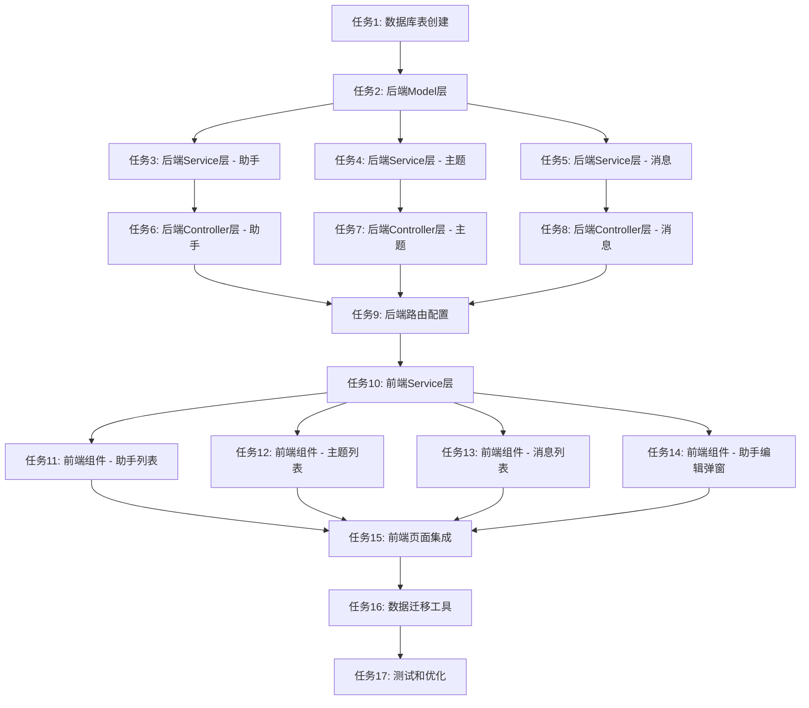

# 多助手系统 - 任务拆分文档

**创建时间**: 2025-11-02  
**任务名称**: 多助手系统（参考CherryStudio）  
**状态**: 任务拆分

---

## 任务依赖图

---

## 任务列表

### 🗄️ 数据库层（1个任务）

#### 任务1: 创建数据库表和索引

**优先级**: 🔴 高  
**预计时间**: 30分钟  
**依赖**: 无

**输入契约**:
- 数据库连接已配置
- 有数据库操作权限

**输出契约**:
- 创建3张新表：`assistants`, `topics`, `messages`
- 创建所有必要的索引
- 创建触发器（更新时间）
- 插入5个预设助手模板数据

**实现约束**:
- 使用SQL文件
- 兼容PostgreSQL
- 包含回滚脚本

**验收标准**:
- [ ] 表结构创建成功
- [ ] 索引创建成功
- [ ] 触发器工作正常
- [ ] 预设数据插入成功
- [ ] 可以成功回滚

**文件清单**:
- `server/database/create-assistant-tables.sql` - 创建表
- `server/database/rollback-assistant-tables.sql` - 回滚脚本

---

### 📦 后端Model层（1个任务）

#### 任务2: 创建数据模型

**优先级**: 🔴 高  
**预计时间**: 1小时  
**依赖**: 任务1

**输入契约**:
- 数据库表已创建
- Supabase连接已配置

**输出契约**:
- `AssistantModel` - 助手CRUD操作
- `TopicModel` - 主题CRUD操作
- `MessageModel` - 消息CRUD操作
- 所有模型包含类型定义

**实现约束**:
- 使用TypeScript
- 使用Supabase客户端
- 包含错误处理
- 包含类型定义

**验收标准**:
- [ ] 所有模型方法实现完整
- [ ] 类型定义正确
- [ ] 错误处理完善
- [ ] 可以通过单元测试

**文件清单**:
- `server/src/models/Assistant.ts`
- `server/src/models/Topic.ts`
- `server/src/models/Message.ts`
- `server/src/types/assistant.ts` - 类型定义

---

### ⚙️ 后端Service层（3个任务）

#### 任务3: 助手服务层

**优先级**: 🔴 高  
**预计时间**: 1.5小时  
**依赖**: 任务2

**输入契约**:
- AssistantModel已实现
- 用户认证中间件可用

**输出契约**:
- `AssistantService` 类
- 包含所有助手业务逻辑
- 预设模板定义
- 初始化默认助手逻辑

**实现约束**:
- 业务逻辑与数据访问分离
- 包含权限验证
- 包含数量限制（50个）
- 包含错误处理

**验收标准**:
- [ ] 获取助手列表
- [ ] 创建助手（含验证）
- [ ] 更新助手（含权限检查）
- [ ] 删除助手（含级联删除检查）
- [ ] 获取预设模板
- [ ] 初始化默认助手
- [ ] 数量限制生效

**文件清单**:
- `server/src/services/assistantService.ts`
- `server/src/constants/assistantPresets.ts` - 预设模板

---

#### 任务4: 主题服务层

**优先级**: 🔴 高  
**预计时间**: 1.5小时  
**依赖**: 任务2

**输入契约**:
- TopicModel已实现
- AssistantModel已实现

**输出契约**:
- `TopicService` 类
- 包含所有主题业务逻辑
- 自动生成标题逻辑
- 批量删除逻辑

**实现约束**:
- 标题自动生成策略
- 消息计数更新
- 批量操作事务处理
- 权限验证

**验收标准**:
- [ ] 获取主题列表（按更新时间排序）
- [ ] 创建主题（自动生成标题）
- [ ] 更新主题（重命名）
- [ ] 删除主题（含权限检查）
- [ ] 批量删除主题
- [ ] 消息计数正确更新

**文件清单**:
- `server/src/services/topicService.ts`

---

#### 任务5: 消息服务层

**优先级**: 🔴 高  
**预计时间**: 2小时  
**依赖**: 任务2

**输入契约**:
- MessageModel已实现
- TopicModel已实现
- IntentService可用（现有）
- DataRetrievalService可用（现有）
- AIService可用（现有）

**输出契约**:
- `MessageService` 类
- `ChatService` 类（整合对话逻辑）
- `ContextManager` 类（上下文管理）
- 完整的对话处理流程

**实现约束**:
- 复用现有意图识别
- 复用现有数据检索
- 上下文最多50条消息
- Token估算和控制
- 系统提示词注入

**验收标准**:
- [ ] 获取消息列表（分页）
- [ ] 创建用户消息
- [ ] 创建AI消息
- [ ] 完整对话流程（意图识别→数据检索→生成回答）
- [ ] 上下文正确构建
- [ ] 知识库数据正确注入
- [ ] 使用日志正确记录

**文件清单**:
- `server/src/services/messageService.ts`
- `server/src/services/chatService.ts`
- `server/src/services/contextManager.ts`

---

### 🎮 后端Controller层（3个任务）

#### 任务6: 助手控制器

**优先级**: 🟡 中  
**预计时间**: 1小时  
**依赖**: 任务3

**输入契约**:
- AssistantService已实现
- 认证中间件可用
- 输入验证中间件可用

**输出契约**:
- `AssistantController` 类
- 所有助手相关的HTTP接口
- 输入验证规则

**实现约束**:
- RESTful API设计
- 统一错误响应格式
- 输入验证
- 权限检查

**验收标准**:
- [ ] GET /api/assistants - 获取列表
- [ ] POST /api/assistants - 创建助手
- [ ] PUT /api/assistants/:id - 更新助手
- [ ] DELETE /api/assistants/:id - 删除助手
- [ ] GET /api/assistants/presets - 获取预设
- [ ] POST /api/assistants/migrate - 迁移对话
- [ ] 所有接口有输入验证
- [ ] 所有接口有权限检查

**文件清单**:
- `server/src/controllers/assistantController.ts`
- `server/src/validators/assistantValidator.ts`

---

#### 任务7: 主题控制器

**优先级**: 🟡 中  
**预计时间**: 1小时  
**依赖**: 任务4

**输入契约**:
- TopicService已实现
- 认证中间件可用

**输出契约**:
- `TopicController` 类
- 所有主题相关的HTTP接口

**实现约束**:
- RESTful API设计
- 输入验证
- 权限检查

**验收标准**:
- [ ] GET /api/assistants/:assistantId/topics - 获取列表
- [ ] POST /api/assistants/:assistantId/topics - 创建主题
- [ ] PUT /api/topics/:id - 更新主题
- [ ] DELETE /api/topics/:id - 删除主题
- [ ] DELETE /api/topics/batch - 批量删除
- [ ] 所有接口有权限检查

**文件清单**:
- `server/src/controllers/topicController.ts`
- `server/src/validators/topicValidator.ts`

---

#### 任务8: 消息控制器

**优先级**: 🟡 中  
**预计时间**: 1小时  
**依赖**: 任务5

**输入契约**:
- MessageService已实现
- ChatService已实现

**输出契约**:
- `MessageController` 类
- 所有消息相关的HTTP接口

**实现约束**:
- 分页查询
- 流式响应（可选）
- 错误处理

**验收标准**:
- [ ] GET /api/topics/:topicId/messages - 获取列表
- [ ] POST /api/topics/:topicId/messages - 发送消息
- [ ] 分页参数正确处理
- [ ] 返回元数据（意图、数据来源）

**文件清单**:
- `server/src/controllers/messageController.ts`

---

### 🛣️ 后端路由层（1个任务）

#### 任务9: 路由配置

**优先级**: 🟡 中  
**预计时间**: 30分钟  
**依赖**: 任务6, 7, 8

**输入契约**:
- 所有Controller已实现
- Express应用已配置

**输出契约**:
- 所有路由正确配置
- 中间件正确应用
- 路由文档

**实现约束**:
- 路由分组
- 中间件顺序正确
- 错误处理中间件

**验收标准**:
- [ ] 所有路由可访问
- [ ] 认证中间件生效
- [ ] 验证中间件生效
- [ ] 错误处理正确

**文件清单**:
- `server/src/routes/assistant.ts`
- `server/src/routes/topic.ts`
- `server/src/routes/message.ts`
- `server/src/routes/index.ts` - 路由汇总

---

### 🎨 前端Service层（1个任务）

#### 任务10: 前端API服务

**优先级**: 🔴 高  
**预计时间**: 1小时  
**依赖**: 任务9

**输入契约**:
- 后端API已部署
- Axios已配置

**输出契约**:
- `assistantService` - 助手API调用
- `topicService` - 主题API调用
- `messageService` - 消息API调用
- 统一错误处理

**实现约束**:
- 使用TypeScript
- 统一错误处理
- 请求拦截器
- 响应拦截器

**验收标准**:
- [ ] 所有API方法实现
- [ ] 类型定义完整
- [ ] 错误处理统一
- [ ] Token自动注入

**文件清单**:
- `client/src/services/assistantService.ts`
- `client/src/services/topicService.ts`
- `client/src/services/messageService.ts`
- `client/src/types/assistant.ts` - 类型定义

---

### 🧩 前端组件层（4个任务）

#### 任务11: 助手列表组件

**优先级**: 🔴 高  
**预计时间**: 2小时  
**依赖**: 任务10

**输入契约**:
- assistantService已实现
- UI组件库可用

**输出契约**:
- `AssistantList` 组件
- `AssistantItem` 组件
- `CreateAssistantButton` 组件
- 拖拽排序功能

**实现约束**:
- 使用React Hooks
- 响应式设计
- 拖拽排序
- 操作确认

**验收标准**:
- [ ] 显示助手列表
- [ ] 点击选中助手
- [ ] 拖拽排序
- [ ] 编辑按钮（打开弹窗）
- [ ] 删除按钮（二次确认）
- [ ] 新建按钮
- [ ] 加载状态
- [ ] 错误提示

**文件清单**:
- `client/src/components/assistant/AssistantList.tsx`
- `client/src/components/assistant/AssistantItem.tsx`
- `client/src/components/assistant/CreateAssistantButton.tsx`

---

#### 任务12: 主题列表组件

**优先级**: 🔴 高  
**预计时间**: 2小时  
**依赖**: 任务10

**输入契约**:
- topicService已实现
- UI组件库可用

**输出契约**:
- `TopicList` 组件
- `TopicItem` 组件
- `CreateTopicButton` 组件
- 批量删除功能

**实现约束**:
- 使用React Hooks
- 响应式设计
- 批量选择
- 操作确认

**验收标准**:
- [ ] 显示主题列表
- [ ] 点击切换主题
- [ ] 重命名功能
- [ ] 删除按钮（二次确认）
- [ ] 批量删除模式
- [ ] 新建按钮
- [ ] 显示消息数和更新时间
- [ ] 加载状态

**文件清单**:
- `client/src/components/topic/TopicList.tsx`
- `client/src/components/topic/TopicItem.tsx`
- `client/src/components/topic/CreateTopicButton.tsx`

---

#### 任务13: 消息列表组件

**优先级**: 🔴 高  
**预计时间**: 2.5小时  
**依赖**: 任务10

**输入契约**:
- messageService已实现
- UI组件库可用

**输出契约**:
- `MessageList` 组件
- `MessageItem` 组件
- `MessageInput` 组件
- `ChatHeader` 组件
- 滚动加载功能

**实现约束**:
- 虚拟滚动（可选）
- 自动滚动到底部
- 分页加载
- 实时更新

**验收标准**:
- [ ] 显示消息列表
- [ ] 区分用户和AI消息
- [ ] 显示时间戳
- [ ] 显示元数据（意图、数据来源）
- [ ] 复制按钮
- [ ] 输入框（多行）
- [ ] 发送按钮
- [ ] Enter发送，Shift+Enter换行
- [ ] 发送中状态
- [ ] 滚动加载更多
- [ ] 空状态提示

**文件清单**:
- `client/src/components/chat/MessageList.tsx`
- `client/src/components/chat/MessageItem.tsx`
- `client/src/components/chat/MessageInput.tsx`
- `client/src/components/chat/ChatHeader.tsx`

---

#### 任务14: 助手编辑弹窗

**优先级**: 🟡 中  
**预计时间**: 2小时  
**依赖**: 任务10

**输入契约**:
- assistantService已实现
- Modal组件可用

**输出契约**:
- `AssistantModal` 组件
- `PresetModal` 组件
- 表单验证

**实现约束**:
- 表单验证
- 预设模板选择
- 高级设置折叠

**验收标准**:
- [ ] 基本信息编辑（名称、描述、图标）
- [ ] 系统提示词编辑（大文本框）
- [ ] 高级设置（模型、温度、Top P）
- [ ] 预设模板选择
- [ ] 表单验证
- [ ] 保存按钮
- [ ] 取消按钮
- [ ] 加载状态

**文件清单**:
- `client/src/components/assistant/AssistantModal.tsx`
- `client/src/components/assistant/PresetModal.tsx`
- `client/src/components/assistant/IconPicker.tsx`

---

### 📄 前端页面集成（1个任务）

#### 任务15: 主页面集成

**优先级**: 🔴 高  
**预计时间**: 2小时  
**依赖**: 任务11, 12, 13, 14

**输入契约**:
- 所有组件已实现
- 路由已配置

**输出契约**:
- `AIAssistantPage` 完整页面
- 左侧面板切换逻辑
- 状态管理
- 数据流转

**实现约束**:
- 使用React Hooks管理状态
- 组件通信
- 性能优化

**验收标准**:
- [ ] 左侧面板切换（助手↔主题）
- [ ] 助手列表和主题列表正确显示
- [ ] 选中助手后显示主题列表
- [ ] 选中主题后显示消息列表
- [ ] 发送消息功能正常
- [ ] 所有CRUD操作正常
- [ ] 加载状态正确显示
- [ ] 错误提示友好
- [ ] 响应式布局

**文件清单**:
- `client/src/pages/ai/AIAssistantPage.tsx` - 重构现有页面
- `client/src/components/ai/LeftPanel.tsx`
- `client/src/components/ai/PanelSwitcher.tsx`

---

### 🔄 数据迁移（1个任务）

#### 任务16: 数据迁移工具

**优先级**: 🟡 中  
**预计时间**: 1.5小时  
**依赖**: 任务15

**输入契约**:
- 后端迁移接口已实现
- 前端页面已集成

**输出契约**:
- `MigrationModal` 组件
- 迁移逻辑
- localStorage清理

**实现约束**:
- 检测localStorage数据
- 用户确认迁移
- 迁移成功提示
- 失败回滚

**验收标准**:
- [ ] 检测到localStorage对话时显示提示
- [ ] 显示待迁移的对话列表
- [ ] 用户可以选择迁移或跳过
- [ ] 迁移成功后清空localStorage
- [ ] 迁移失败时保留localStorage
- [ ] 迁移成功提示
- [ ] 只提示一次（记录迁移状态）

**文件清单**:
- `client/src/components/migration/MigrationModal.tsx`
- `client/src/utils/migrationHelper.ts`

---

### 🧪 测试和优化（1个任务）

#### 任务17: 测试和优化

**优先级**: 🟢 低  
**预计时间**: 2小时  
**依赖**: 任务16

**输入契约**:
- 所有功能已实现
- 系统可运行

**输出契约**:
- 功能测试通过
- 性能优化完成
- 文档更新

**实现约束**:
- 手动测试所有功能
- 性能测试
- 边界测试

**验收标准**:
- [ ] 所有CRUD操作正常
- [ ] 对话功能正常
- [ ] 知识库集成正常
- [ ] 迁移功能正常
- [ ] 页面加载时间 < 2s
- [ ] API响应时间 < 1s
- [ ] 无明显卡顿
- [ ] 无内存泄漏
- [ ] 错误处理完善
- [ ] 用户体验良好

**文件清单**:
- `docs/多助手系统/TESTING_GUIDE.md` - 测试指南
- `docs/多助手系统/ACCEPTANCE_多助手系统.md` - 验收记录

---

## 任务执行顺序

### 第一批（并行）
- ✅ 任务1: 数据库表创建

### 第二批（并行）
- ✅ 任务2: 后端Model层

### 第三批（并行）
- ✅ 任务3: 助手服务层
- ✅ 任务4: 主题服务层
- ✅ 任务5: 消息服务层

### 第四批（并行）
- ✅ 任务6: 助手控制器
- ✅ 任务7: 主题控制器
- ✅ 任务8: 消息控制器

### 第五批（串行）
- ✅ 任务9: 路由配置

### 第六批（串行）
- ✅ 任务10: 前端API服务

### 第七批（并行）
- ✅ 任务11: 助手列表组件
- ✅ 任务12: 主题列表组件
- ✅ 任务13: 消息列表组件
- ✅ 任务14: 助手编辑弹窗

### 第八批（串行）
- ✅ 任务15: 主页面集成

### 第九批（串行）
- ✅ 任务16: 数据迁移工具

### 第十批（串行）
- ✅ 任务17: 测试和优化

---

## 任务统计

- **总任务数**: 17个
- **数据库层**: 1个
- **后端层**: 8个（Model 1 + Service 3 + Controller 3 + 路由 1）
- **前端层**: 6个（Service 1 + 组件 4 + 集成 1）
- **迁移层**: 1个
- **测试层**: 1个

**预计总时间**: 约25小时

---

## 风险评估

### 高风险任务
- ❗ 任务5: 消息服务层 - 逻辑复杂，涉及多个服务集成
- ❗ 任务15: 主页面集成 - 状态管理复杂，组件通信多

### 中风险任务
- ⚠️ 任务16: 数据迁移工具 - 需要处理边界情况
- ⚠️ 任务13: 消息列表组件 - 性能优化要求高

### 低风险任务
- ✅ 其他任务 - 相对独立，风险可控

---

**文档版本**: 1.0.0  
**创建时间**: 2025-11-02  
**状态**: 任务拆分完成 ✅  
**下一步**: 进入人工审批阶段

